# Summary of 4_Default_RandomForest

## Random Forest
- **criterion**: gini
- **max_features**: 0.6
- **min_samples_split**: 30
- **num_class**: 3
- **explain_level**: 2

## Validation
 - **validation_type**: split
 - **train_ratio**: 0.75
 - **shuffle**: True
 - **stratify**: True

## Optimized metric
logloss

## Training time

25.7 seconds

### Metric details
|           |   setosa |   versicolor |   virginica |   accuracy |   macro avg |   weighted avg |   logloss |
|:----------|---------:|-------------:|------------:|-----------:|------------:|---------------:|----------:|
| precision |        1 |     1        |    0.9      |   0.962963 |    0.966667 |       0.966667 |  0.138415 |
| recall    |        1 |     0.888889 |    1        |   0.962963 |    0.962963 |       0.962963 |  0.138415 |
| f1-score  |        1 |     0.941176 |    0.947368 |   0.962963 |    0.962848 |       0.962848 |  0.138415 |
| support   |        9 |     9        |    9        |   0.962963 |   27        |      27        |  0.138415 |

## Confusion matrix
|                       |   Predicted as setosa |   Predicted as versicolor |   Predicted as virginica |
|:----------------------|----------------------:|--------------------------:|-------------------------:|
| Labeled as setosa     |                     9 |                         0 |                        0 |
| Labeled as versicolor |                     0 |                         8 |                        1 |
| Labeled as virginica  |                     0 |                         0 |                        9 |

## Learning curves
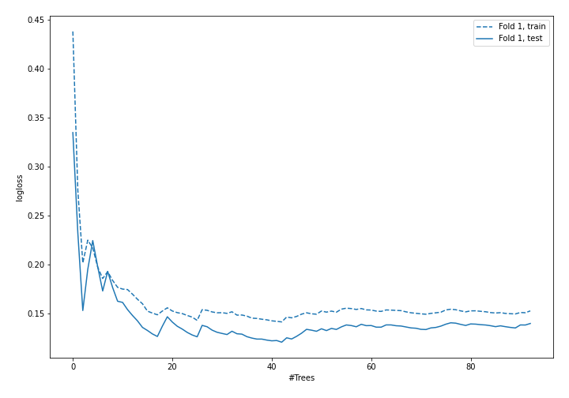

## Permutation-based Importance
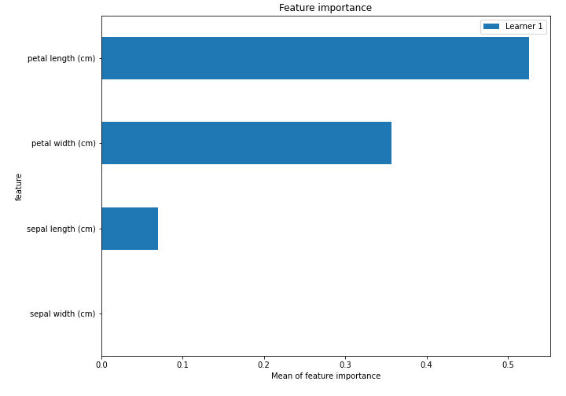

## SHAP Importance
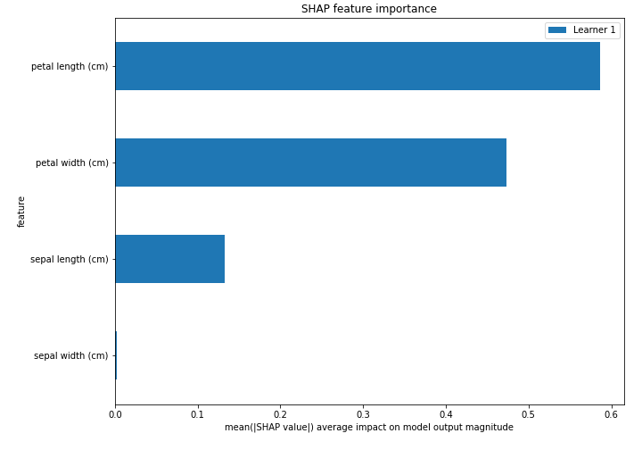

## SHAP Dependence plots

### Dependence setosa (Fold #1)
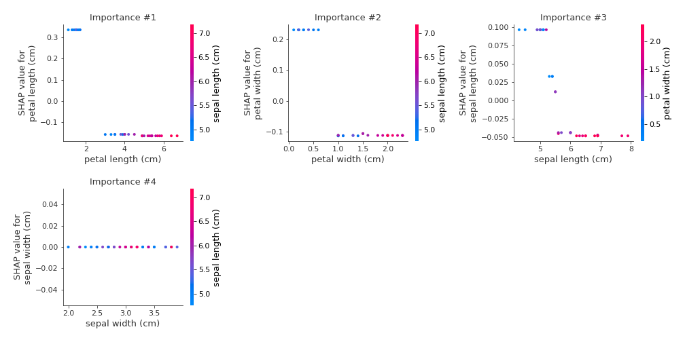
### Dependence versicolor (Fold #1)
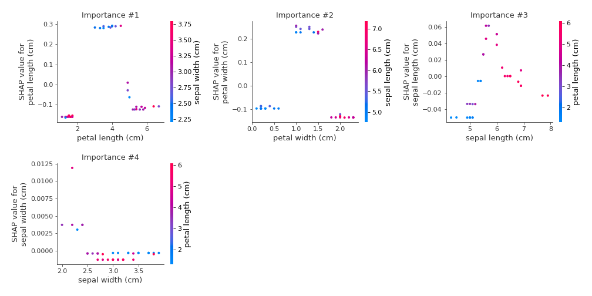
### Dependence virginica (Fold #1)
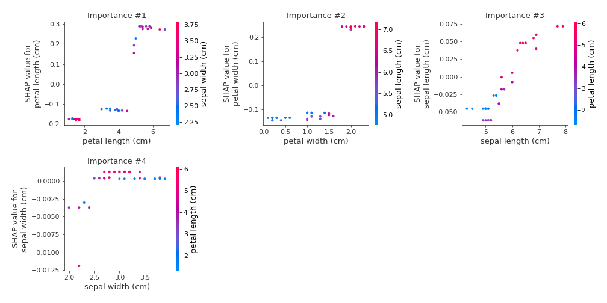

## SHAP Decision plots

### Worst decisions for selected sample #1 (Fold #1)
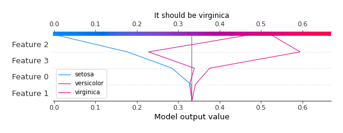
### Worst decisions for selected sample #2 (Fold #1)
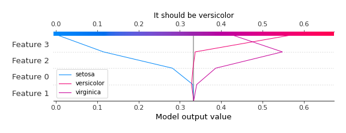
### Worst decisions for selected sample #3 (Fold #1)
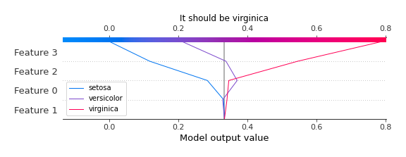
### Worst decisions for selected sample #4 (Fold #1)
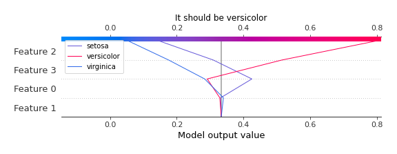
### Best decisions for selected sample #1 (Fold #1)

### Best decisions for selected sample #2 (Fold #1)
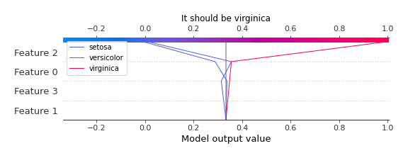
### Best decisions for selected sample #3 (Fold #1)
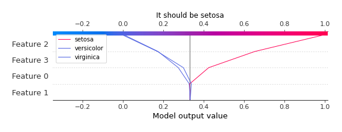
### Best decisions for selected sample #4 (Fold #1)
