# Summary of 5_Default_Xgboost

## Extreme Gradient Boosting (Xgboost)
- **objective**: multi:softprob
- **eval_metric**: mlogloss
- **eta**: 0.1
- **max_depth**: 6
- **min_child_weight**: 1
- **subsample**: 1.0
- **colsample_bytree**: 1.0
- **num_class**: 3
- **explain_level**: 2

## Validation
 - **validation_type**: split
 - **train_ratio**: 0.75
 - **shuffle**: True
 - **stratify**: True

## Optimized metric
logloss

## Training time

4.9 seconds

### Metric details
|           |    setosa |   versicolor |   virginica |   accuracy |   macro avg |   weighted avg |   logloss |
|:----------|----------:|-------------:|------------:|-----------:|------------:|---------------:|----------:|
| precision |  0.916667 |     0.909091 |    1        |   0.941176 |    0.941919 |       0.943627 |  0.207343 |
| recall    |  1        |     0.909091 |    0.916667 |   0.941176 |    0.941919 |       0.941176 |  0.207343 |
| f1-score  |  0.956522 |     0.909091 |    0.956522 |   0.941176 |    0.940711 |       0.941176 |  0.207343 |
| support   | 11        |    11        |   12        |   0.941176 |   34        |      34        |  0.207343 |

## Confusion matrix
|                       |   Predicted as setosa |   Predicted as versicolor |   Predicted as virginica |
|:----------------------|----------------------:|--------------------------:|-------------------------:|
| Labeled as setosa     |                    11 |                         0 |                        0 |
| Labeled as versicolor |                     1 |                        10 |                        0 |
| Labeled as virginica  |                     0 |                         1 |                       11 |

## Learning curves
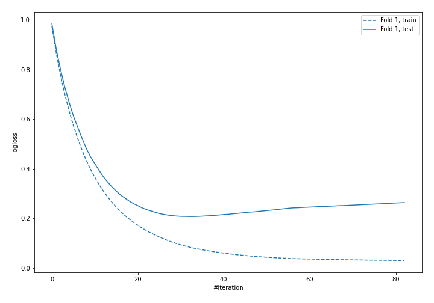

## Permutation-based Importance
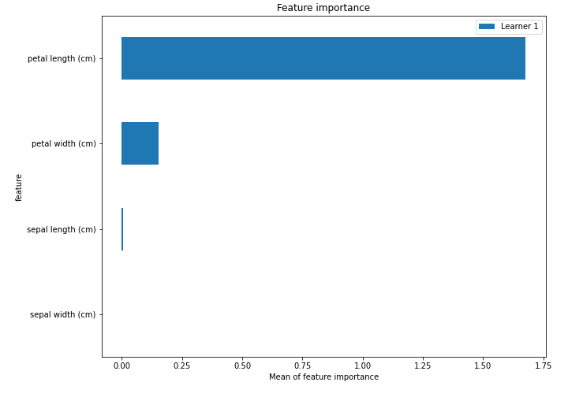

## SHAP Importance
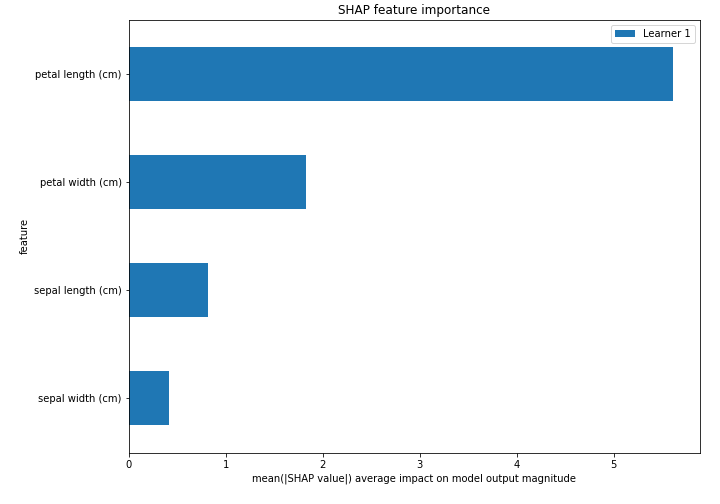

## SHAP Dependence plots

### Dependence setosa (Fold #1)
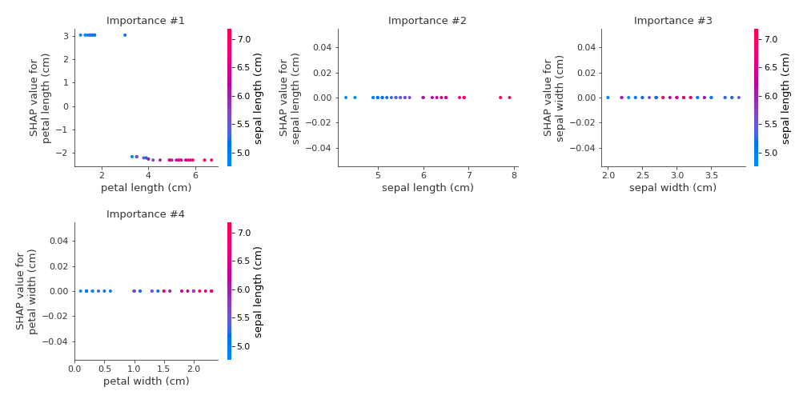
### Dependence versicolor (Fold #1)
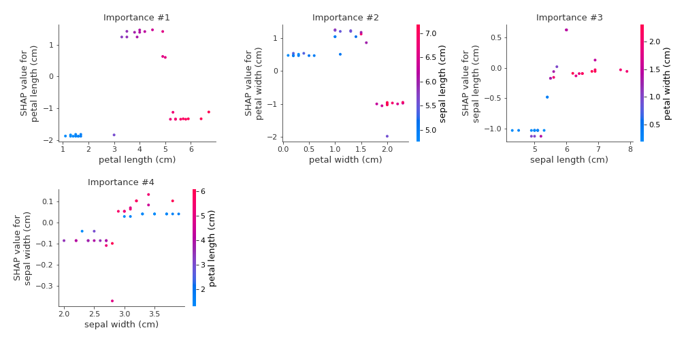
### Dependence virginica (Fold #1)
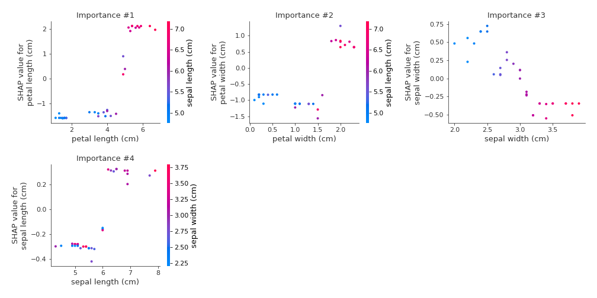

## SHAP Decision plots

### Worst decisions for selected sample #1 (Fold #1)
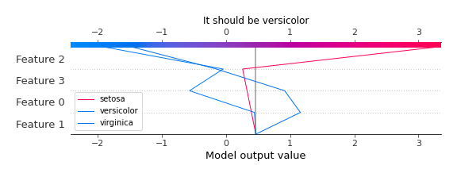
### Worst decisions for selected sample #2 (Fold #1)
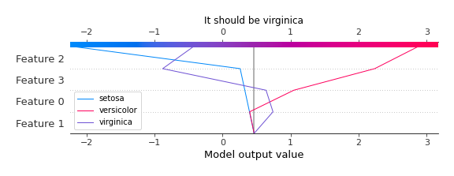
### Worst decisions for selected sample #3 (Fold #1)
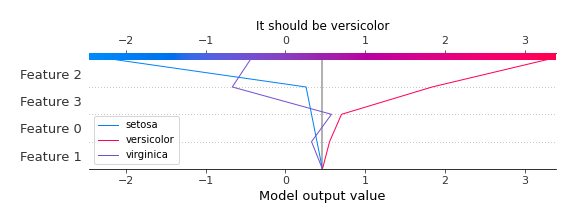
### Worst decisions for selected sample #4 (Fold #1)
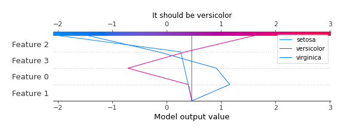
### Best decisions for selected sample #1 (Fold #1)
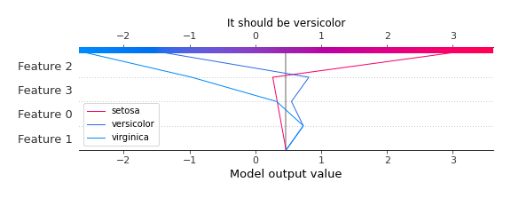
### Best decisions for selected sample #2 (Fold #1)

### Best decisions for selected sample #3 (Fold #1)
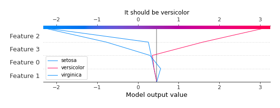
### Best decisions for selected sample #4 (Fold #1)
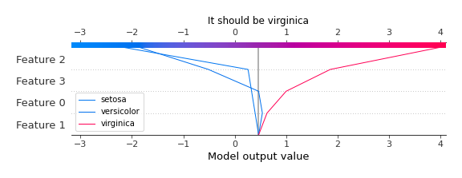