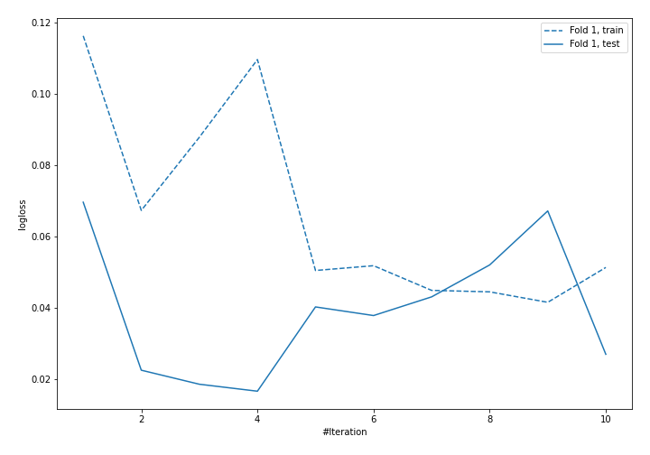
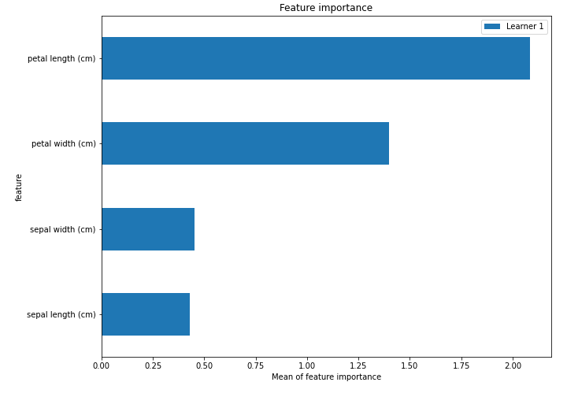

# Summary of 6_Default_NeuralNetwork

## Neural Network
- **dense_layers**: 2
- **dense_1_size**: 32
- **dense_2_size**: 16
- **dropout**: 0
- **learning_rate**: 0.05
- **momentum**: 0.9
- **decay**: 0.001
- **num_class**: 3
- **explain_level**: 2
- **model_architecture_json**: "{\"class_name\": \"Sequential\", \"config\": {\"name\": \"sequential_1\", \"layers\": [{\"class_name\": \"Dense\", \"config\": {\"name\": \"dense_1\", \"trainable\": true, \"batch_input_shape\": [null, 4], \"dtype\": \"float32\", \"units\": 32, \"activation\": \"relu\", \"use_bias\": true, \"kernel_initializer\": {\"class_name\": \"VarianceScaling\", \"config\": {\"scale\": 1.0, \"mode\": \"fan_avg\", \"distribution\": \"uniform\", \"seed\": null}}, \"bias_initializer\": {\"class_name\": \"Zeros\", \"config\": {}}, \"kernel_regularizer\": null, \"bias_regularizer\": null, \"activity_regularizer\": null, \"kernel_constraint\": null, \"bias_constraint\": null}}, {\"class_name\": \"Dense\", \"config\": {\"name\": \"dense_2\", \"trainable\": true, \"batch_input_shape\": [null, 4], \"dtype\": \"float32\", \"units\": 16, \"activation\": \"relu\", \"use_bias\": true, \"kernel_initializer\": {\"class_name\": \"VarianceScaling\", \"config\": {\"scale\": 1.0, \"mode\": \"fan_avg\", \"distribution\": \"uniform\", \"seed\": null}}, \"bias_initializer\": {\"class_name\": \"Zeros\", \"config\": {}}, \"kernel_regularizer\": null, \"bias_regularizer\": null, \"activity_regularizer\": null, \"kernel_constraint\": null, \"bias_constraint\": null}}, {\"class_name\": \"Dense\", \"config\": {\"name\": \"dense_3\", \"trainable\": true, \"dtype\": \"float32\", \"units\": 3, \"activation\": \"softmax\", \"use_bias\": true, \"kernel_initializer\": {\"class_name\": \"VarianceScaling\", \"config\": {\"scale\": 1.0, \"mode\": \"fan_avg\", \"distribution\": \"uniform\", \"seed\": null}}, \"bias_initializer\": {\"class_name\": \"Zeros\", \"config\": {}}, \"kernel_regularizer\": null, \"bias_regularizer\": null, \"activity_regularizer\": null, \"kernel_constraint\": null, \"bias_constraint\": null}}]}, \"keras_version\": \"2.3.1\", \"backend\": \"tensorflow\"}"

## Validation
 - **validation_type**: split
 - **train_ratio**: 0.75
 - **shuffle**: True
 - **stratify**: True

## Optimized metric
logloss

## Training time

10.7 seconds

### Metric details
|           |   setosa |   versicolor |   virginica |   accuracy |   macro avg |   weighted avg |    logloss |
|:----------|---------:|-------------:|------------:|-----------:|------------:|---------------:|-----------:|
| precision |        1 |            1 |           1 |          1 |           1 |              1 | 0.00636223 |
| recall    |        1 |            1 |           1 |          1 |           1 |              1 | 0.00636223 |
| f1-score  |        1 |            1 |           1 |          1 |           1 |              1 | 0.00636223 |
| support   |        9 |            9 |           9 |          1 |          27 |             27 | 0.00636223 |

## Confusion matrix
|                       |   Predicted as setosa |   Predicted as versicolor |   Predicted as virginica |
|:----------------------|----------------------:|--------------------------:|-------------------------:|
| Labeled as setosa     |                     9 |                         0 |                        0 |
| Labeled as versicolor |                     0 |                         9 |                        0 |
| Labeled as virginica  |                     0 |                         0 |                        9 |

## Learning curves

## Permutation-based Importance
