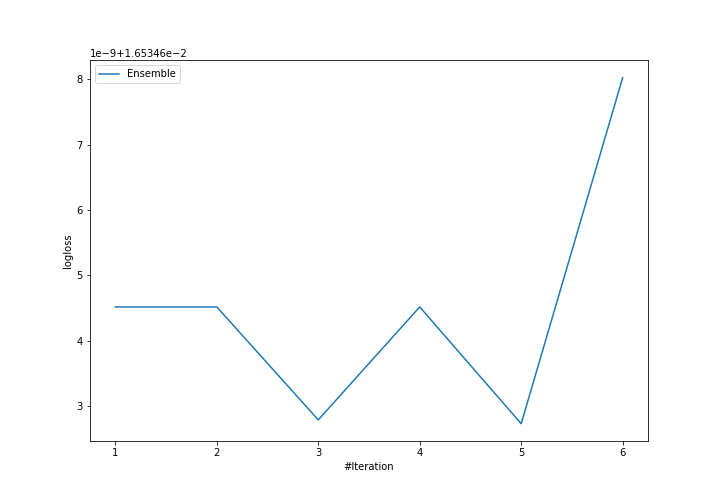

# Summary of Ensemble

## Ensemble structure
| Model                   |   Weight |
|:------------------------|---------:|
| 6_Default_NeuralNetwork |        1 |

### Metric details
|           |   setosa |   versicolor |   virginica |   accuracy |   macro avg |   weighted avg |    logloss |
|:----------|---------:|-------------:|------------:|-----------:|------------:|---------------:|-----------:|
| precision |        1 |            1 |           1 |          1 |           1 |              1 | 0.00636223 |
| recall    |        1 |            1 |           1 |          1 |           1 |              1 | 0.00636223 |
| f1-score  |        1 |            1 |           1 |          1 |           1 |              1 | 0.00636223 |
| support   |        9 |            9 |           9 |          1 |          27 |             27 | 0.00636223 |

## Confusion matrix
|                       |   Predicted as setosa |   Predicted as versicolor |   Predicted as virginica |
|:----------------------|----------------------:|--------------------------:|-------------------------:|
| Labeled as setosa     |                     9 |                         0 |                        0 |
| Labeled as versicolor |                     0 |                         9 |                        0 |
| Labeled as virginica  |                     0 |                         0 |                        9 |

## Learning curves
