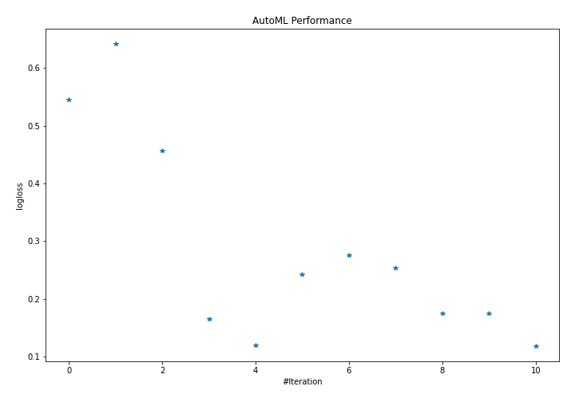
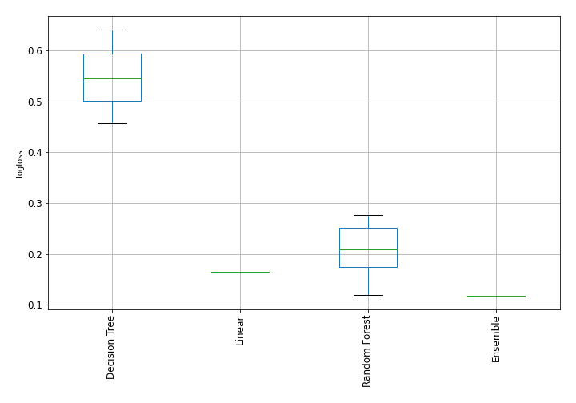

# AutoML Leaderboard

| Best model   | name                    | model_type     | metric_type   |   metric_value |   train_time | Link                                              |
|:-------------|:------------------------|:---------------|:--------------|---------------:|-------------:|:--------------------------------------------------|
|              | 1_Baseline              | Baseline       | logloss       |     1.09861    |         0.12 | [Results link](1_Baseline/README.md)              |
|              | 2_DecisionTree          | Decision Tree  | logloss       |     0.0256741  |        32.68 | [Results link](2_DecisionTree/README.md)          |
|              | 3_Linear                | Linear         | logloss       |     0.12529    |        27.06 | [Results link](3_Linear/README.md)                |
|              | 4_Default_RandomForest  | Random Forest  | logloss       |     0.138415   |        25.67 | [Results link](4_Default_RandomForest/README.md)  |
|              | 5_Default_Xgboost       | Xgboost        | logloss       |     0.212116   |        17.02 | [Results link](5_Default_Xgboost/README.md)       |
| **the best** | 6_Default_NeuralNetwork | Neural Network | logloss       |     0.00636223 |        10.71 | [Results link](6_Default_NeuralNetwork/README.md) |
|              | Ensemble                | Ensemble       | logloss       |     0.00636223 |         0.54 | [Results link](Ensemble/README.md)                |

### AutoML Performance

### AutoML Performance Boxplot
