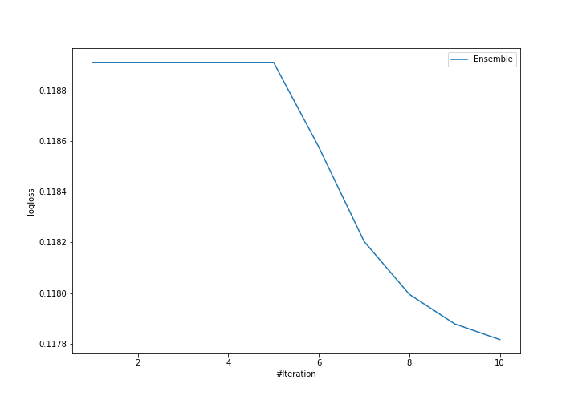

# Summary of ensemble

## Ensemble structure
| Model    |   Weight |
|:---------|---------:|
| model_11 |        9 |
| model_4  |        1 |

### Metric details
|           |   setosa |   versicolor |   virginica |   accuracy |   macro avg |   weighted avg |   logloss |
|:----------|---------:|-------------:|------------:|-----------:|------------:|---------------:|----------:|
| precision |        1 |     0.930233 |    0.934783 |   0.955556 |    0.955005 |       0.955556 |  0.117816 |
| recall    |        1 |     0.930233 |    0.934783 |   0.955556 |    0.955005 |       0.955556 |  0.117816 |
| f1-score  |        1 |     0.930233 |    0.934783 |   0.955556 |    0.955005 |       0.955556 |  0.117816 |
| support   |       46 |    43        |   46        |   0.955556 |  135        |     135        |  0.117816 |

## Confusion matrix
|                       |   Predicted as setosa |   Predicted as versicolor |   Predicted as virginica |
|:----------------------|----------------------:|--------------------------:|-------------------------:|
| Labeled as setosa     |                    46 |                         0 |                        0 |
| Labeled as versicolor |                     0 |                        40 |                        3 |
| Labeled as virginica  |                     0 |                         3 |                       43 |

## Learning curves
