# Summary of model_11

## Random Forest
- **criterion**: gini
- **max_features**: 0.7
- **min_samples_split**: 2
- **min_samples_leaf**: 1
- **num_class**: 3

## Validation
 - **validation_type**: kfold
 - **k_folds**: 5
 - **shuffle**: True
 - **stratify**: True

## Optimized metric
logloss

## Training time

28.7 seconds

### Metric details
|           |   setosa |   versicolor |   virginica |   accuracy |   macro avg |   weighted avg |   logloss |
|:----------|---------:|-------------:|------------:|-----------:|------------:|---------------:|----------:|
| precision |        1 |     0.930233 |    0.934783 |   0.955556 |    0.955005 |       0.955556 |  0.118912 |
| recall    |        1 |     0.930233 |    0.934783 |   0.955556 |    0.955005 |       0.955556 |  0.118912 |
| f1-score  |        1 |     0.930233 |    0.934783 |   0.955556 |    0.955005 |       0.955556 |  0.118912 |
| support   |       46 |    43        |   46        |   0.955556 |  135        |     135        |  0.118912 |

## Confusion matrix
|                       |   Predicted as setosa |   Predicted as versicolor |   Predicted as virginica |
|:----------------------|----------------------:|--------------------------:|-------------------------:|
| Labeled as setosa     |                    46 |                         0 |                        0 |
| Labeled as versicolor |                     0 |                        40 |                        3 |
| Labeled as virginica  |                     0 |                         3 |                       43 |

## Learning curves
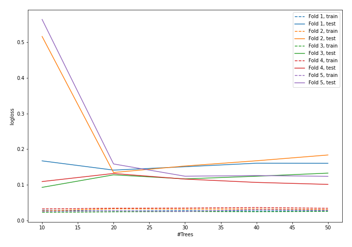

## Permutation-based Importance
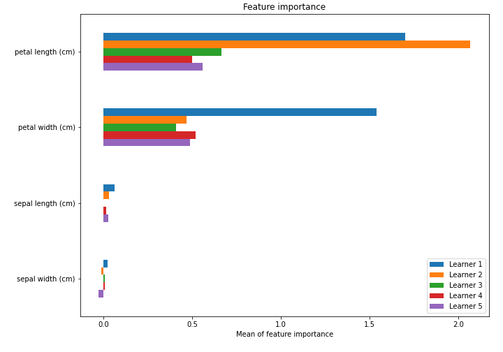

## SHAP Importance
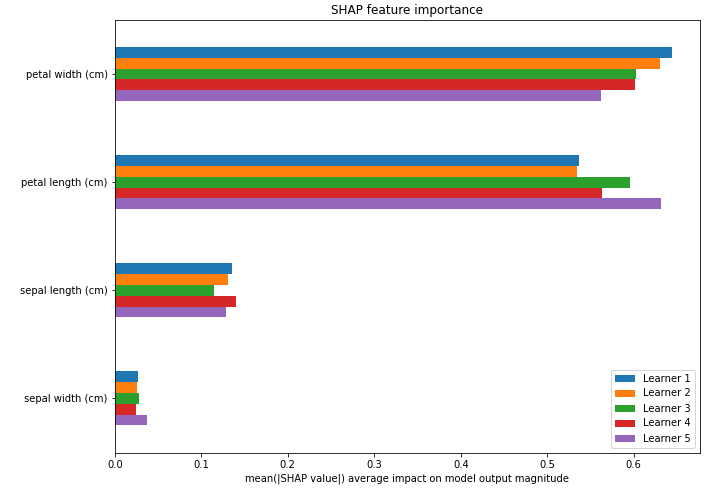

## SHAP Dependence plots

### Dependence setosa (Fold #1)
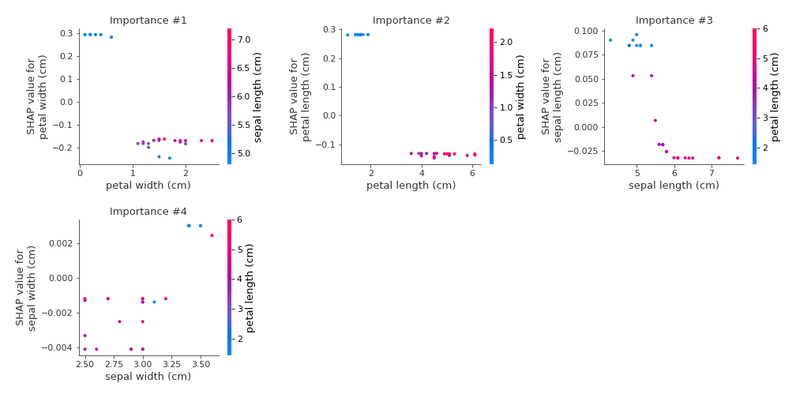
### Dependence versicolor (Fold #1)
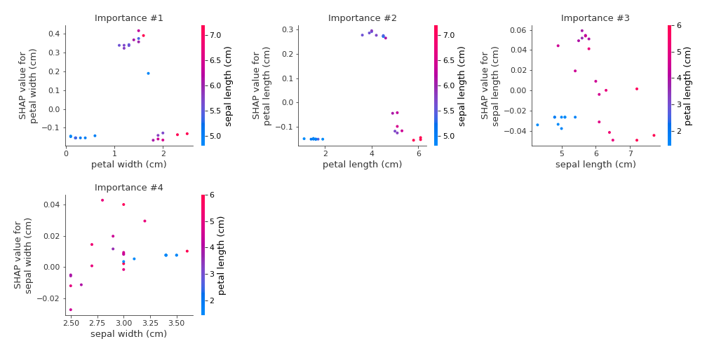
### Dependence virginica (Fold #1)
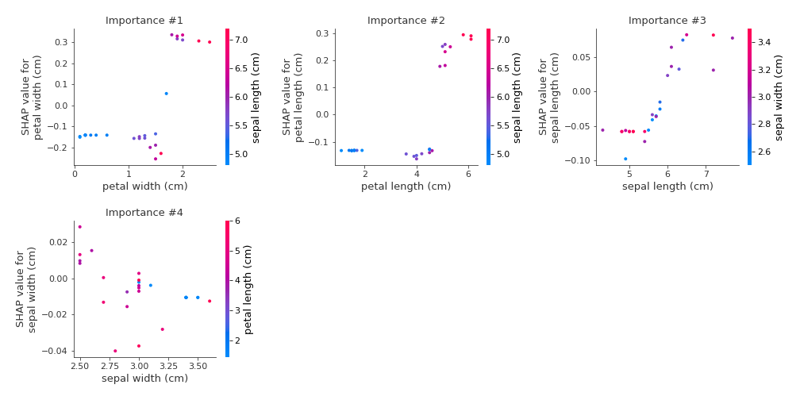
### Dependence setosa (Fold #2)
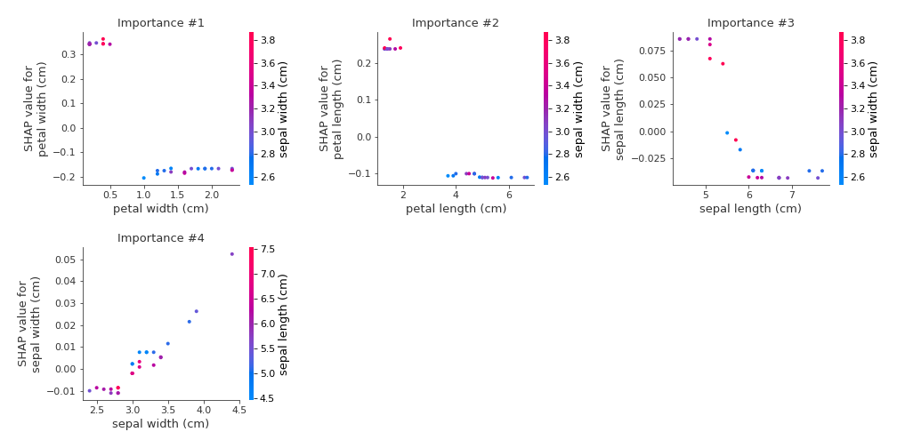
### Dependence versicolor (Fold #2)
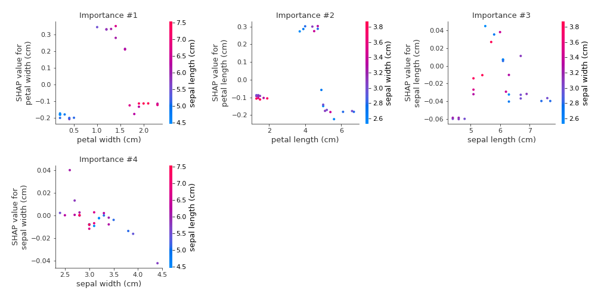
### Dependence virginica (Fold #2)
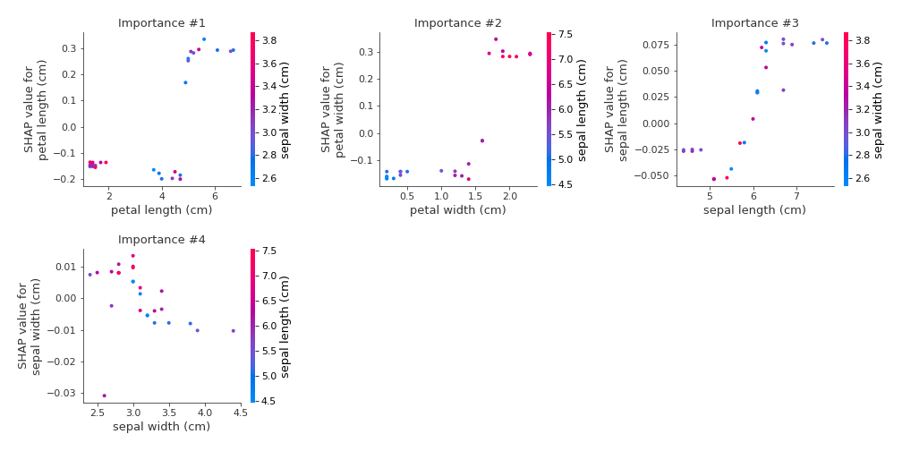
### Dependence setosa (Fold #3)
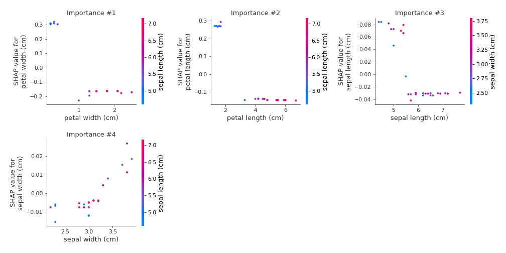
### Dependence versicolor (Fold #3)
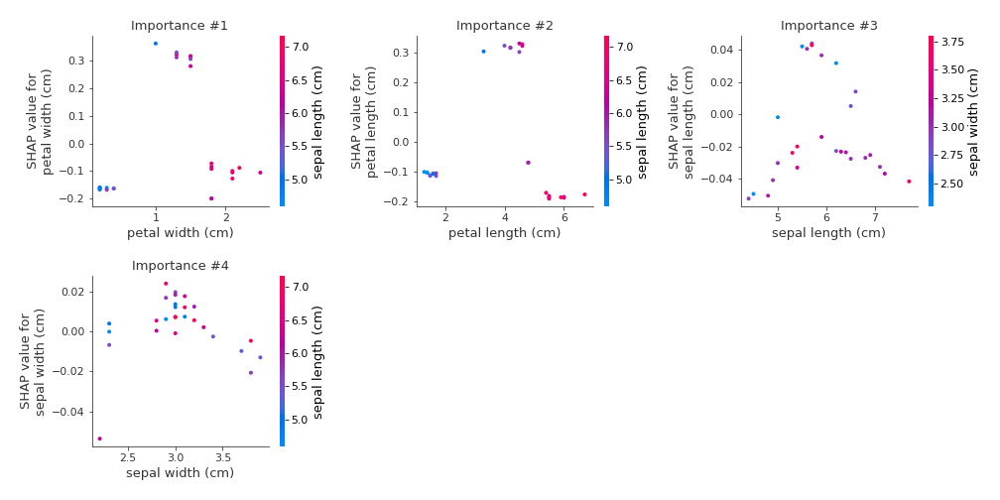
### Dependence virginica (Fold #3)
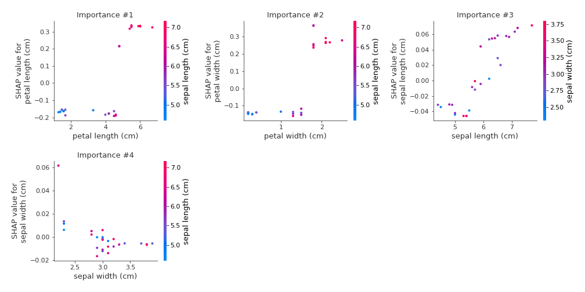
### Dependence setosa (Fold #4)
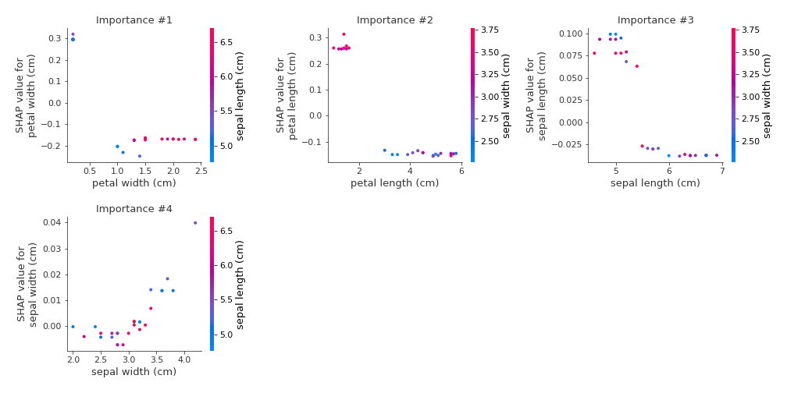
### Dependence versicolor (Fold #4)
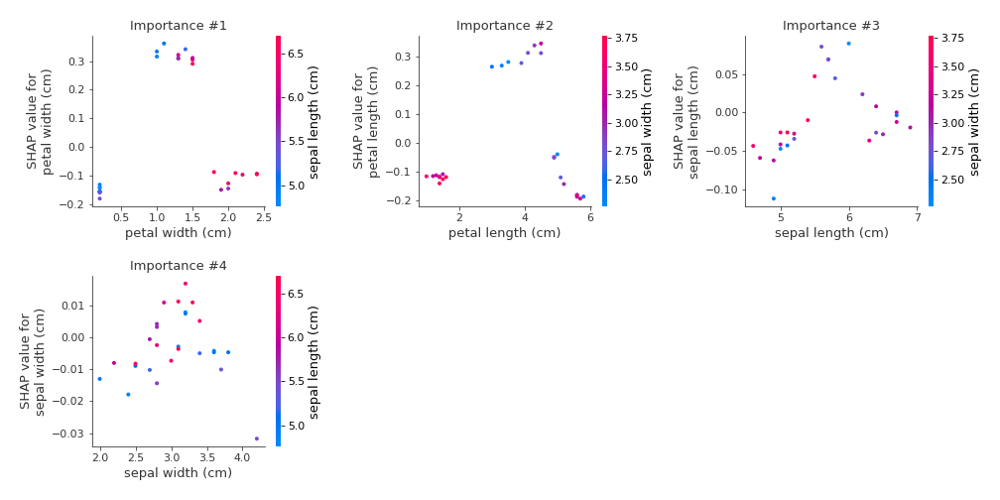
### Dependence virginica (Fold #4)
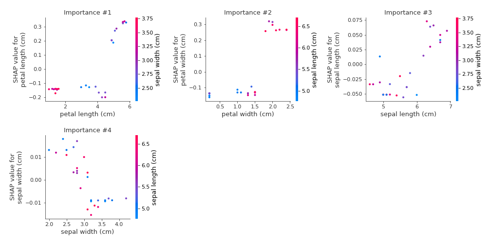
### Dependence setosa (Fold #5)
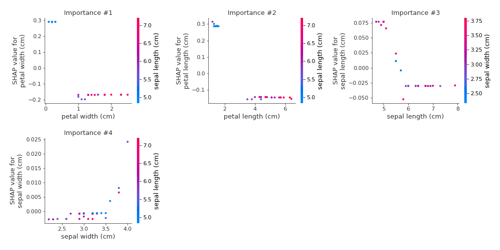
### Dependence versicolor (Fold #5)
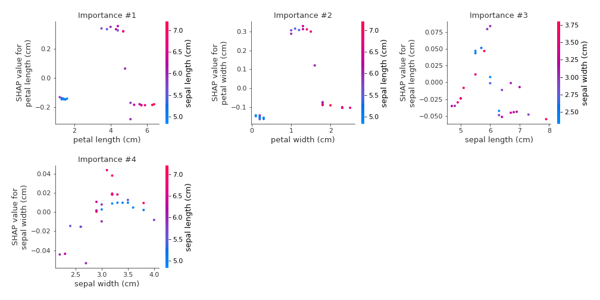
### Dependence virginica (Fold #5)
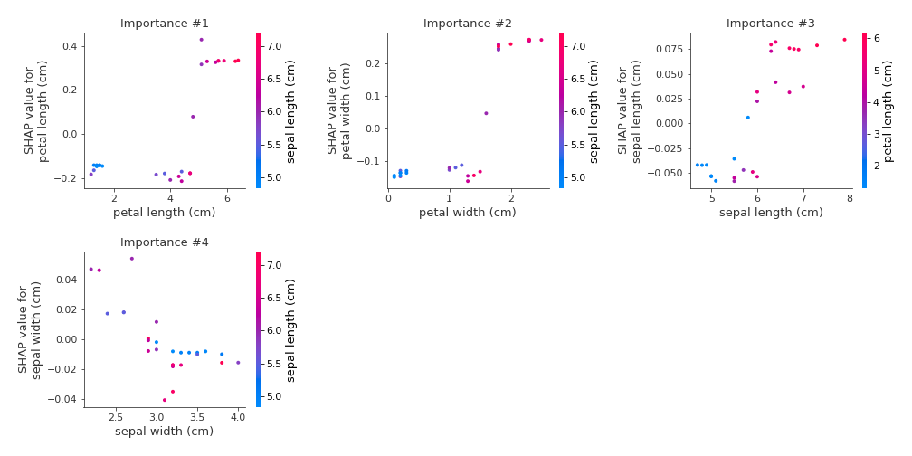

## SHAP Decision plots

### Worst decisions for selected sample #1 (Fold #1)

### Worst decisions for selected sample #1 (Fold #2)

### Worst decisions for selected sample #1 (Fold #3)

### Worst decisions for selected sample #1 (Fold #4)

### Worst decisions for selected sample #1 (Fold #5)
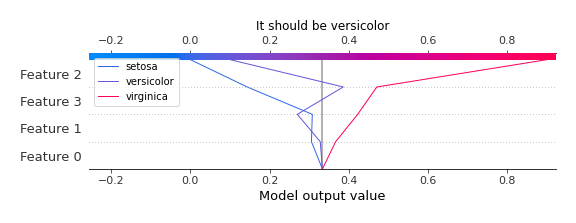
### Worst decisions for selected sample #2 (Fold #1)
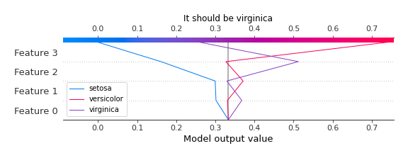
### Worst decisions for selected sample #2 (Fold #2)
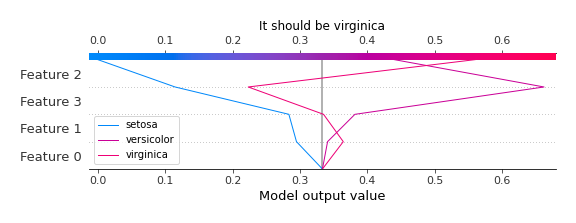
### Worst decisions for selected sample #2 (Fold #3)
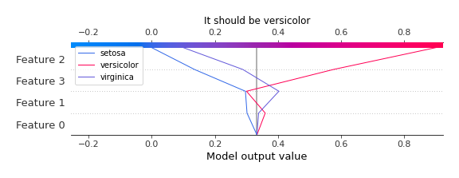
### Worst decisions for selected sample #2 (Fold #4)
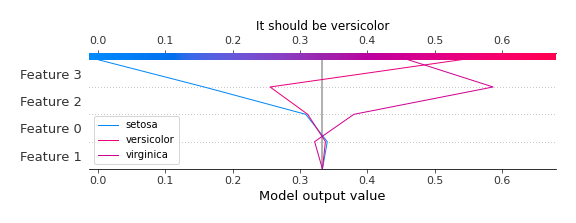
### Worst decisions for selected sample #2 (Fold #5)
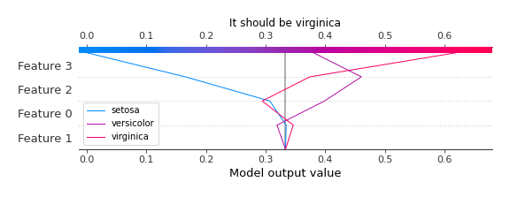
### Worst decisions for selected sample #3 (Fold #1)
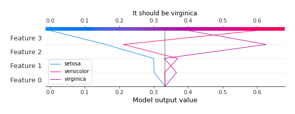
### Worst decisions for selected sample #3 (Fold #2)
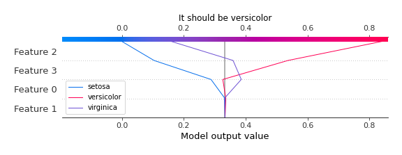
### Worst decisions for selected sample #3 (Fold #3)

### Worst decisions for selected sample #3 (Fold #4)
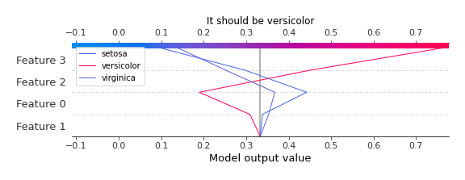
### Worst decisions for selected sample #3 (Fold #5)

### Worst decisions for selected sample #4 (Fold #1)

### Worst decisions for selected sample #4 (Fold #2)
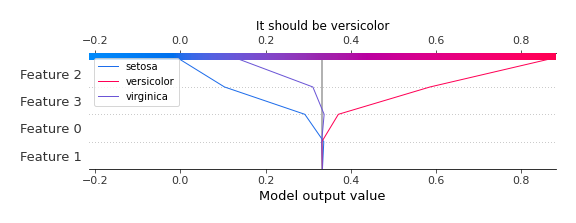
### Worst decisions for selected sample #4 (Fold #3)

### Worst decisions for selected sample #4 (Fold #4)
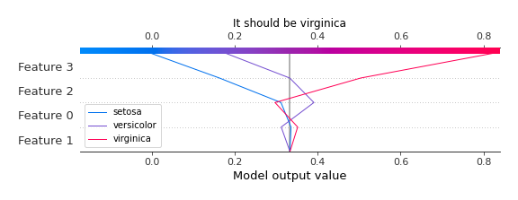
### Worst decisions for selected sample #4 (Fold #5)
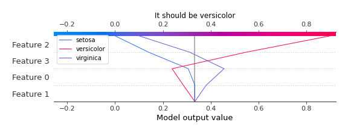
### Best decisions for selected sample #1 (Fold #1)
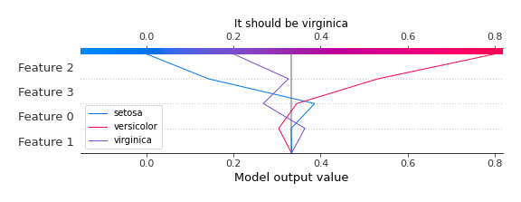
### Best decisions for selected sample #1 (Fold #2)

### Best decisions for selected sample #1 (Fold #3)

### Best decisions for selected sample #1 (Fold #4)
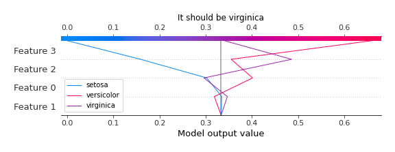
### Best decisions for selected sample #1 (Fold #5)

### Best decisions for selected sample #2 (Fold #1)
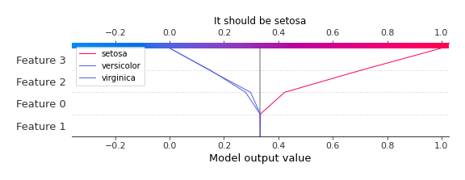
### Best decisions for selected sample #2 (Fold #2)

### Best decisions for selected sample #2 (Fold #3)

### Best decisions for selected sample #2 (Fold #4)

### Best decisions for selected sample #2 (Fold #5)
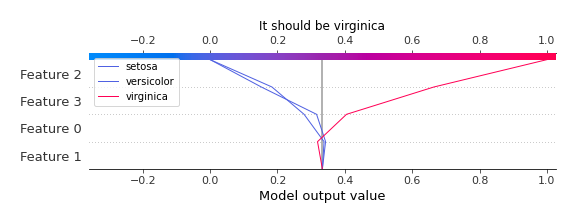
### Best decisions for selected sample #3 (Fold #1)

### Best decisions for selected sample #3 (Fold #2)

### Best decisions for selected sample #3 (Fold #3)

### Best decisions for selected sample #3 (Fold #4)

### Best decisions for selected sample #3 (Fold #5)

### Best decisions for selected sample #4 (Fold #1)

### Best decisions for selected sample #4 (Fold #2)

### Best decisions for selected sample #4 (Fold #3)

### Best decisions for selected sample #4 (Fold #4)

### Best decisions for selected sample #4 (Fold #5)
