# Summary of model_4

## Logistic Regression (Linear)
- **num_class**: 3

## Validation
 - **validation_type**: kfold
 - **k_folds**: 5
 - **shuffle**: True
 - **stratify**: True

## Optimized metric
logloss

## Training time

15.7 seconds

### Metric details
|           |   setosa |   versicolor |   virginica |   accuracy |   macro avg |   weighted avg |   logloss |
|:----------|---------:|-------------:|------------:|-----------:|------------:|---------------:|----------:|
| precision |        1 |     0.930233 |    0.934783 |   0.955556 |    0.955005 |       0.955556 |  0.165071 |
| recall    |        1 |     0.930233 |    0.934783 |   0.955556 |    0.955005 |       0.955556 |  0.165071 |
| f1-score  |        1 |     0.930233 |    0.934783 |   0.955556 |    0.955005 |       0.955556 |  0.165071 |
| support   |       46 |    43        |   46        |   0.955556 |  135        |     135        |  0.165071 |

## Confusion matrix
|                       |   Predicted as setosa |   Predicted as versicolor |   Predicted as virginica |
|:----------------------|----------------------:|--------------------------:|-------------------------:|
| Labeled as setosa     |                    46 |                         0 |                        0 |
| Labeled as versicolor |                     0 |                        40 |                        3 |
| Labeled as virginica  |                     0 |                         3 |                       43 |

## Learning curves
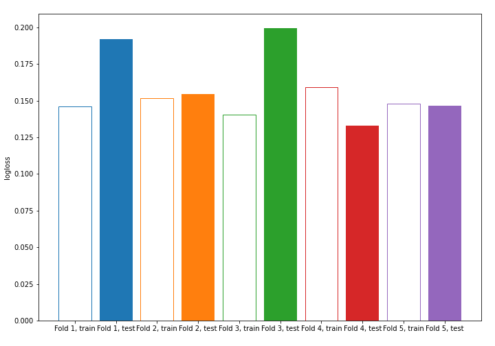

## Coefficients

### Coefficients learner #1
|                   |     setosa |   versicolor |   virginica |
|:------------------|-----------:|-------------:|------------:|
| intercept         | -0.0812738 |     1.85035  |   -1.76908  |
| sepal length (cm) | -1.00948   |     0.442153 |    0.567322 |
| sepal width (cm)  |  1.08583   |    -0.352137 |   -0.733694 |
| petal length (cm) | -1.74353   |    -0.282511 |    2.02604  |
| petal width (cm)  | -1.65102   |    -0.669855 |    2.32087  |

### Coefficients learner #2
|                   |    setosa |   versicolor |   virginica |
|:------------------|----------:|-------------:|------------:|
| intercept         | -0.207499 |     1.75735  |   -1.54985  |
| sepal length (cm) | -0.941017 |     0.44975  |    0.491267 |
| sepal width (cm)  |  1.04321  |    -0.428563 |   -0.614652 |
| petal length (cm) | -1.74665  |    -0.231231 |    1.97789  |
| petal width (cm)  | -1.6539   |    -0.720868 |    2.37476  |

### Coefficients learner #3
|                   |     setosa |   versicolor |   virginica |
|:------------------|-----------:|-------------:|------------:|
| intercept         | -0.0762337 |     1.80072  |   -1.72449  |
| sepal length (cm) | -0.964719  |     0.527352 |    0.437367 |
| sepal width (cm)  |  1.27388   |    -0.363827 |   -0.910054 |
| petal length (cm) | -1.65075   |    -0.321262 |    1.97201  |
| petal width (cm)  | -1.58779   |    -0.784058 |    2.37185  |

### Coefficients learner #4
|                   |    setosa |   versicolor |   virginica |
|:------------------|----------:|-------------:|------------:|
| intercept         | -0.198024 |     1.77113  |   -1.57311  |
| sepal length (cm) | -1.07198  |     0.503455 |    0.568523 |
| sepal width (cm)  |  0.94378  |    -0.344314 |   -0.599465 |
| petal length (cm) | -1.75296  |    -0.28621  |    2.03917  |
| petal width (cm)  | -1.62787  |    -0.654303 |    2.28218  |

### Coefficients learner #5
|                   |    setosa |   versicolor |   virginica |
|:------------------|----------:|-------------:|------------:|
| intercept         | -0.124399 |     1.89101  |   -1.76661  |
| sepal length (cm) | -0.979113 |     0.392445 |    0.586668 |
| sepal width (cm)  |  1.11354  |    -0.209956 |   -0.903583 |
| petal length (cm) | -1.79572  |    -0.313217 |    2.10894  |
| petal width (cm)  | -1.71179  |    -0.592913 |    2.30471  |

## Permutation-based Importance
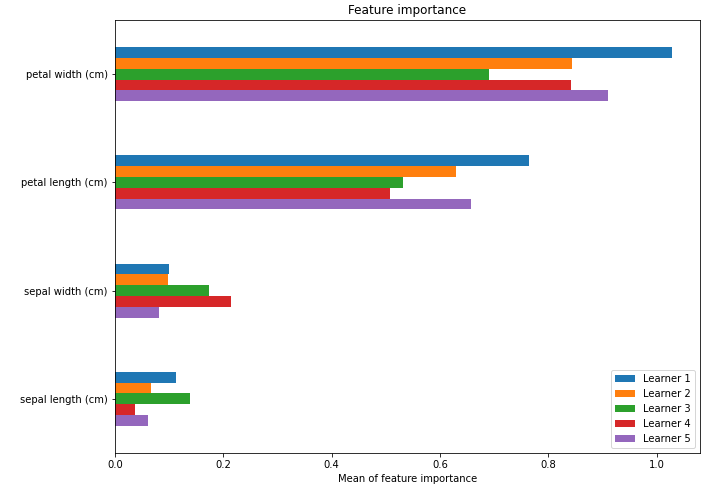

## SHAP Importance
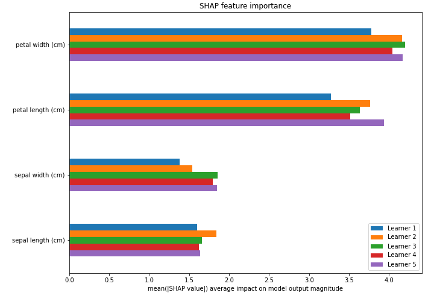

## SHAP Dependence plots

### Dependence setosa (Fold #1)
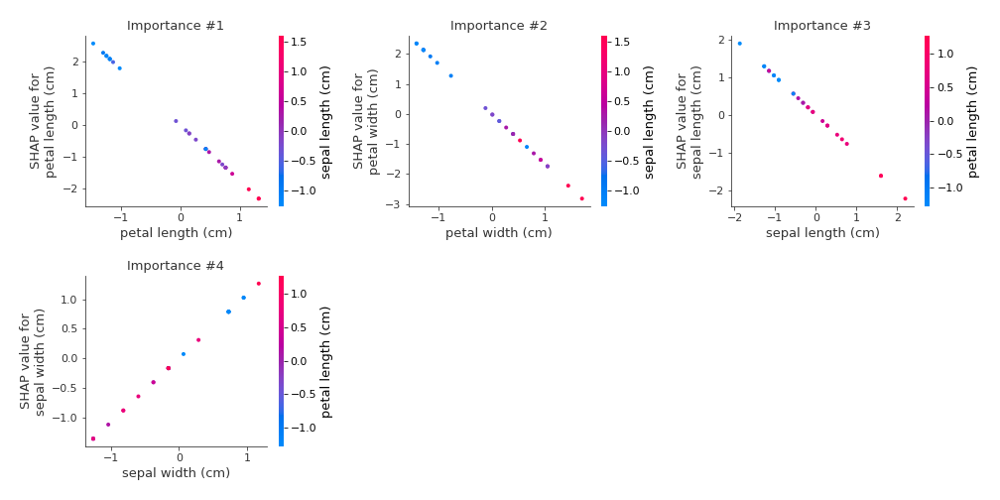
### Dependence versicolor (Fold #1)
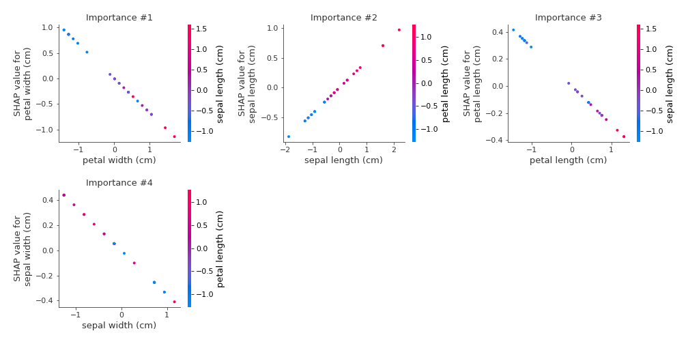
### Dependence virginica (Fold #1)

### Dependence setosa (Fold #2)
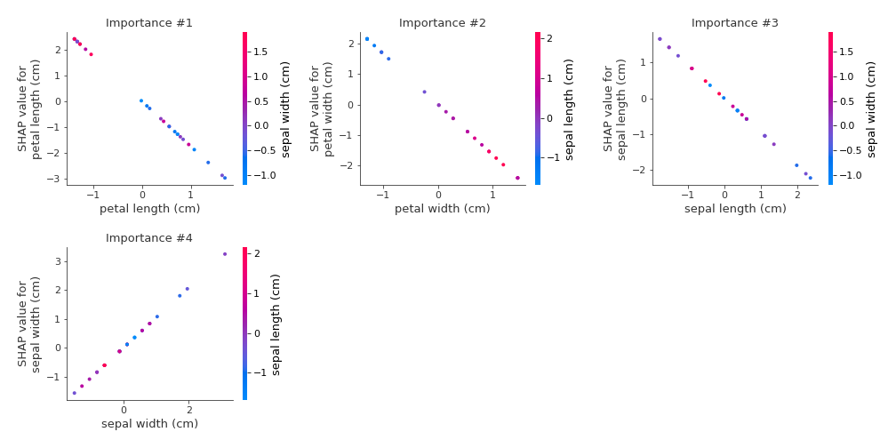
### Dependence versicolor (Fold #2)
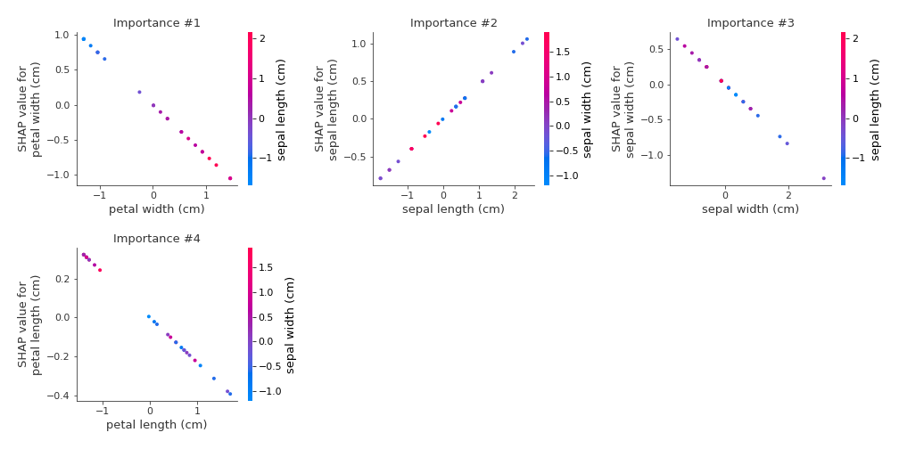
### Dependence virginica (Fold #2)

### Dependence setosa (Fold #3)
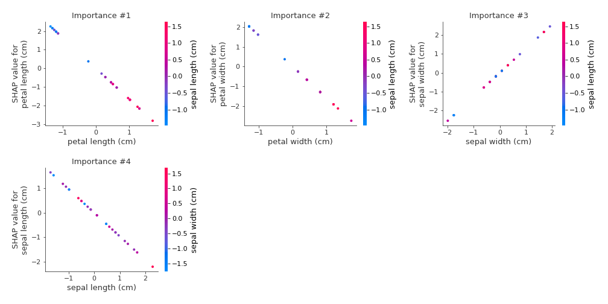
### Dependence versicolor (Fold #3)
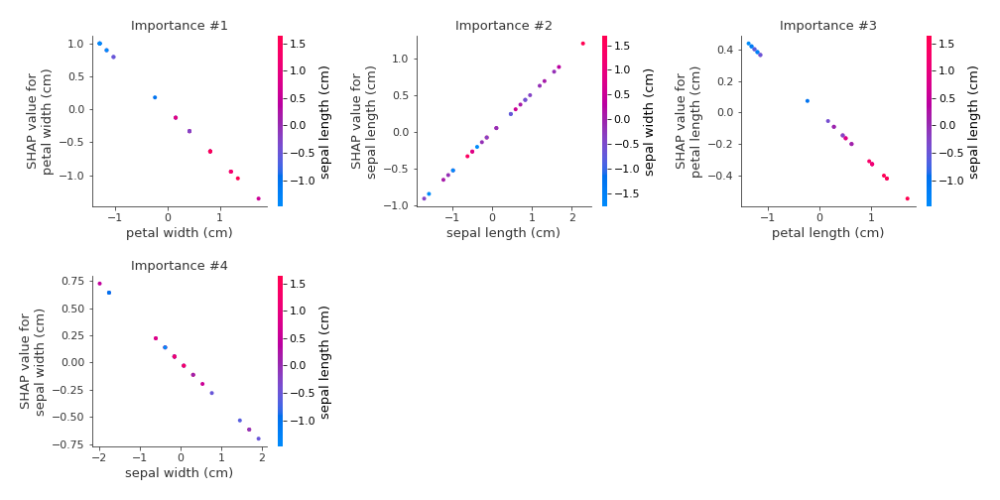
### Dependence virginica (Fold #3)
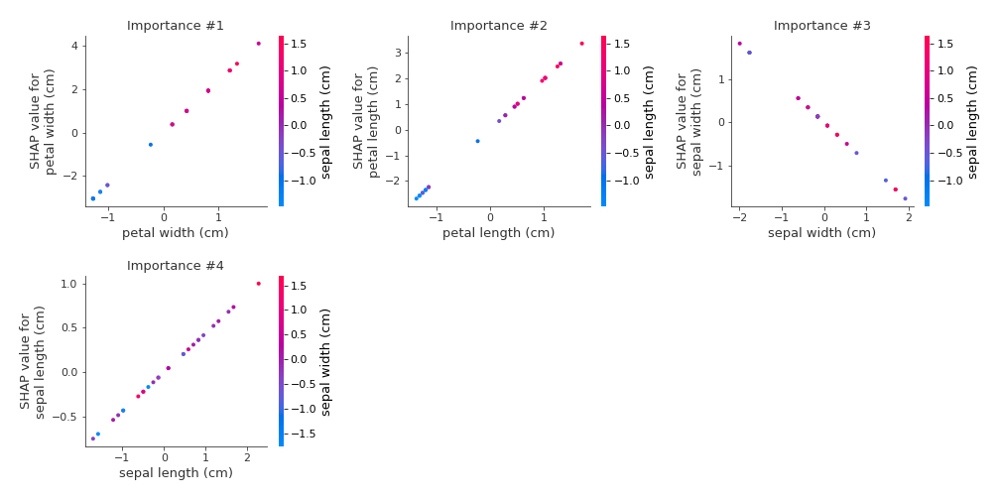
### Dependence setosa (Fold #4)
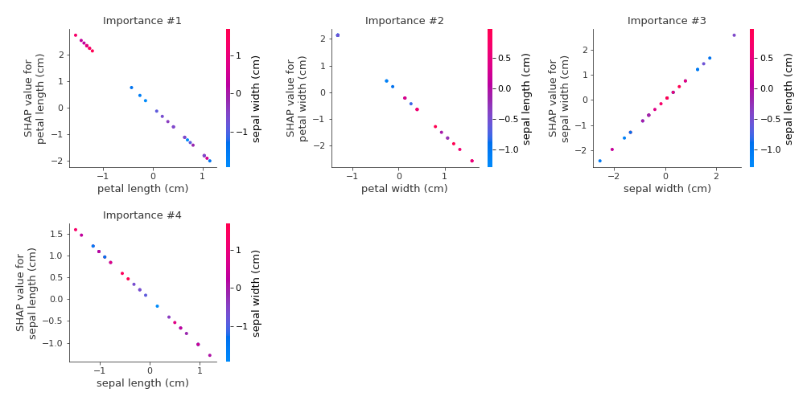
### Dependence versicolor (Fold #4)
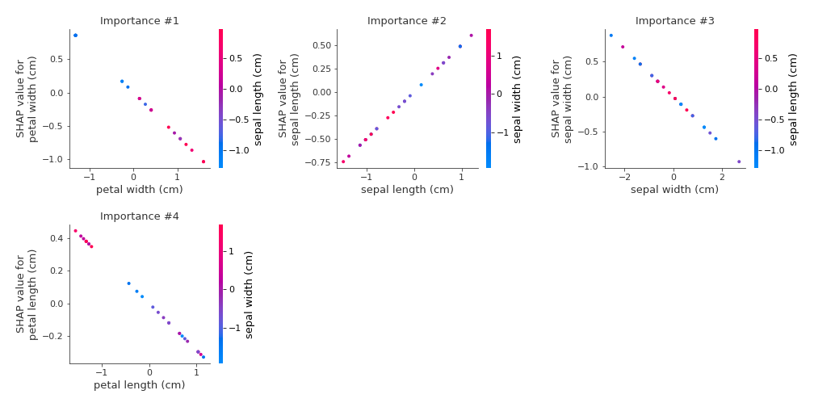
### Dependence virginica (Fold #4)
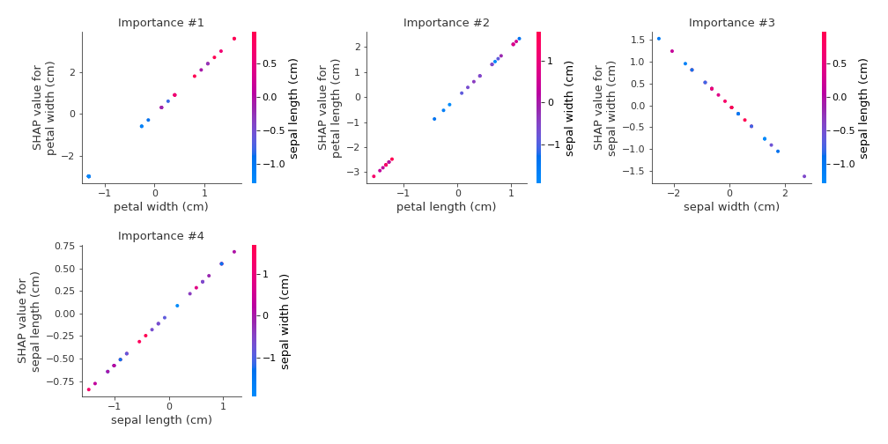
### Dependence setosa (Fold #5)
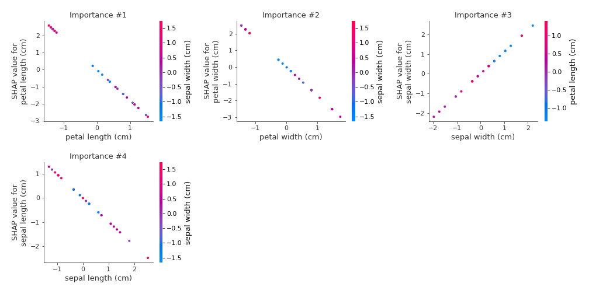
### Dependence versicolor (Fold #5)

### Dependence virginica (Fold #5)
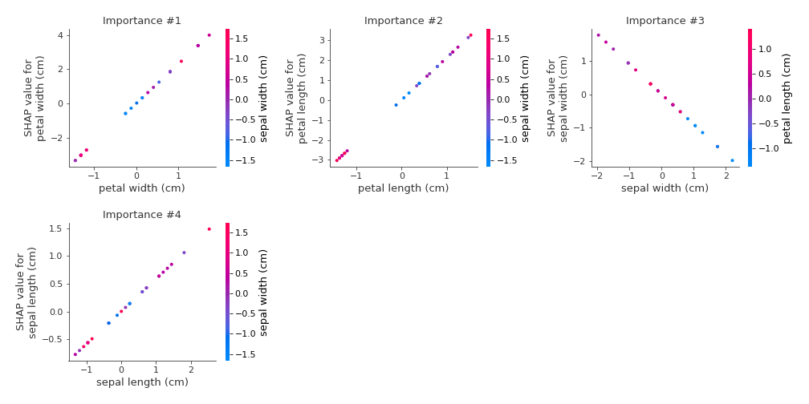

## SHAP Decision plots

### Worst decisions for selected sample #1 (Fold #1)
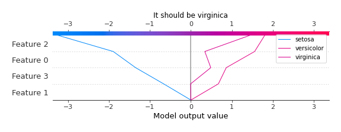
### Worst decisions for selected sample #1 (Fold #2)

### Worst decisions for selected sample #1 (Fold #3)
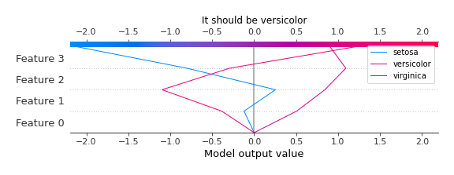
### Worst decisions for selected sample #1 (Fold #4)

### Worst decisions for selected sample #1 (Fold #5)

### Worst decisions for selected sample #2 (Fold #1)
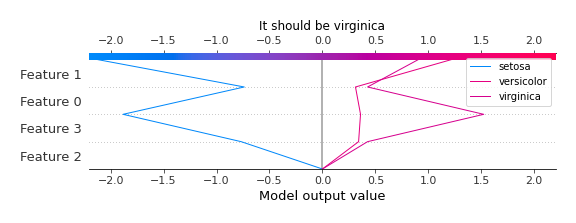
### Worst decisions for selected sample #2 (Fold #2)
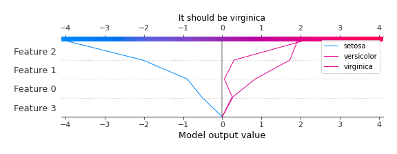
### Worst decisions for selected sample #2 (Fold #3)
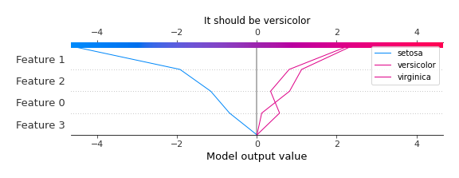
### Worst decisions for selected sample #2 (Fold #4)
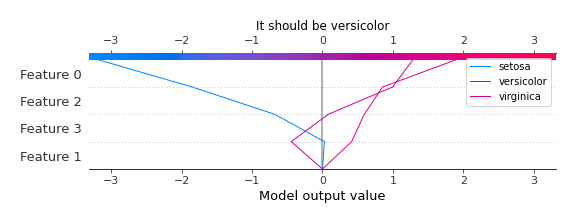
### Worst decisions for selected sample #2 (Fold #5)

### Worst decisions for selected sample #3 (Fold #1)
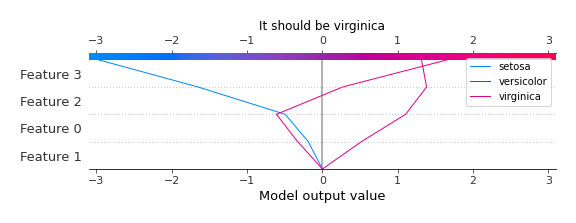
### Worst decisions for selected sample #3 (Fold #2)
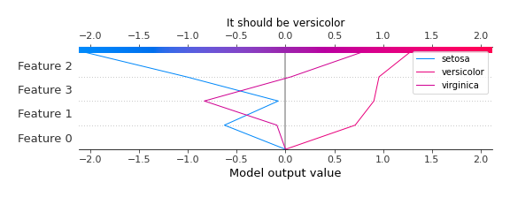
### Worst decisions for selected sample #3 (Fold #3)
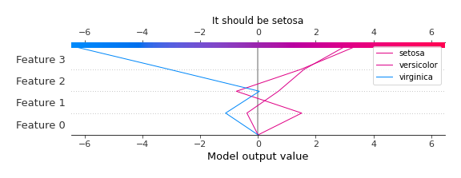
### Worst decisions for selected sample #3 (Fold #4)
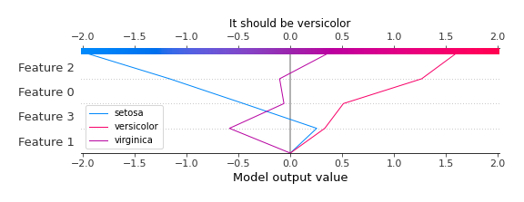
### Worst decisions for selected sample #3 (Fold #5)
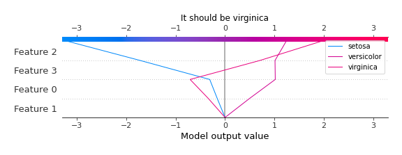
### Worst decisions for selected sample #4 (Fold #1)

### Worst decisions for selected sample #4 (Fold #2)
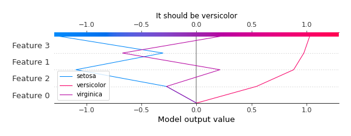
### Worst decisions for selected sample #4 (Fold #3)
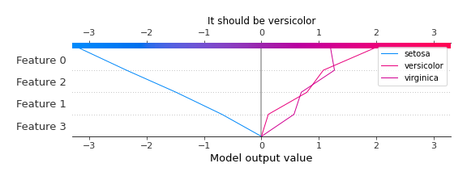
### Worst decisions for selected sample #4 (Fold #4)

### Worst decisions for selected sample #4 (Fold #5)
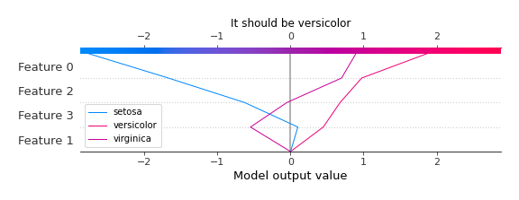
### Best decisions for selected sample #1 (Fold #1)

### Best decisions for selected sample #1 (Fold #2)
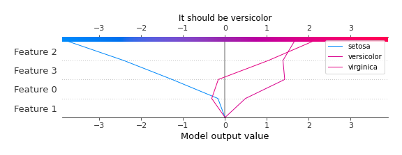
### Best decisions for selected sample #1 (Fold #3)

### Best decisions for selected sample #1 (Fold #4)
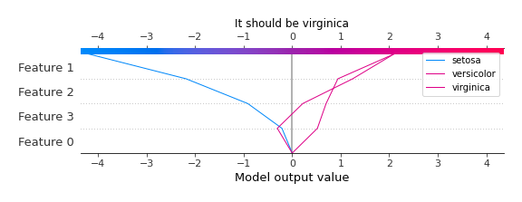
### Best decisions for selected sample #1 (Fold #5)

### Best decisions for selected sample #2 (Fold #1)
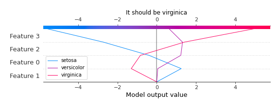
### Best decisions for selected sample #2 (Fold #2)

### Best decisions for selected sample #2 (Fold #3)
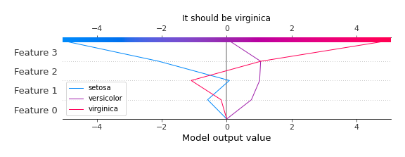
### Best decisions for selected sample #2 (Fold #4)

### Best decisions for selected sample #2 (Fold #5)

### Best decisions for selected sample #3 (Fold #1)
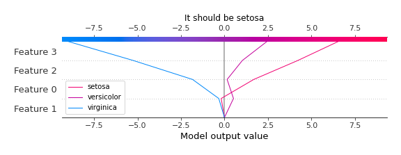
### Best decisions for selected sample #3 (Fold #2)

### Best decisions for selected sample #3 (Fold #3)

### Best decisions for selected sample #3 (Fold #4)
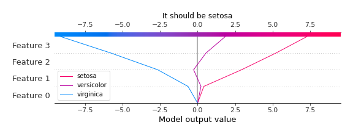
### Best decisions for selected sample #3 (Fold #5)

### Best decisions for selected sample #4 (Fold #1)
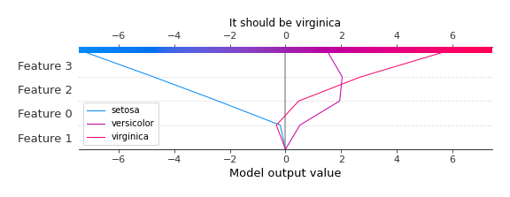
### Best decisions for selected sample #4 (Fold #2)

### Best decisions for selected sample #4 (Fold #3)

### Best decisions for selected sample #4 (Fold #4)

### Best decisions for selected sample #4 (Fold #5)
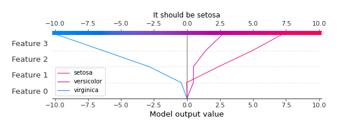