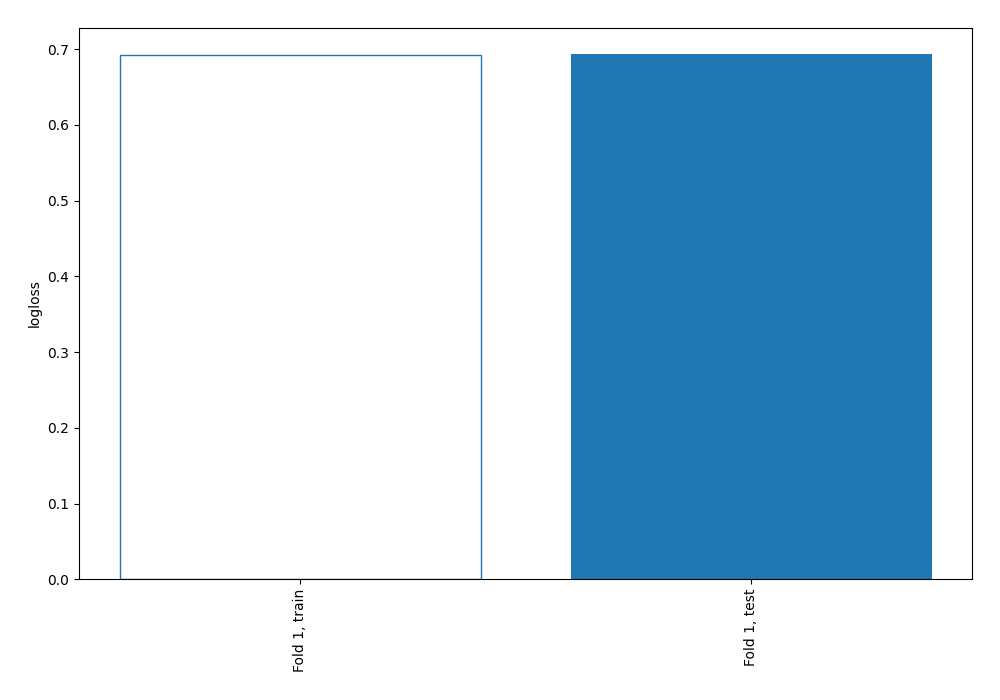
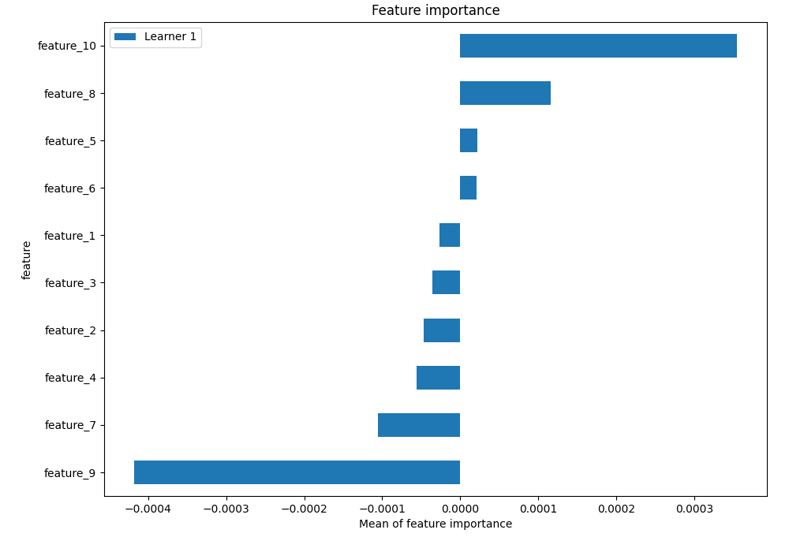
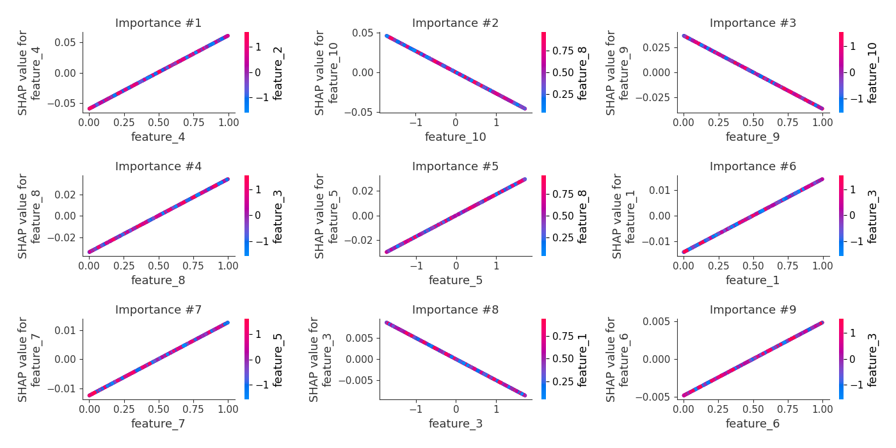
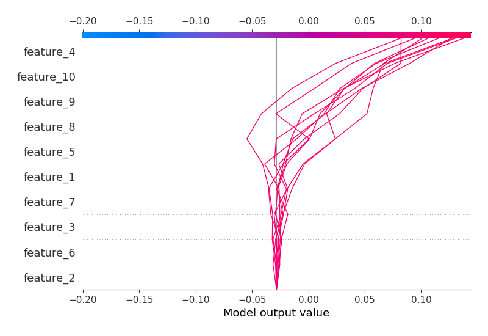
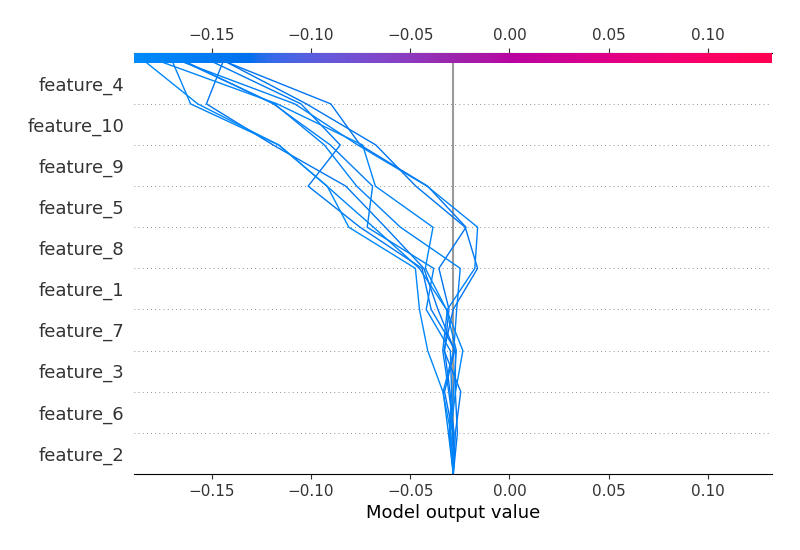
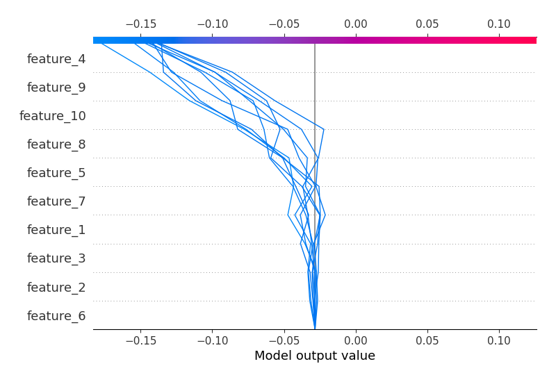
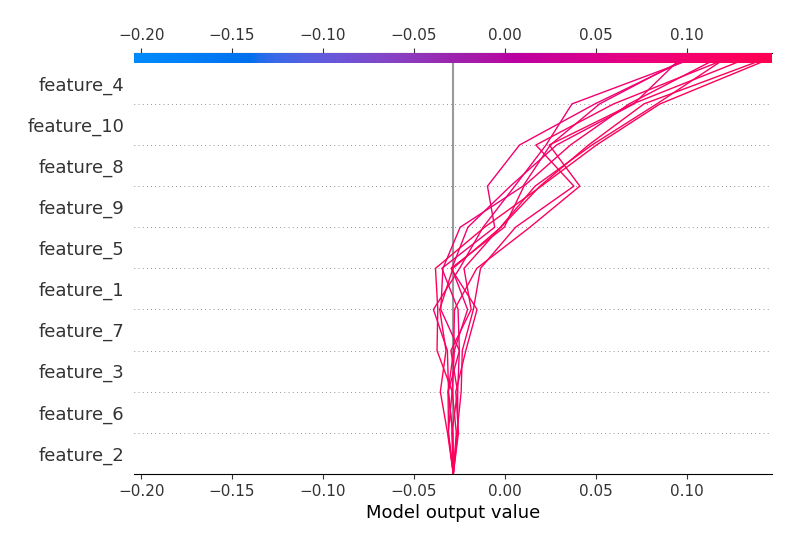

# Summary of 3_Linear

## Logistic Regression (Linear)
- **explain_level**: 2

## Validation
 - **validation_type**: split
 - **train_ratio**: 0.75
 - **shuffle**: True
 - **stratify**: True

## Optimized metric
logloss

## Training time

3.2 seconds

## Metric details
|           |     score |   threshold |
|:----------|----------:|------------:|
| logloss   | 0.693691  |  nan        |
| auc       | 0.492034  |  nan        |
| f1        | 0.660595  |    0.40724  |
| accuracy  | 0.5104    |    0.519469 |
| precision | 0.554217  |    0.519469 |
| recall    | 1         |    0.40724  |
| mcc       | 0.0226163 |    0.519469 |

## Confusion matrix (at threshold=0.519469)
|                     |   Predicted as negative |   Predicted as positive |
|:--------------------|------------------------:|------------------------:|
| Labeled as negative |                       0 |                    1267 |
| Labeled as positive |                       0 |                    1233 |

## Learning curves

## Coefficients
| feature    |   Learner_1 |
|:-----------|------------:|
| feature_4  |  0.120491   |
| feature_8  |  0.067805   |
| feature_1  |  0.0288477  |
| feature_7  |  0.02505    |
| feature_5  |  0.0172333  |
| feature_6  |  0.00971048 |
| feature_2  | -0.00191878 |
| feature_3  | -0.00504741 |
| feature_10 | -0.0267526  |
| feature_9  | -0.0733346  |
| intercept  | -0.115995   |

## Permutation-based Importance

## SHAP Importance

## SHAP Dependence plots

### Dependence (Fold #1)

## SHAP Decision plots

### Top-10 Worst decisions for class 0 (Fold #1)

### Top-10 Best decisions for class 0 (Fold #1)

### Top-10 Worst decisions for class 1 (Fold #1)

### Top-10 Best decisions for class 1 (Fold #1)
