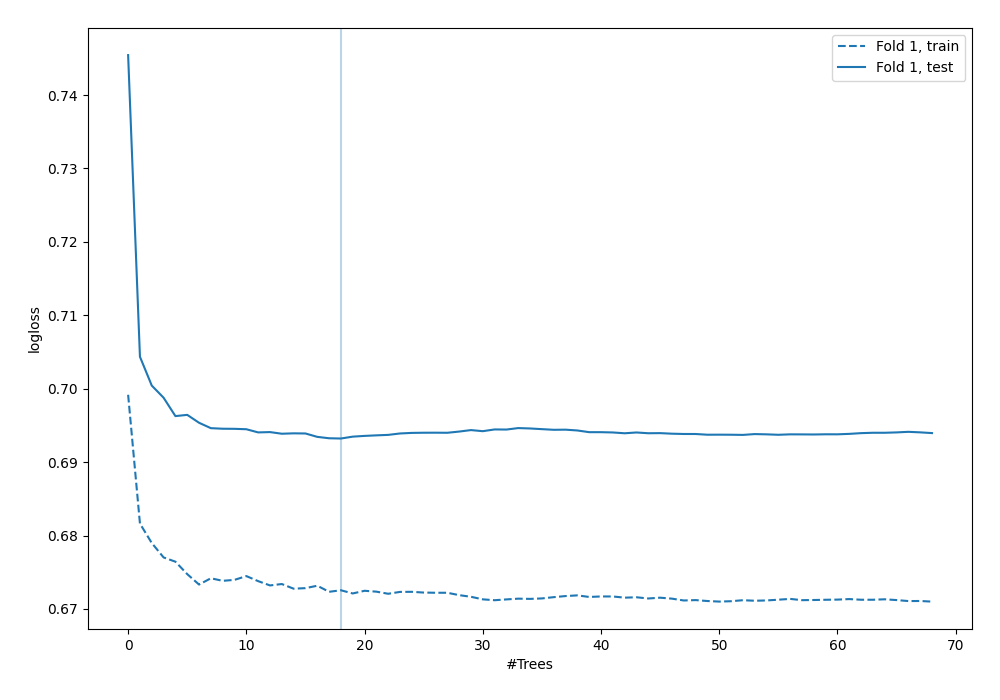
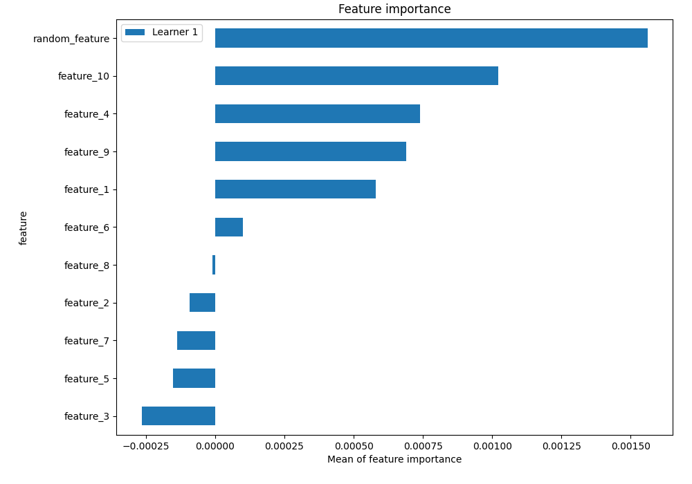

# Summary of 4_Default_RandomForest_RandomFeature

## Random Forest
- **criterion**: gini
- **max_features**: 0.6
- **min_samples_split**: 30
- **max_depth**: 6
- **explain_level**: 1

## Validation
 - **validation_type**: split
 - **train_ratio**: 0.75
 - **shuffle**: True
 - **stratify**: True

## Optimized metric
logloss

## Training time

2.8 seconds

## Metric details
|           |     score |   threshold |
|:----------|----------:|------------:|
| logloss   | 0.693219  |  nan        |
| auc       | 0.518718  |  nan        |
| f1        | 0.660595  |    0.333534 |
| accuracy  | 0.5184    |    0.499923 |
| precision | 0.529897  |    0.511913 |
| recall    | 1         |    0.333534 |
| mcc       | 0.0523673 |    0.474249 |

## Confusion matrix (at threshold=0.499923)
|                     |   Predicted as negative |   Predicted as positive |
|:--------------------|------------------------:|------------------------:|
| Labeled as negative |                       0 |                    1267 |
| Labeled as positive |                       0 |                    1233 |

## Learning curves

## Permutation-based Importance
