## Feature : target
- **Feature type** : discrete
- **Missing** : 0.0%
- **Unique** : 2
- **Count** :10000.0
- **Mean** :0.493
- **Std** :0.4999759970236171
- **Min** :0.0
- **25%th Percentile** : 0.0
- **50%th Percentile** : 0.0
- **75%th Percentile** : 1.0
- **Max** :1.0

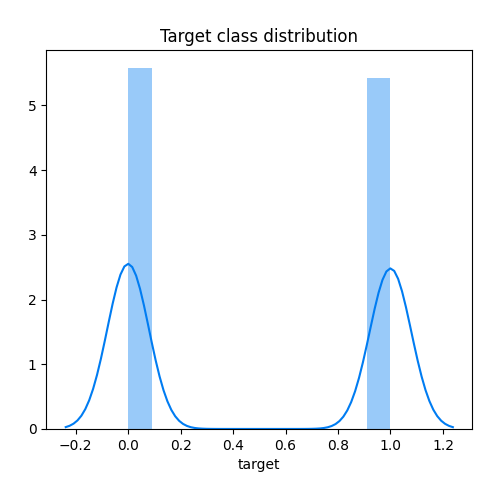
## Feature : feature_1
- **Feature type** : continous
- **Missing** : 0.0%
- **Unique** : 10000
- **Count** :10000.0
- **Mean** :0.4984078937829854
- **Std** :0.28892497435729847
- **Min** :1.8653523600753452e-05
- **25%th Percentile** : 0.24861321375452106
- **50%th Percentile** : 0.4981945531905171
- **75%th Percentile** : 0.749291634129287
- **Max** :0.9999887305623005

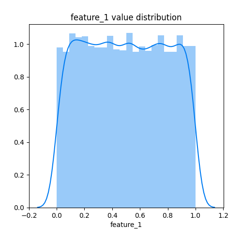
## Feature : feature_2
- **Feature type** : continous
- **Missing** : 0.0%
- **Unique** : 10000
- **Count** :10000.0
- **Mean** :0.5037975053686254
- **Std** :0.2883228421139752
- **Min** :1.3994775410530735e-05
- **25%th Percentile** : 0.25606139575065123
- **50%th Percentile** : 0.5084943728529474
- **75%th Percentile** : 0.7503631929121155
- **Max** :0.9998186995246916

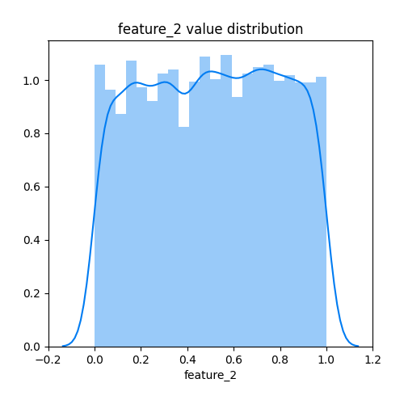
## Feature : feature_3
- **Feature type** : continous
- **Missing** : 0.0%
- **Unique** : 10000
- **Count** :10000.0
- **Mean** :0.5000867622441076
- **Std** :0.28892081749267967
- **Min** :3.739937890001599e-05
- **25%th Percentile** : 0.24969860063519395
- **50%th Percentile** : 0.4967152042979139
- **75%th Percentile** : 0.7493068612430771
- **Max** :0.9999894838400878

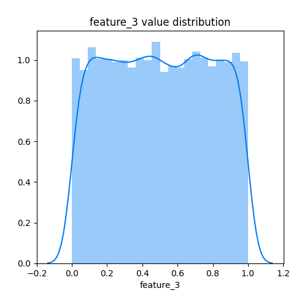
## Feature : feature_4
- **Feature type** : continous
- **Missing** : 0.0%
- **Unique** : 10000
- **Count** :10000.0
- **Mean** :0.49214075130874135
- **Std** :0.28958994415057576
- **Min** :3.498467718976439e-05
- **25%th Percentile** : 0.23778841052159488
- **50%th Percentile** : 0.4876859502808339
- **75%th Percentile** : 0.7423713883613356
- **Max** :0.9999749368207638

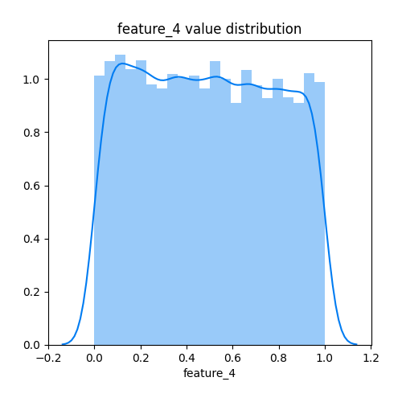
## Feature : feature_5
- **Feature type** : continous
- **Missing** : 0.0%
- **Unique** : 10000
- **Count** :10000.0
- **Mean** :0.5041780318389167
- **Std** :0.28754134208990134
- **Min** :0.00014497464729579246
- **25%th Percentile** : 0.2561945475509842
- **50%th Percentile** : 0.5052192236760207
- **75%th Percentile** : 0.7503850685192176
- **Max** :0.9998078977712788

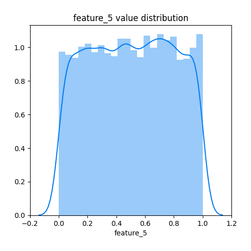
## Feature : feature_6
- **Feature type** : continous
- **Missing** : 0.0%
- **Unique** : 10000
- **Count** :10000.0
- **Mean** :0.49608788326026626
- **Std** :0.28749822008510106
- **Min** :0.0001318022980082434
- **25%th Percentile** : 0.24869273508472264
- **50%th Percentile** : 0.49587913597296046
- **75%th Percentile** : 0.7433264294218399
- **Max** :0.9999331468398904

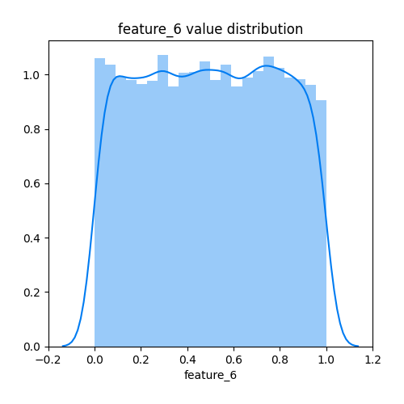
## Feature : feature_7
- **Feature type** : continous
- **Missing** : 0.0%
- **Unique** : 10000
- **Count** :10000.0
- **Mean** :0.4976908409808476
- **Std** :0.287485384693267
- **Min** :9.935835405328053e-05
- **25%th Percentile** : 0.24715076190932111
- **50%th Percentile** : 0.5008302852943316
- **75%th Percentile** : 0.7450662169500273
- **Max** :0.9999959238405425

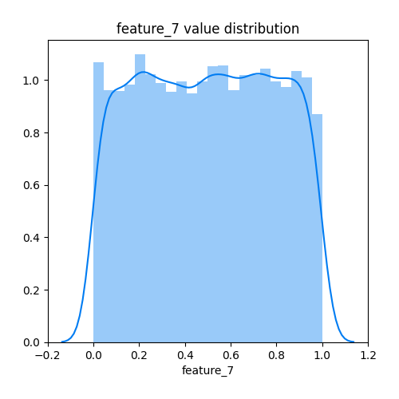
## Feature : feature_8
- **Feature type** : continous
- **Missing** : 0.0%
- **Unique** : 10000
- **Count** :10000.0
- **Mean** :0.4996213863139642
- **Std** :0.2883109083212732
- **Min** :0.00012628388180013772
- **25%th Percentile** : 0.2499424028099385
- **50%th Percentile** : 0.5024710267084695
- **75%th Percentile** : 0.7488557331328473
- **Max** :0.9999994752468082

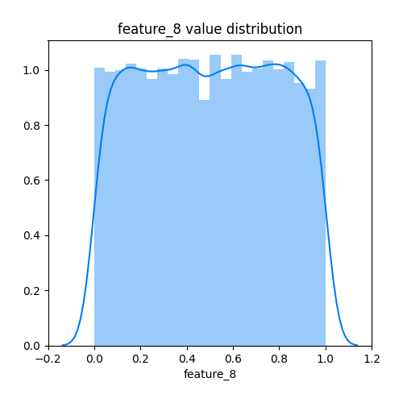
## Feature : feature_9
- **Feature type** : continous
- **Missing** : 0.0%
- **Unique** : 10000
- **Count** :10000.0
- **Mean** :0.4979905153632149
- **Std** :0.288413342488594
- **Min** :0.0002929079840426896
- **25%th Percentile** : 0.24612091207589015
- **50%th Percentile** : 0.4962437865544459
- **75%th Percentile** : 0.7480062621747142
- **Max** :0.9999812962558062

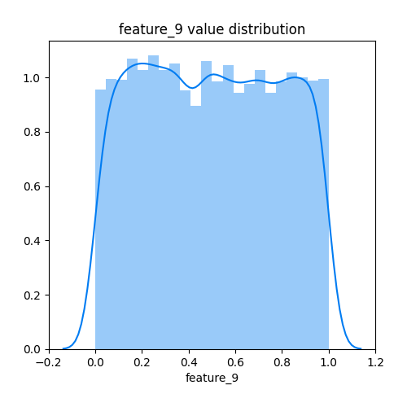
## Feature : feature_10
- **Feature type** : continous
- **Missing** : 0.0%
- **Unique** : 10000
- **Count** :10000.0
- **Mean** :0.5008975501617355
- **Std** :0.28956915493912383
- **Min** :0.00012769707122051166
- **25%th Percentile** : 0.24747820958461786
- **50%th Percentile** : 0.5038477114212792
- **75%th Percentile** : 0.754626759017172
- **Max** :0.9999164772393179

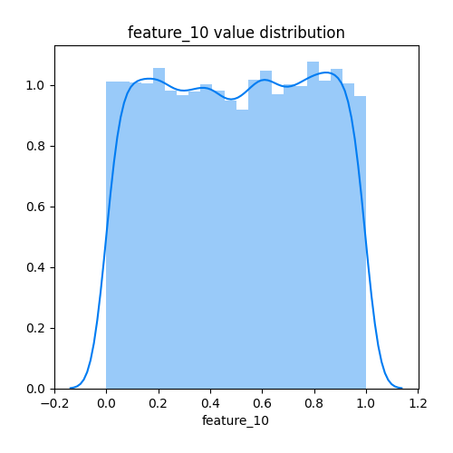
