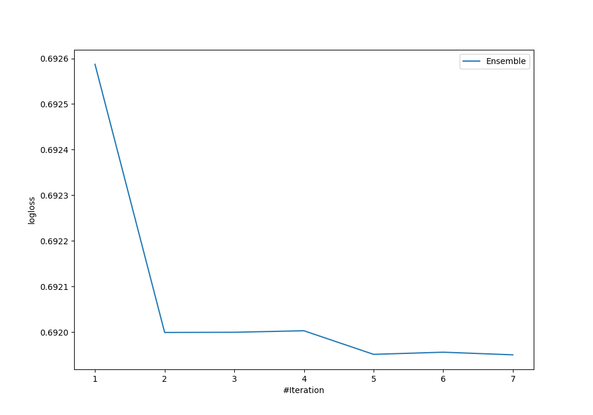

# Summary of Ensemble

## Ensemble structure
| Model                                |   Weight |
|:-------------------------------------|---------:|
| 4_Default_RandomForest               |        3 |
| 4_Default_RandomForest_RandomFeature |        1 |
| 6_Default_NeuralNetwork              |        3 |

## Metric details
|           |     score |   threshold |
|:----------|----------:|------------:|
| logloss   | 0.69195   |  nan        |
| auc       | 0.524601  |  nan        |
| f1        | 0.660595  |    0.36947  |
| accuracy  | 0.5288    |    0.507313 |
| precision | 0.578947  |    0.530736 |
| recall    | 1         |    0.36947  |
| mcc       | 0.0635192 |    0.509269 |

## Confusion matrix (at threshold=0.507313)
|                     |   Predicted as negative |   Predicted as positive |
|:--------------------|------------------------:|------------------------:|
| Labeled as negative |                       0 |                    1267 |
| Labeled as positive |                       0 |                    1233 |

## Learning curves
