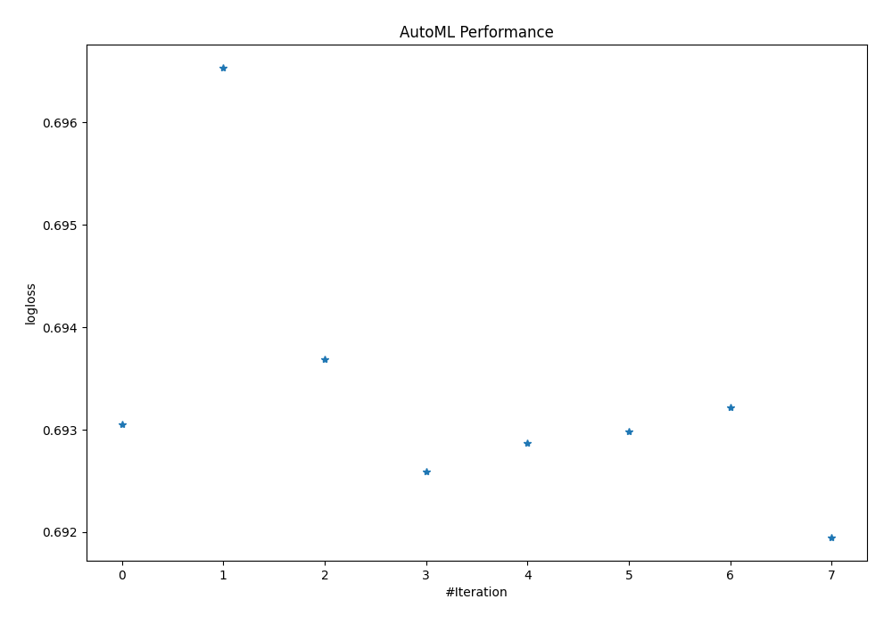
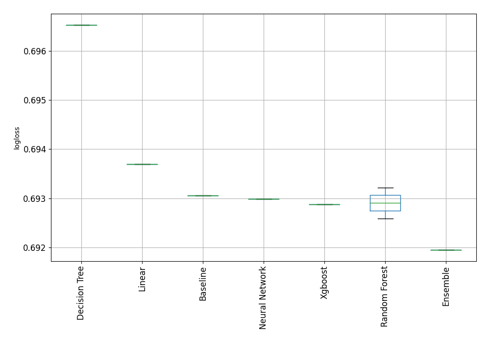

# AutoML Leaderboard

| Best model   | name                                 | model_type     | metric_type   |   metric_value |   train_time | Link                                                           |
|:-------------|:-------------------------------------|:---------------|:--------------|---------------:|-------------:|:---------------------------------------------------------------|
|              | 1_Baseline                           | Baseline       | logloss       |       0.693055 |         0.16 | [Results link](1_Baseline/README.md)                           |
|              | 2_DecisionTree                       | Decision Tree  | logloss       |       0.696531 |         6.01 | [Results link](2_DecisionTree/README.md)                       |
|              | 3_Linear                             | Linear         | logloss       |       0.693691 |         3.79 | [Results link](3_Linear/README.md)                             |
|              | 4_Default_RandomForest               | Random Forest  | logloss       |       0.692587 |         5.7  | [Results link](4_Default_RandomForest/README.md)               |
|              | 5_Default_Xgboost                    | Xgboost        | logloss       |       0.692873 |         3.87 | [Results link](5_Default_Xgboost/README.md)                    |
|              | 6_Default_NeuralNetwork              | Neural Network | logloss       |       0.692984 |         4.66 | [Results link](6_Default_NeuralNetwork/README.md)              |
|              | 4_Default_RandomForest_RandomFeature | Random Forest  | logloss       |       0.693219 |         3.17 | [Results link](4_Default_RandomForest_RandomFeature/README.md) |
| **the best** | Ensemble                             | Ensemble       | logloss       |       0.69195  |         0.94 | [Results link](Ensemble/README.md)                             |

### AutoML Performance

### AutoML Performance Boxplot
