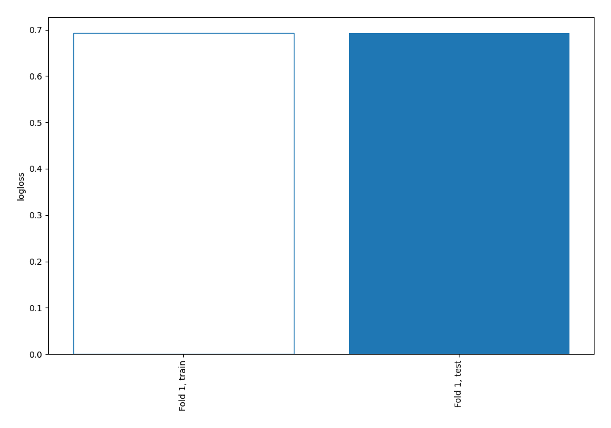

# Summary of 1_Baseline

## Baseline Classifier (Baseline)
- **explain_level**: 2

## Validation
 - **validation_type**: split
 - **train_ratio**: 0.75
 - **shuffle**: True
 - **stratify**: True

## Optimized metric
logloss

## Training time

0.0 seconds

## Metric details
|           |    score |   threshold |
|:----------|---------:|------------:|
| logloss   | 0.692639 |    nan      |
| auc       | 0.5      |    nan      |
| f1        | 0.680739 |      0.4632 |
| accuracy  | 0.516    |      0.4632 |
| precision | 0.516    |      0.4632 |
| recall    | 1        |      0.4632 |
| mcc       | 0        |      0.4632 |

## Confusion matrix (at threshold=0.4632)
|                     |   Predicted as negative |   Predicted as positive |
|:--------------------|------------------------:|------------------------:|
| Labeled as negative |                       0 |                     121 |
| Labeled as positive |                       0 |                     129 |

## Learning curves
