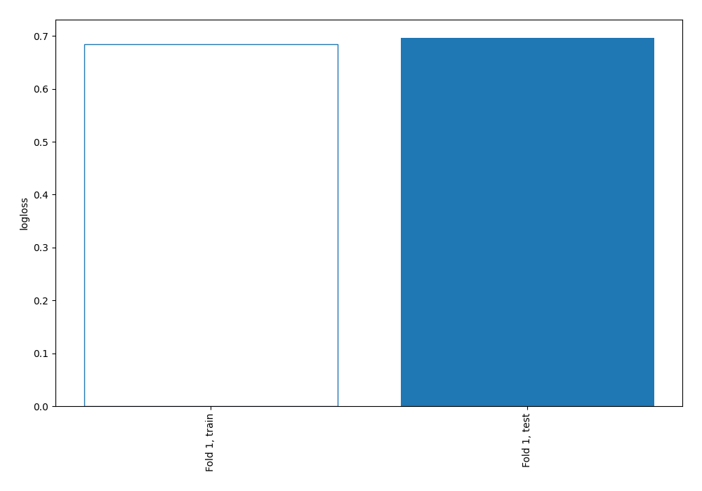
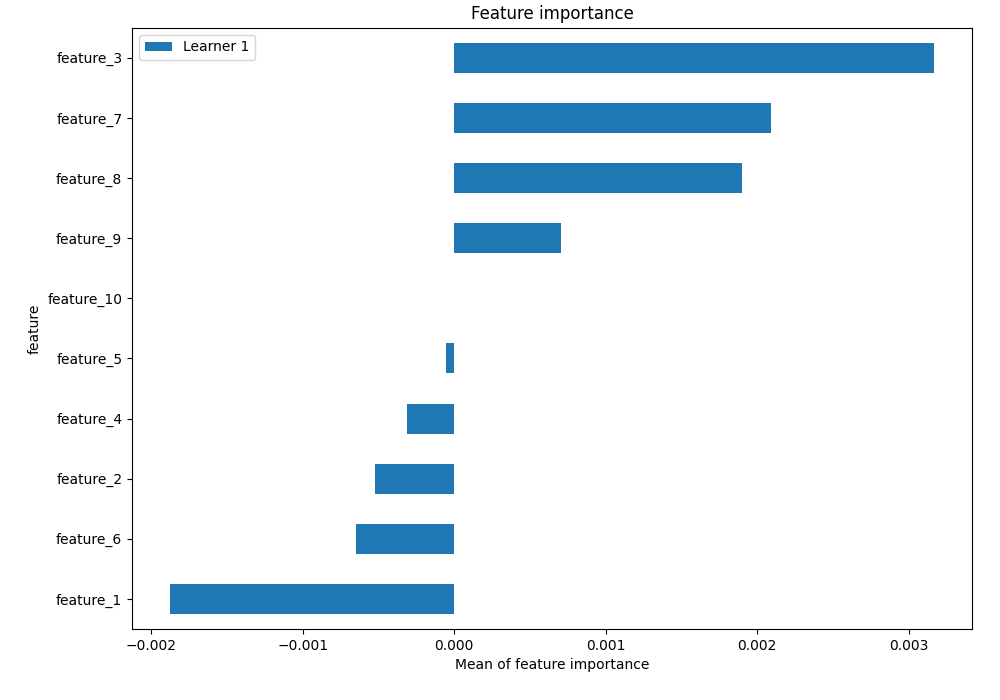
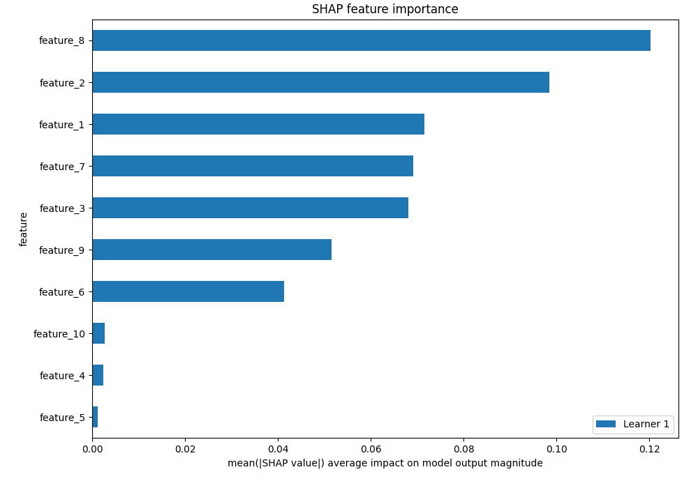
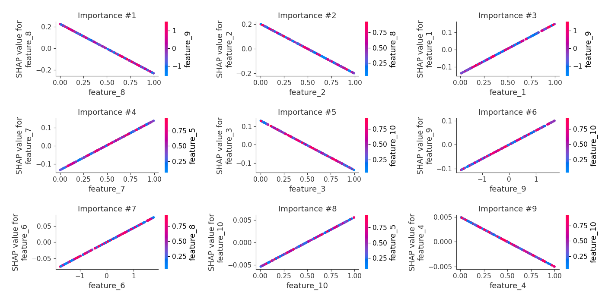
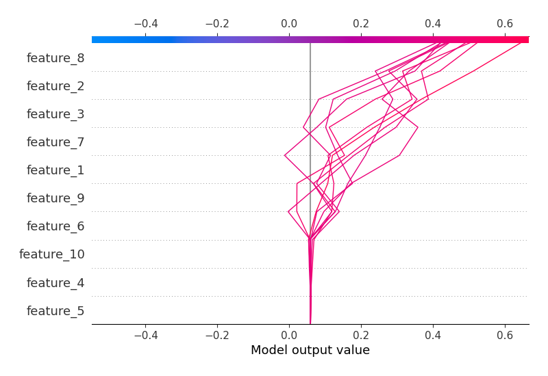
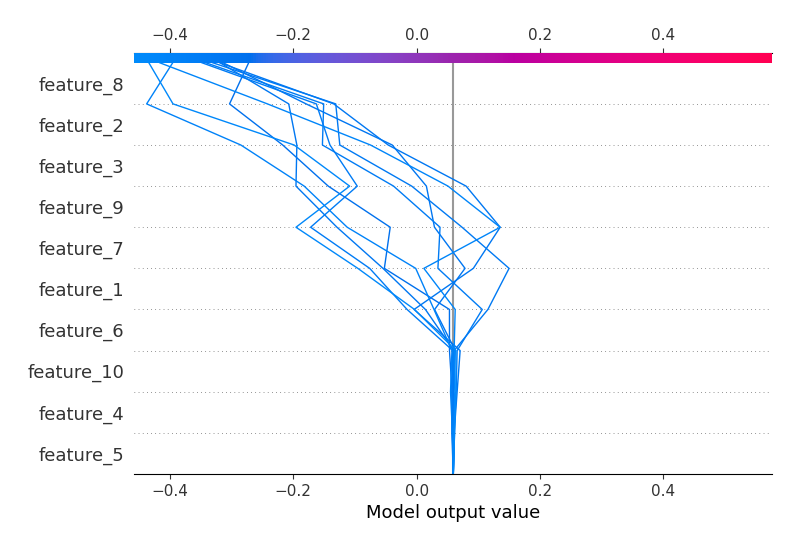
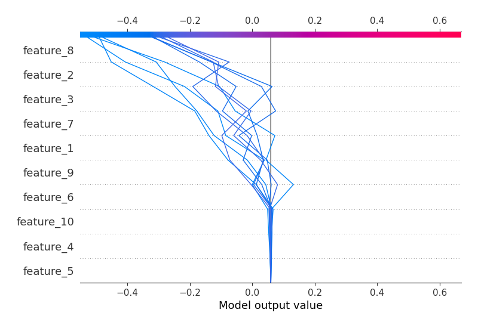
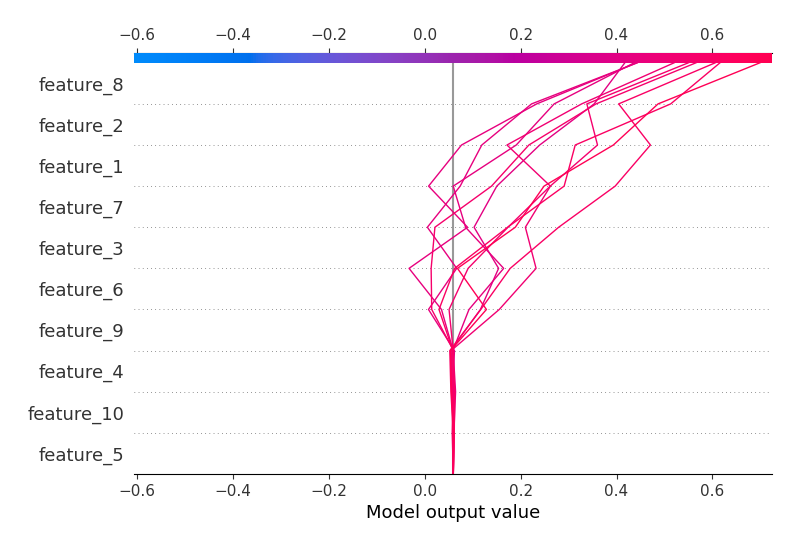

# Summary of 3_Linear

## Logistic Regression (Linear)
- **explain_level**: 2

## Validation
 - **validation_type**: split
 - **train_ratio**: 0.75
 - **shuffle**: True
 - **stratify**: True

## Optimized metric
logloss

## Training time

5.4 seconds

## Metric details
|           |     score |   threshold |
|:----------|----------:|------------:|
| logloss   | 0.696153  |  nan        |
| auc       | 0.515536  |  nan        |
| f1        | 0.680739  |    0.334116 |
| accuracy  | 0.54      |    0.464913 |
| precision | 0.666667  |    0.6209   |
| recall    | 1         |    0.334116 |
| mcc       | 0.0760389 |    0.464913 |

## Confusion matrix (at threshold=0.464913)
|                     |   Predicted as negative |   Predicted as positive |
|:--------------------|------------------------:|------------------------:|
| Labeled as negative |                       0 |                     121 |
| Labeled as positive |                       0 |                     129 |

## Learning curves

## Coefficients
| feature    |   Learner_1 |
|:-----------|------------:|
| intercept  |  0.347999   |
| feature_1  |  0.290862   |
| feature_7  |  0.272887   |
| feature_9  |  0.0594082  |
| feature_6  |  0.0438184  |
| feature_10 |  0.0110764  |
| feature_5  | -0.00477186 |
| feature_4  | -0.0100319  |
| feature_3  | -0.270123   |
| feature_2  | -0.403471   |
| feature_8  | -0.458039   |

## Permutation-based Importance

## SHAP Importance

## SHAP Dependence plots

### Dependence (Fold #1)

## SHAP Decision plots

### Top-10 Worst decisions for class 0 (Fold #1)

### Top-10 Best decisions for class 0 (Fold #1)

### Top-10 Worst decisions for class 1 (Fold #1)

### Top-10 Best decisions for class 1 (Fold #1)
