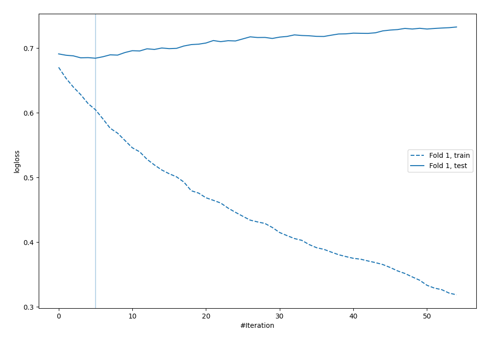
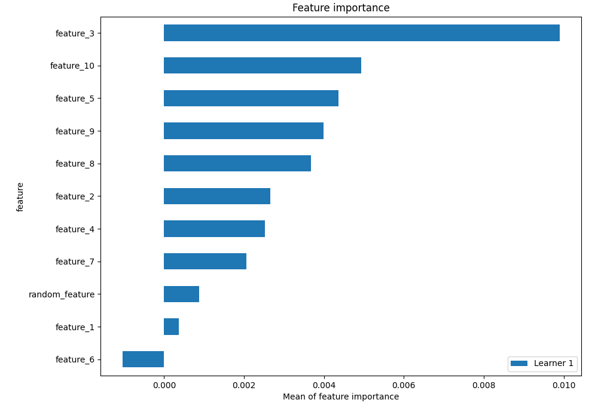

# Summary of 5_Default_Xgboost_RandomFeature

## Extreme Gradient Boosting (Xgboost)
- **objective**: binary:logistic
- **eval_metric**: logloss
- **eta**: 0.1
- **max_depth**: 6
- **min_child_weight**: 1
- **subsample**: 1.0
- **colsample_bytree**: 1.0
- **explain_level**: 1

## Validation
 - **validation_type**: split
 - **train_ratio**: 0.75
 - **shuffle**: True
 - **stratify**: True

## Optimized metric
logloss

## Training time

0.6 seconds

## Metric details
|           |    score |   threshold |
|:----------|---------:|------------:|
| logloss   | 0.684524 |  nan        |
| auc       | 0.569287 |  nan        |
| f1        | 0.688047 |    0.443816 |
| accuracy  | 0.572    |    0.445197 |
| precision | 0.636364 |    0.627325 |
| recall    | 1        |    0.307827 |
| mcc       | 0.172717 |    0.443816 |

## Confusion matrix (at threshold=0.445197)
|                     |   Predicted as negative |   Predicted as positive |
|:--------------------|------------------------:|------------------------:|
| Labeled as negative |                      25 |                      96 |
| Labeled as positive |                      11 |                     118 |

## Learning curves

## Permutation-based Importance
