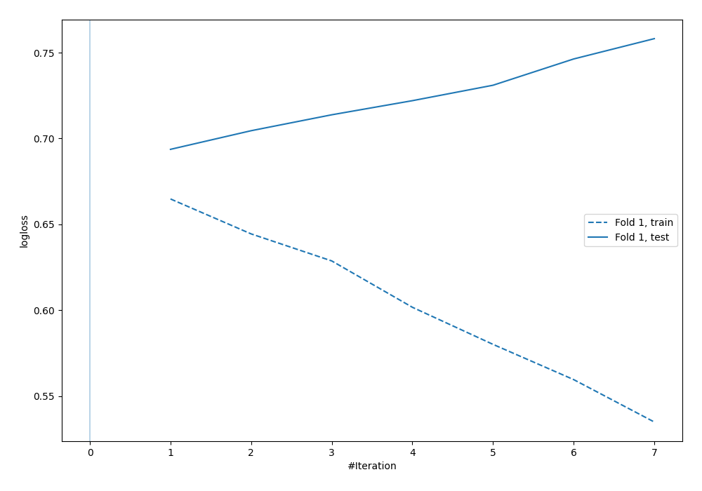
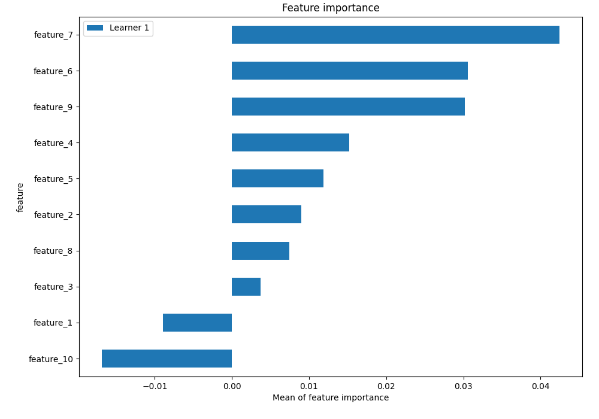

# Summary of 6_Default_NeuralNetwork

## Neural Network
- **dense_layers**: 2
- **dense_1_size**: 32
- **dense_2_size**: 16
- **dropout**: 0
- **learning_rate**: 0.05
- **momentum**: 0.9
- **decay**: 0.001
- **explain_level**: 2

## Validation
 - **validation_type**: split
 - **train_ratio**: 0.75
 - **shuffle**: True
 - **stratify**: True

## Optimized metric
logloss

## Training time

4.5 seconds

## Metric details
|           |    score |   threshold |
|:----------|---------:|------------:|
| logloss   | 0.693683 |  nan        |
| auc       | 0.551733 |  nan        |
| f1        | 0.680739 |    0.203121 |
| accuracy  | 0.564    |    0.556044 |
| precision | 0.678571 |    0.556044 |
| recall    | 1        |    0.203121 |
| mcc       | 0.174779 |    0.556044 |

## Confusion matrix (at threshold=0.556044)
|                     |   Predicted as negative |   Predicted as positive |
|:--------------------|------------------------:|------------------------:|
| Labeled as negative |                       0 |                     121 |
| Labeled as positive |                       0 |                     129 |

## Learning curves

## Permutation-based Importance
