## Feature : target
- **Feature type** : discrete
- **Missing** : 0.0%
- **Unique** : 2
- **Count** :1000.0
- **Mean** :0.515
- **Std** :0.5000250243988044
- **Min** :0.0
- **25%th Percentile** : 0.0
- **50%th Percentile** : 1.0
- **75%th Percentile** : 1.0
- **Max** :1.0

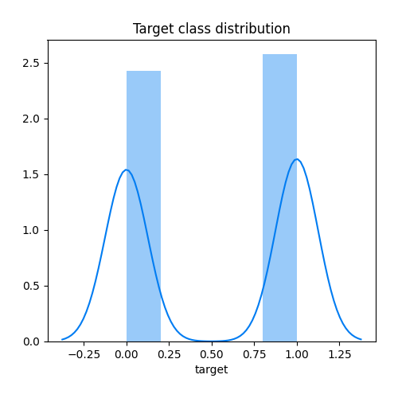
## Feature : feature_1
- **Feature type** : continous
- **Missing** : 0.0%
- **Unique** : 1000
- **Count** :1000.0
- **Mean** :0.4781388477018885
- **Std** :0.28548656118899696
- **Min** :0.0030208713561612477
- **25%th Percentile** : 0.23343835927437867
- **50%th Percentile** : 0.45455859509691
- **75%th Percentile** : 0.7304894801341223
- **Max** :0.9966832779346797

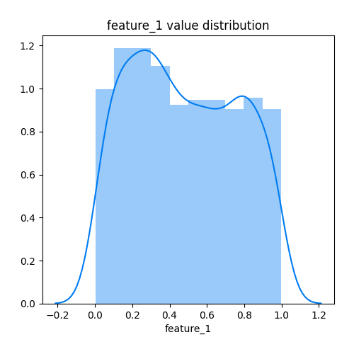
## Feature : feature_2
- **Feature type** : continous
- **Missing** : 0.0%
- **Unique** : 1000
- **Count** :1000.0
- **Mean** :0.49709766968305696
- **Std** :0.29327956160660706
- **Min** :3.071884538241587e-05
- **25%th Percentile** : 0.22817482141219744
- **50%th Percentile** : 0.5040364992291954
- **75%th Percentile** : 0.7522651571675951
- **Max** :0.9997176732861306

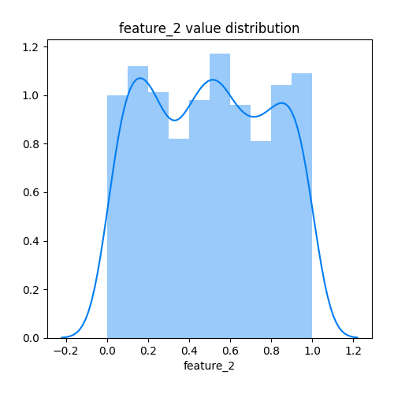
## Feature : feature_3
- **Feature type** : continous
- **Missing** : 0.0%
- **Unique** : 1000
- **Count** :1000.0
- **Mean** :0.49369413190760497
- **Std** :0.2903179088726757
- **Min** :1.1634755366141114e-05
- **25%th Percentile** : 0.2374046882390896
- **50%th Percentile** : 0.5055525326998431
- **75%th Percentile** : 0.7365733172003501
- **Max** :0.9988926120332906

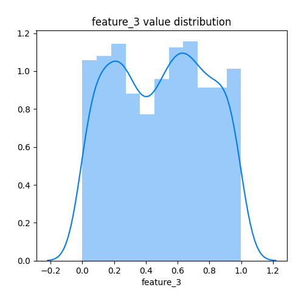
## Feature : feature_4
- **Feature type** : continous
- **Missing** : 0.0%
- **Unique** : 1000
- **Count** :1000.0
- **Mean** :0.49690994690070195
- **Std** :0.28156294563508905
- **Min** :0.00040154402533987277
- **25%th Percentile** : 0.26842965231014027
- **50%th Percentile** : 0.49239777513344934
- **75%th Percentile** : 0.7357311836637538
- **Max** :0.9994606810596731

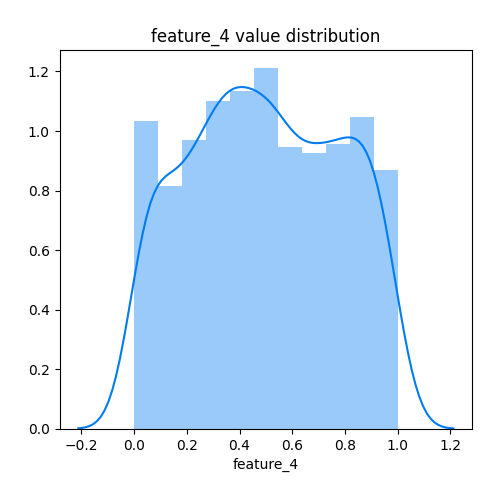
## Feature : feature_5
- **Feature type** : continous
- **Missing** : 0.0%
- **Unique** : 1000
- **Count** :1000.0
- **Mean** :0.4930465277716466
- **Std** :0.28641557264474765
- **Min** :0.00013469300448532007
- **25%th Percentile** : 0.2493866697870291
- **50%th Percentile** : 0.4847143181553243
- **75%th Percentile** : 0.7346215767892585
- **Max** :0.9994137257706666

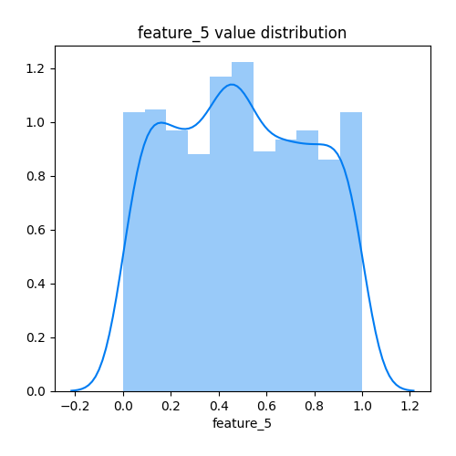
## Feature : feature_6
- **Feature type** : continous
- **Missing** : 0.0%
- **Unique** : 1000
- **Count** :1000.0
- **Mean** :0.5033106589707161
- **Std** :0.29053522799213427
- **Min** :0.0002270382182555375
- **25%th Percentile** : 0.2579909948929964
- **50%th Percentile** : 0.5011964502883994
- **75%th Percentile** : 0.7519894041862907
- **Max** :0.9989046997630767

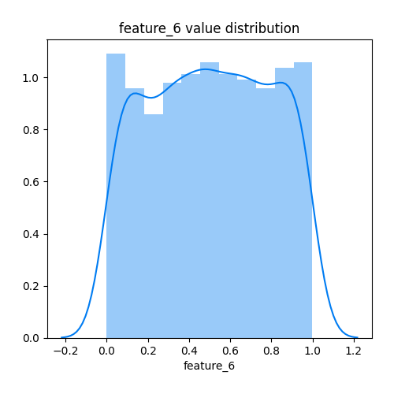
## Feature : feature_7
- **Feature type** : continous
- **Missing** : 0.0%
- **Unique** : 1000
- **Count** :1000.0
- **Mean** :0.49596421960771814
- **Std** :0.285964620191058
- **Min** :0.00041028943917487126
- **25%th Percentile** : 0.24532895047973377
- **50%th Percentile** : 0.49764820787649927
- **75%th Percentile** : 0.7331763631203441
- **Max** :0.9977493890102006

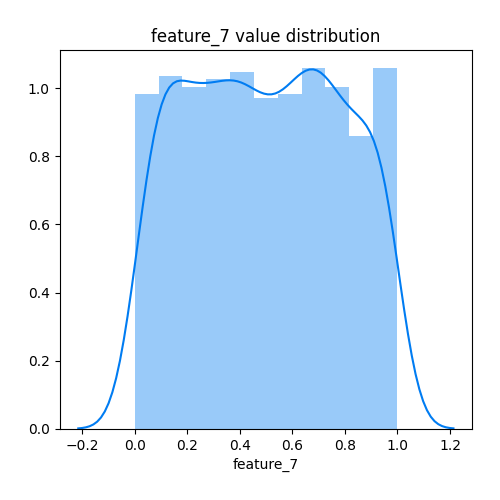
## Feature : feature_8
- **Feature type** : continous
- **Missing** : 0.0%
- **Unique** : 1000
- **Count** :1000.0
- **Mean** :0.48961237727988527
- **Std** :0.2892172095062957
- **Min** :5.282693229680113e-05
- **25%th Percentile** : 0.24239873912448917
- **50%th Percentile** : 0.4804558623016236
- **75%th Percentile** : 0.7426823676574844
- **Max** :0.9995051897085165

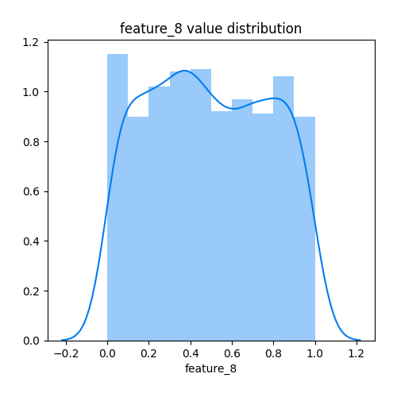
## Feature : feature_9
- **Feature type** : continous
- **Missing** : 0.0%
- **Unique** : 1000
- **Count** :1000.0
- **Mean** :0.5043594702958849
- **Std** :0.286690698032148
- **Min** :0.0009058352460902253
- **25%th Percentile** : 0.2576415402650021
- **50%th Percentile** : 0.5020336108501966
- **75%th Percentile** : 0.7511095873327933
- **Max** :0.9993503004722002

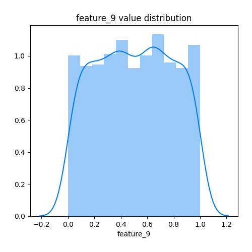
## Feature : feature_10
- **Feature type** : continous
- **Missing** : 0.0%
- **Unique** : 1000
- **Count** :1000.0
- **Mean** :0.48946172672389326
- **Std** :0.28707393033643547
- **Min** :0.0011120941961874076
- **25%th Percentile** : 0.2369153183958879
- **50%th Percentile** : 0.49866517619020667
- **75%th Percentile** : 0.7292075657813875
- **Max** :0.9995577032504386

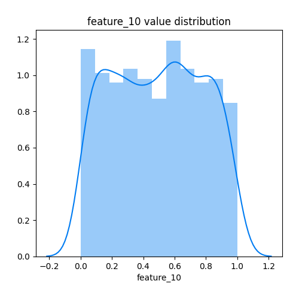
