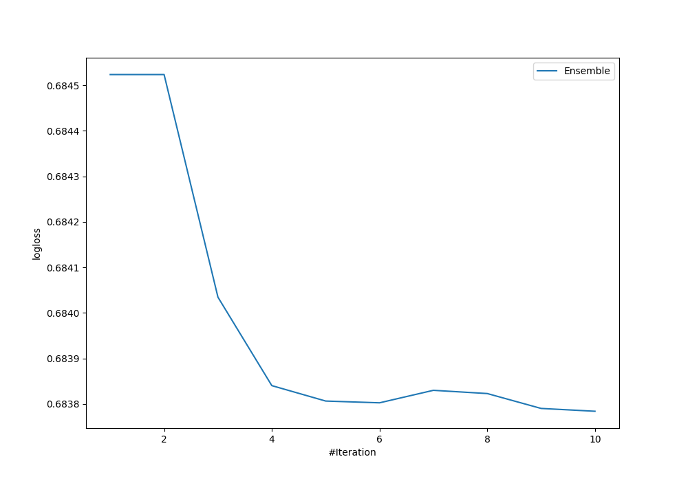

# Summary of Ensemble

## Ensemble structure
| Model                                            |   Weight |
|:-------------------------------------------------|---------:|
| 5_Default_Xgboost_RandomFeature                  |        7 |
| 5_Default_Xgboost_RandomFeature_SelectedFeatures |        1 |
| 6_Default_NeuralNetwork                          |        2 |

## Metric details
|           |    score |   threshold |
|:----------|---------:|------------:|
| logloss   | 0.683784 |  nan        |
| auc       | 0.581523 |  nan        |
| f1        | 0.680739 |    0.335838 |
| accuracy  | 0.576    |    0.533957 |
| precision | 0.632353 |    0.546916 |
| recall    | 1        |    0.335838 |
| mcc       | 0.164572 |    0.533957 |

## Confusion matrix (at threshold=0.533957)
|                     |   Predicted as negative |   Predicted as positive |
|:--------------------|------------------------:|------------------------:|
| Labeled as negative |                       0 |                     121 |
| Labeled as positive |                       0 |                     129 |

## Learning curves
