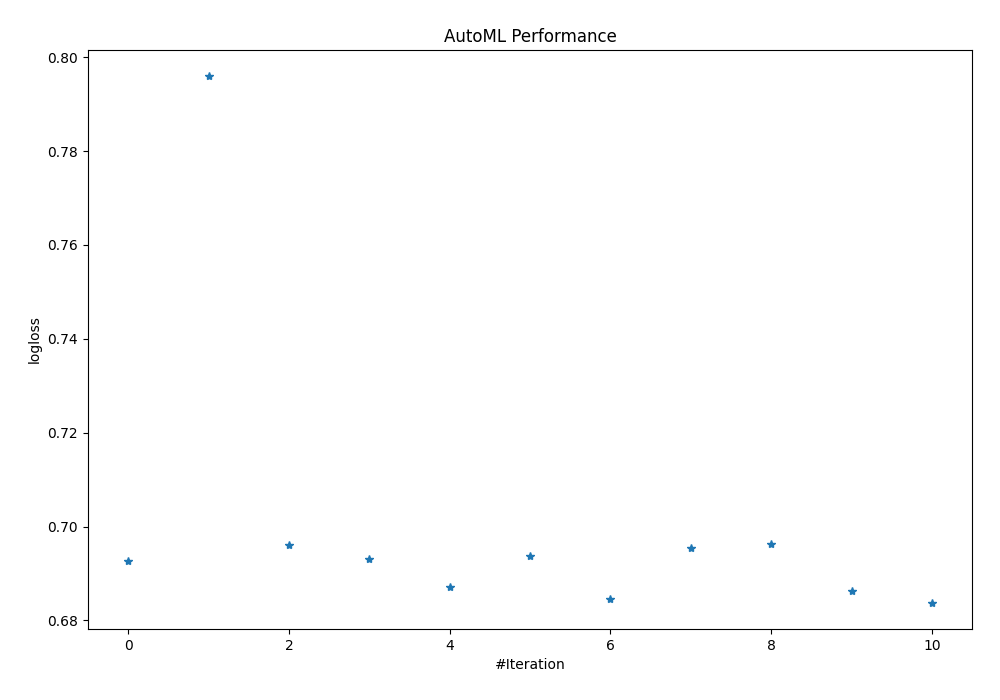

# AutoML Leaderboard

| Best model   | name                                             | model_type     | metric_type   |   metric_value |   train_time | Link                                                                       |
|:-------------|:-------------------------------------------------|:---------------|:--------------|---------------:|-------------:|:---------------------------------------------------------------------------|
|              | 1_Baseline                                       | Baseline       | logloss       |       0.692639 |         0.17 | [Results link](1_Baseline/README.md)                                       |
|              | 2_DecisionTree                                   | Decision Tree  | logloss       |       0.79591  |         9.32 | [Results link](2_DecisionTree/README.md)                                   |
|              | 3_Linear                                         | Linear         | logloss       |       0.696153 |         5.83 | [Results link](3_Linear/README.md)                                         |
|              | 4_Default_RandomForest                           | Random Forest  | logloss       |       0.693047 |         7.18 | [Results link](4_Default_RandomForest/README.md)                           |
|              | 5_Default_Xgboost                                | Xgboost        | logloss       |       0.687018 |         3.86 | [Results link](5_Default_Xgboost/README.md)                                |
|              | 6_Default_NeuralNetwork                          | Neural Network | logloss       |       0.693683 |         4.75 | [Results link](6_Default_NeuralNetwork/README.md)                          |
|              | 5_Default_Xgboost_RandomFeature                  | Xgboost        | logloss       |       0.684524 |         0.93 | [Results link](5_Default_Xgboost_RandomFeature/README.md)                  |
|              | 6_Default_NeuralNetwork_SelectedFeatures         | Neural Network | logloss       |       0.695517 |         4.56 | [Results link](6_Default_NeuralNetwork_SelectedFeatures/README.md)         |
|              | 4_Default_RandomForest_SelectedFeatures          | Random Forest  | logloss       |       0.696178 |         5.78 | [Results link](4_Default_RandomForest_SelectedFeatures/README.md)          |
|              | 5_Default_Xgboost_RandomFeature_SelectedFeatures | Xgboost        | logloss       |       0.686194 |         1    | [Results link](5_Default_Xgboost_RandomFeature_SelectedFeatures/README.md) |
| **the best** | Ensemble                                         | Ensemble       | logloss       |       0.683784 |         0.77 | [Results link](Ensemble/README.md)                                         |

### AutoML Performance

### AutoML Performance Boxplot
