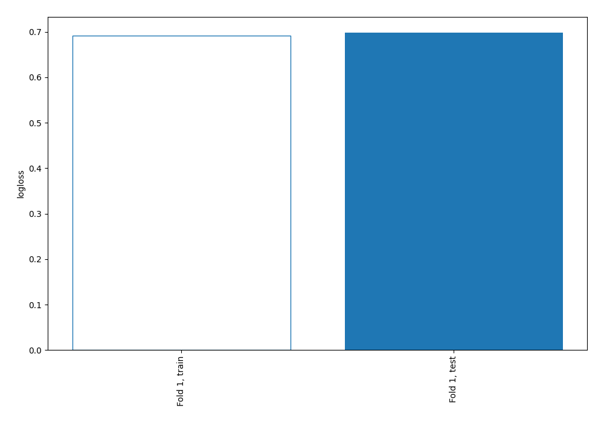
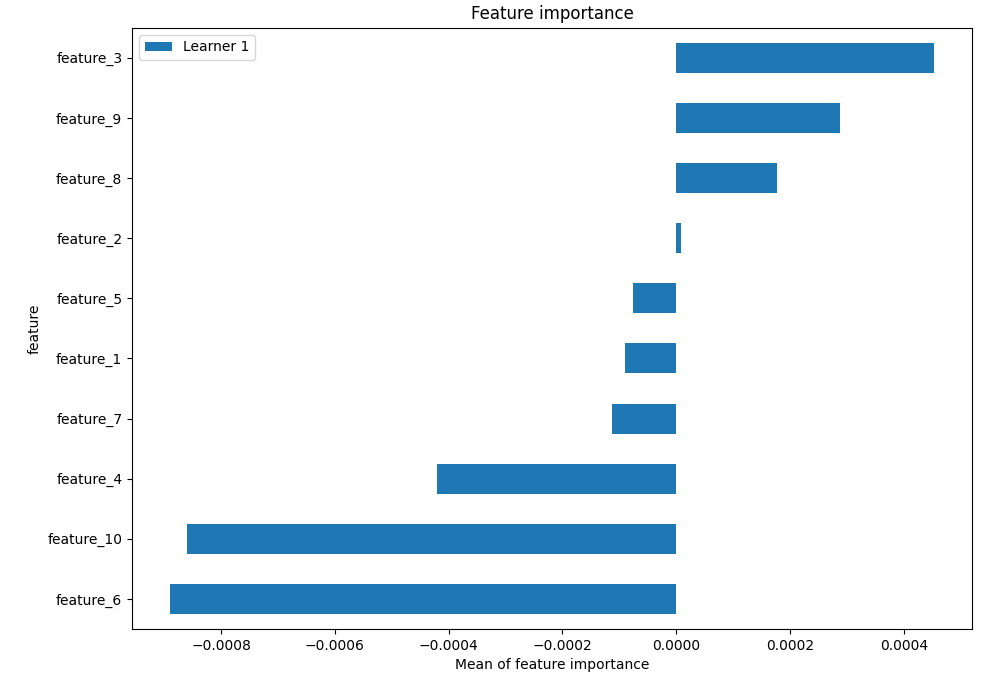
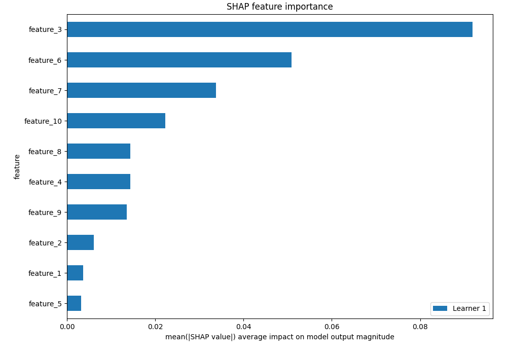
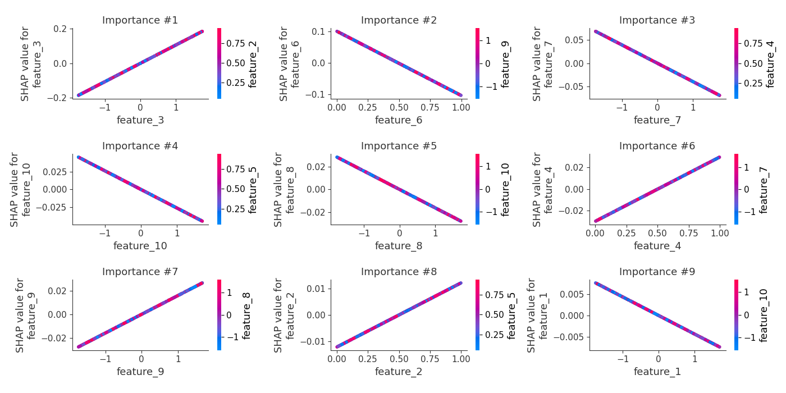
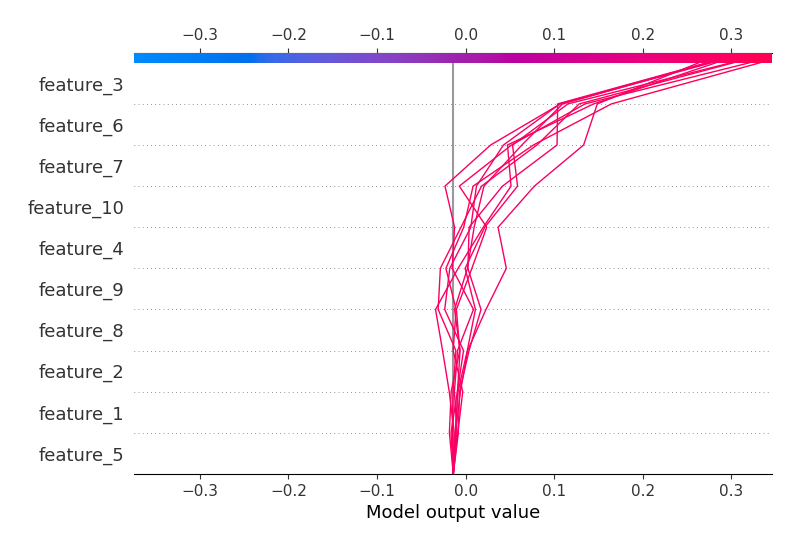
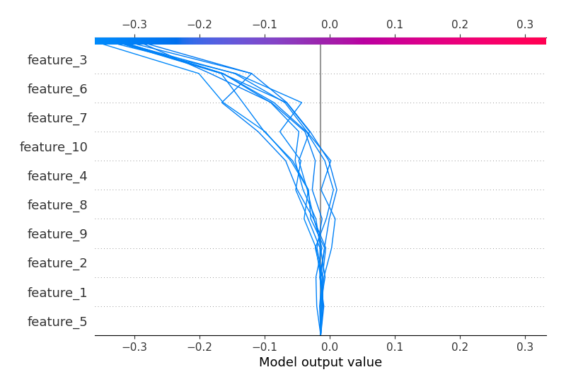
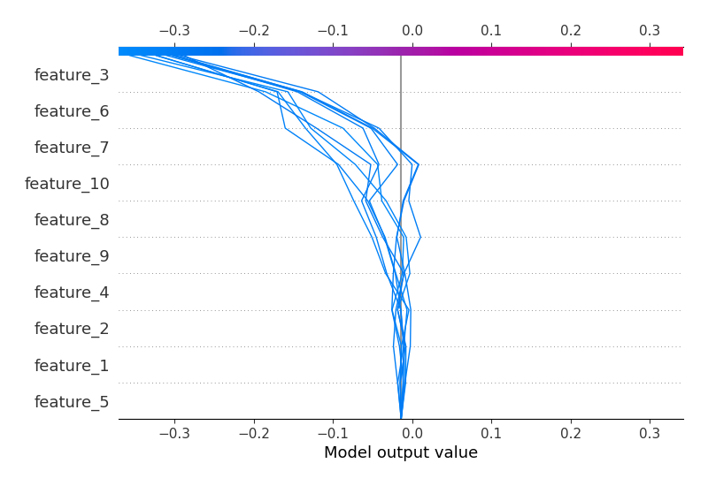

# Summary of 3_Linear

## Logistic Regression (Linear)
- **explain_level**: 2

## Validation
 - **validation_type**: split
 - **train_ratio**: 0.75
 - **shuffle**: True
 - **stratify**: True

## Optimized metric
logloss

## Training time

3.1 seconds

## Metric details
|           |     score |   threshold |
|:----------|----------:|------------:|
| logloss   | 0.698015  |  nan        |
| auc       | 0.477769  |  nan        |
| f1        | 0.663816  |    0.370601 |
| accuracy  | 0.5024    |    0.467722 |
| precision | 0.499487  |    0.467722 |
| recall    | 1         |    0.370601 |
| mcc       | 0.0132592 |    0.445461 |

## Confusion matrix (at threshold=0.467722)
|                     |   Predicted as negative |   Predicted as positive |
|:--------------------|------------------------:|------------------------:|
| Labeled as negative |                       0 |                     629 |
| Labeled as positive |                       0 |                     621 |

## Learning curves

## Coefficients
| feature    |   Learner_1 |
|:-----------|------------:|
| feature_3  |  0.106531   |
| feature_4  |  0.059384   |
| intercept  |  0.0387243  |
| feature_2  |  0.02413    |
| feature_9  |  0.0159414  |
| feature_5  |  0.0129551  |
| feature_1  | -0.00433705 |
| feature_8  | -0.0162675  |
| feature_10 | -0.026165   |
| feature_7  | -0.0390506  |
| feature_6  | -0.204505   |

## Permutation-based Importance

## SHAP Importance

## SHAP Dependence plots

### Dependence (Fold #1)

## SHAP Decision plots

### Top-10 Worst decisions for class 0 (Fold #1)

### Top-10 Best decisions for class 0 (Fold #1)

### Top-10 Worst decisions for class 1 (Fold #1)

### Top-10 Best decisions for class 1 (Fold #1)
