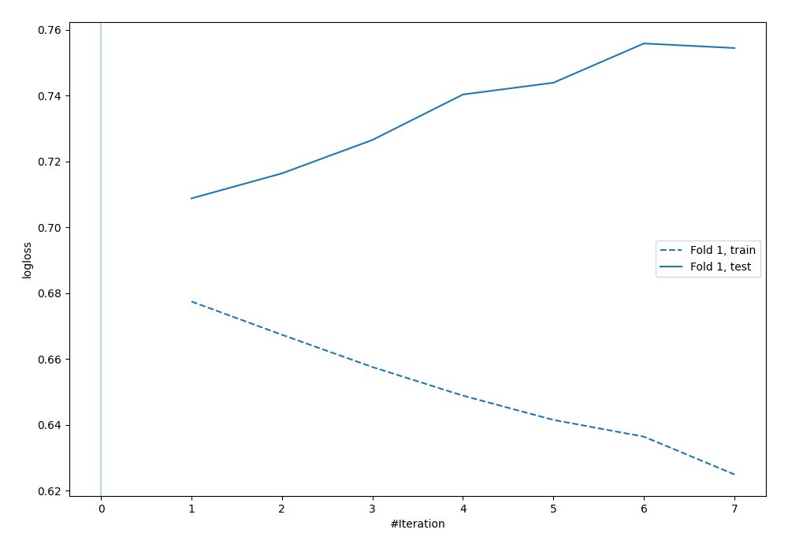
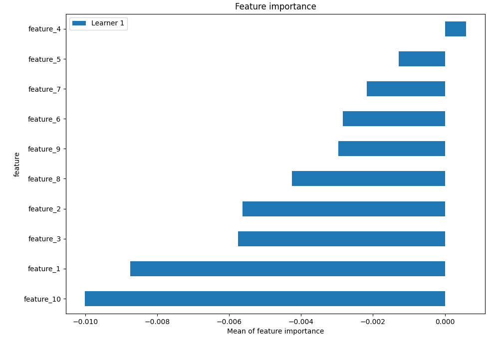

# Summary of 6_Default_NeuralNetwork

## Neural Network
- **dense_layers**: 2
- **dense_1_size**: 32
- **dense_2_size**: 16
- **dropout**: 0
- **learning_rate**: 0.05
- **momentum**: 0.9
- **decay**: 0.001
- **explain_level**: 2

## Validation
 - **validation_type**: split
 - **train_ratio**: 0.75
 - **shuffle**: True
 - **stratify**: True

## Optimized metric
logloss

## Training time

13.9 seconds

## Metric details
|           |     score |   threshold |
|:----------|----------:|------------:|
| logloss   | 0.70879   |   nan       |
| auc       | 0.478161  |   nan       |
| f1        | 0.663816  |     0.25424 |
| accuracy  | 0.5056    |     0.64432 |
| precision | 0.542857  |     0.64432 |
| recall    | 1         |     0.25424 |
| mcc       | 0.0156344 |     0.64432 |

## Confusion matrix (at threshold=0.64432)
|                     |   Predicted as negative |   Predicted as positive |
|:--------------------|------------------------:|------------------------:|
| Labeled as negative |                       0 |                     629 |
| Labeled as positive |                       0 |                     621 |

## Learning curves

## Permutation-based Importance
