## Feature : target
- **Feature type** : discrete
- **Missing** : 0.0%
- **Unique** : 2
- **Count** :5000.0
- **Mean** :0.4966
- **Std** :0.5000384462114268
- **Min** :0.0
- **25%th Percentile** : 0.0
- **50%th Percentile** : 0.0
- **75%th Percentile** : 1.0
- **Max** :1.0

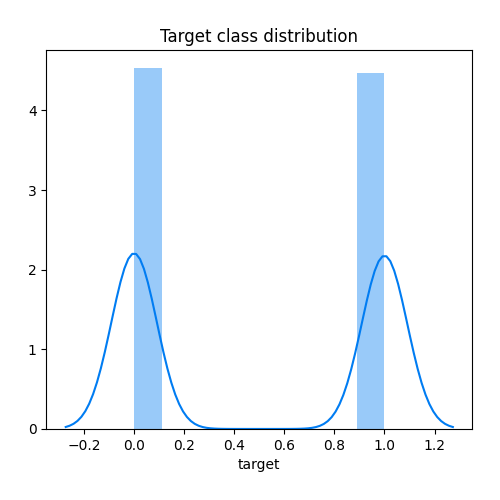
## Feature : feature_1
- **Feature type** : continous
- **Missing** : 0.0%
- **Unique** : 5000
- **Count** :5000.0
- **Mean** :0.5012567519229308
- **Std** :0.28715928403172125
- **Min** :2.8245575196539363e-06
- **25%th Percentile** : 0.25643342626297727
- **50%th Percentile** : 0.5002606592545504
- **75%th Percentile** : 0.7449393117106015
- **Max** :0.9998646178658074

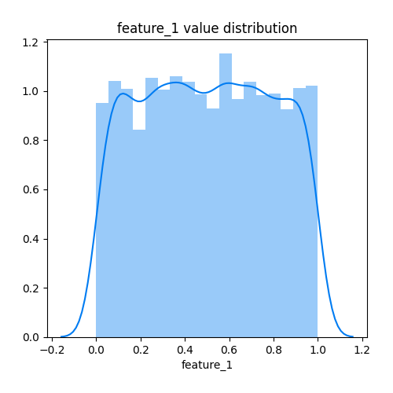
## Feature : feature_2
- **Feature type** : continous
- **Missing** : 0.0%
- **Unique** : 5000
- **Count** :5000.0
- **Mean** :0.4984056235431328
- **Std** :0.28909847280554507
- **Min** :0.00016895997688592956
- **25%th Percentile** : 0.2501655309625277
- **50%th Percentile** : 0.49860754272232566
- **75%th Percentile** : 0.7465733851121379
- **Max** :0.9999712110208063

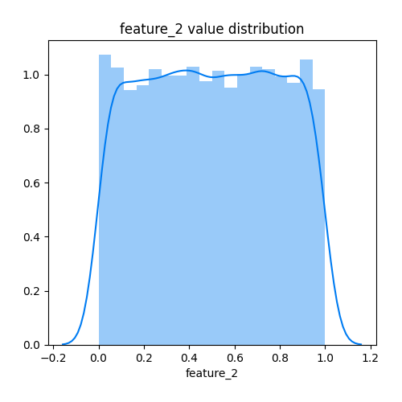
## Feature : feature_3
- **Feature type** : continous
- **Missing** : 0.0%
- **Unique** : 5000
- **Count** :5000.0
- **Mean** :0.5019231690917888
- **Std** :0.2866597867402486
- **Min** :0.0004346454635332231
- **25%th Percentile** : 0.2603326622873212
- **50%th Percentile** : 0.48872695437224206
- **75%th Percentile** : 0.7523718987141718
- **Max** :0.9999791484778461

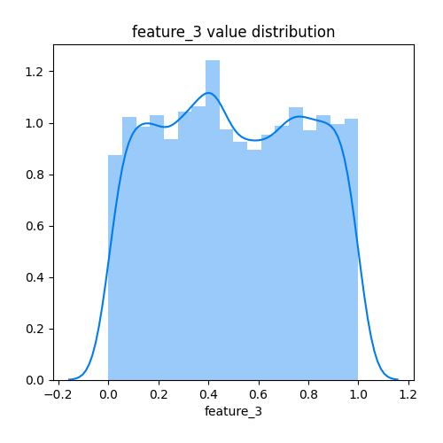
## Feature : feature_4
- **Feature type** : continous
- **Missing** : 0.0%
- **Unique** : 5000
- **Count** :5000.0
- **Mean** :0.4991654858278096
- **Std** :0.2861494230438106
- **Min** :0.0006384616711656577
- **25%th Percentile** : 0.25434638827861145
- **50%th Percentile** : 0.49020459391121934
- **75%th Percentile** : 0.7448262650154397
- **Max** :0.9999951186805913

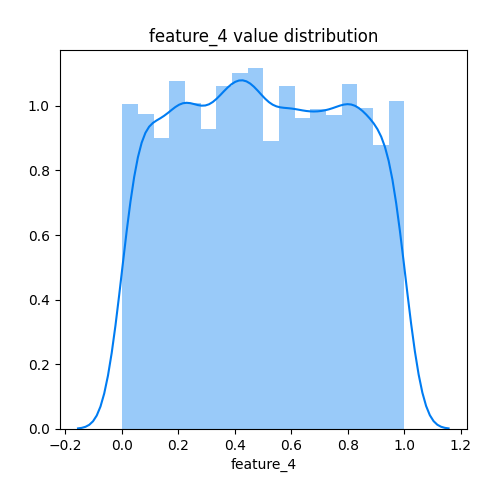
## Feature : feature_5
- **Feature type** : continous
- **Missing** : 0.0%
- **Unique** : 5000
- **Count** :5000.0
- **Mean** :0.49814173626125857
- **Std** :0.2902662037127267
- **Min** :0.00012650275000603006
- **25%th Percentile** : 0.24669740737102988
- **50%th Percentile** : 0.49520822406588627
- **75%th Percentile** : 0.7516405483277298
- **Max** :0.9999394121219466

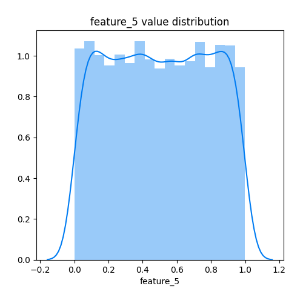
## Feature : feature_6
- **Feature type** : continous
- **Missing** : 0.0%
- **Unique** : 5000
- **Count** :5000.0
- **Mean** :0.4964191704125902
- **Std** :0.2892333735236705
- **Min** :0.0002445285020142851
- **25%th Percentile** : 0.24440676380064882
- **50%th Percentile** : 0.49391018323675306
- **75%th Percentile** : 0.7444687575322024
- **Max** :0.9999158579028213

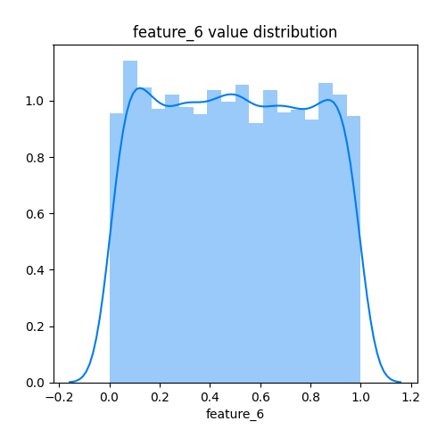
## Feature : feature_7
- **Feature type** : continous
- **Missing** : 0.0%
- **Unique** : 5000
- **Count** :5000.0
- **Mean** :0.5025755387959744
- **Std** :0.2853450898723086
- **Min** :3.767673963483986e-06
- **25%th Percentile** : 0.2620795725179743
- **50%th Percentile** : 0.5037494489177502
- **75%th Percentile** : 0.743041998814336
- **Max** :0.9999358207691946

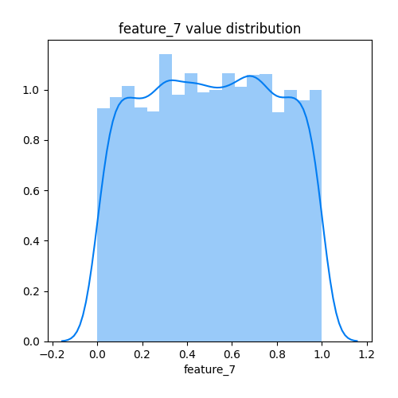
## Feature : feature_8
- **Feature type** : continous
- **Missing** : 0.0%
- **Unique** : 5000
- **Count** :5000.0
- **Mean** :0.5046226031252244
- **Std** :0.28781167842845967
- **Min** :1.6814000731946166e-05
- **25%th Percentile** : 0.2544653447620556
- **50%th Percentile** : 0.5074141293840175
- **75%th Percentile** : 0.7528751170234816
- **Max** :0.9999417283143802

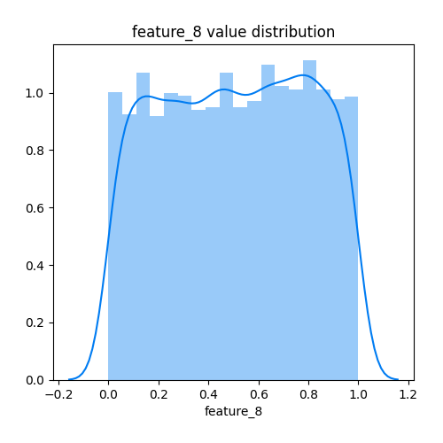
## Feature : feature_9
- **Feature type** : continous
- **Missing** : 0.0%
- **Unique** : 5000
- **Count** :5000.0
- **Mean** :0.5069743372719302
- **Std** :0.2912839207828591
- **Min** :0.00038267580679751667
- **25%th Percentile** : 0.25251974736498906
- **50%th Percentile** : 0.5097502995955434
- **75%th Percentile** : 0.7608067542457161
- **Max** :0.9999894841790959

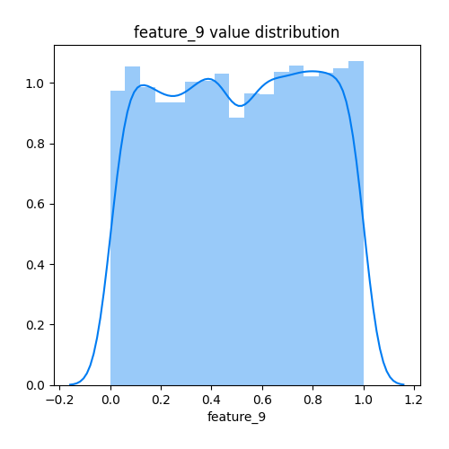
## Feature : feature_10
- **Feature type** : continous
- **Missing** : 0.0%
- **Unique** : 5000
- **Count** :5000.0
- **Mean** :0.5001017297282582
- **Std** :0.28894364196205713
- **Min** :0.0005196529654398763
- **25%th Percentile** : 0.24445751009888209
- **50%th Percentile** : 0.4956979273188786
- **75%th Percentile** : 0.7561531386631168
- **Max** :0.9999322951172022

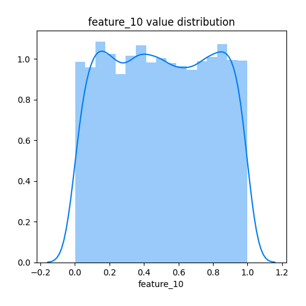
