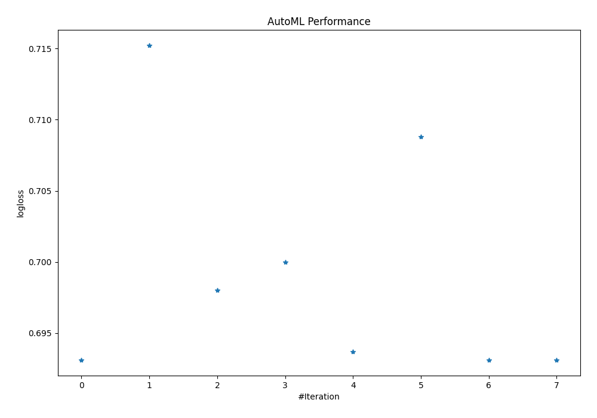
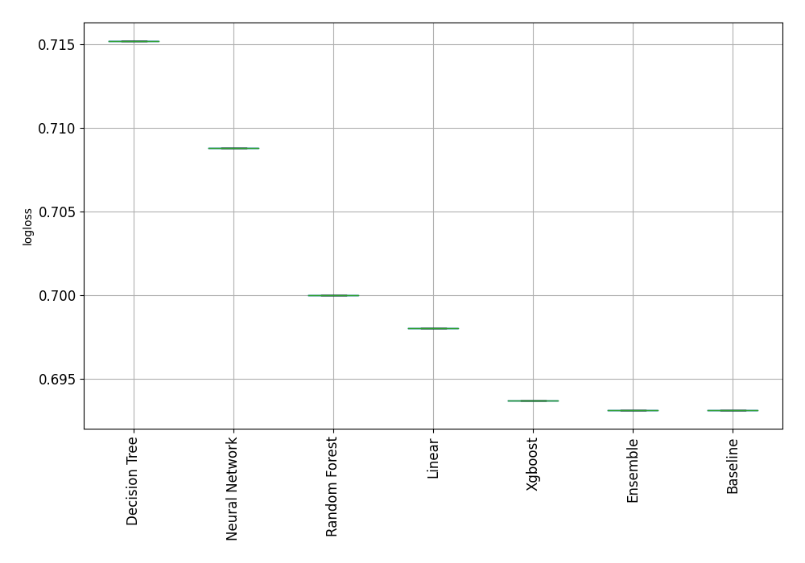

# AutoML Leaderboard

| Best model   | name                     | model_type     | metric_type   |   metric_value |   train_time | Link                                               |
|:-------------|:-------------------------|:---------------|:--------------|---------------:|-------------:|:---------------------------------------------------|
| **the best** | 1_Baseline               | Baseline       | logloss       |       0.693127 |         0.15 | [Results link](1_Baseline/README.md)               |
|              | 2_DecisionTree           | Decision Tree  | logloss       |       0.715201 |         5.29 | [Results link](2_DecisionTree/README.md)           |
|              | 3_Linear                 | Linear         | logloss       |       0.698015 |         3.51 | [Results link](3_Linear/README.md)                 |
|              | 4_Default_RandomForest   | Random Forest  | logloss       |       0.699996 |         7.39 | [Results link](4_Default_RandomForest/README.md)   |
|              | 5_Default_Xgboost        | Xgboost        | logloss       |       0.693689 |         3.79 | [Results link](5_Default_Xgboost/README.md)        |
|              | 6_Default_NeuralNetwork  | Neural Network | logloss       |       0.70879  |        14.19 | [Results link](6_Default_NeuralNetwork/README.md)  |
|              | 1_Baseline_RandomFeature | Baseline       | logloss       |       0.693127 |         0.15 | [Results link](1_Baseline_RandomFeature/README.md) |
|              | Ensemble                 | Ensemble       | logloss       |       0.693127 |         0.22 | [Results link](Ensemble/README.md)                 |

### AutoML Performance

### AutoML Performance Boxplot
