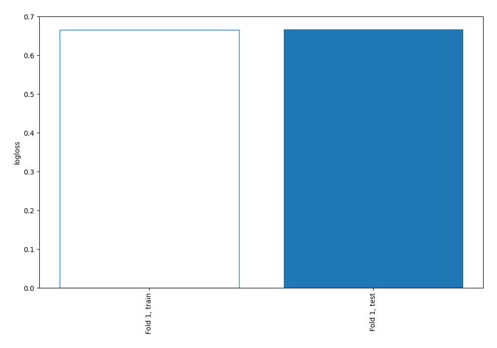

# Summary of 1_Baseline

## Baseline Classifier (Baseline)
- **explain_level**: 2

## Validation
 - **validation_type**: split
 - **train_ratio**: 0.75
 - **shuffle**: True
 - **stratify**: True

## Optimized metric
logloss

## Training time

0.1 seconds

## Metric details
|           |    score |   threshold |
|:----------|---------:|------------:|
| logloss   | 0.666775 |   nan       |
| auc       | 0.5      |   nan       |
| f1        | 0.556634 |     0.34491 |
| accuracy  | 0.38565  |     0.34491 |
| precision | 0.38565  |     0.34491 |
| recall    | 1        |     0.34491 |
| mcc       | 0        |     0.34491 |

## Confusion matrix (at threshold=0.34491)
|                     |   Predicted as negative |   Predicted as positive |
|:--------------------|------------------------:|------------------------:|
| Labeled as negative |                       0 |                     137 |
| Labeled as positive |                       0 |                      86 |

## Learning curves
