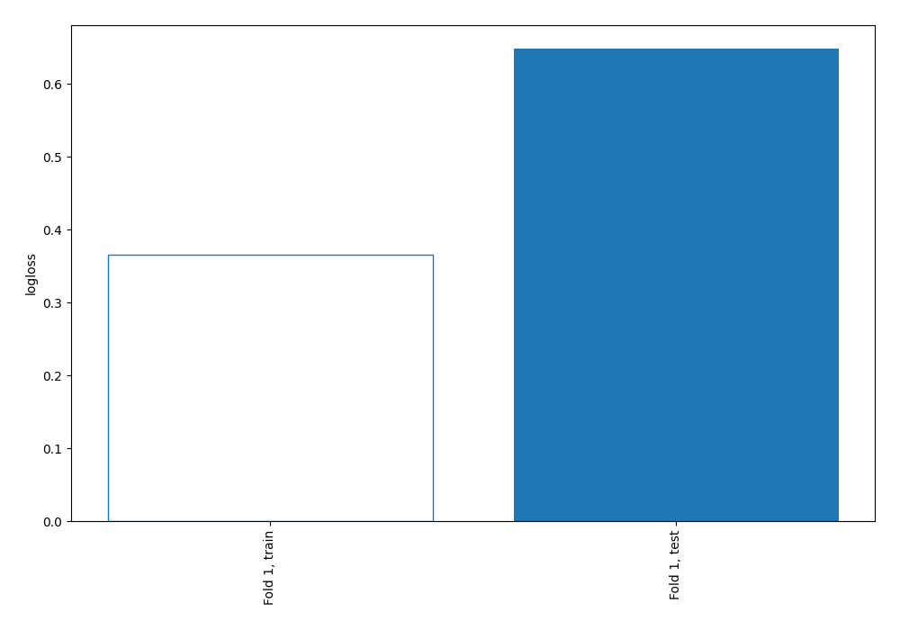
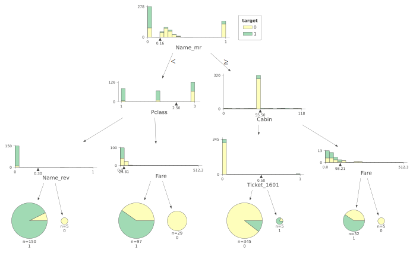
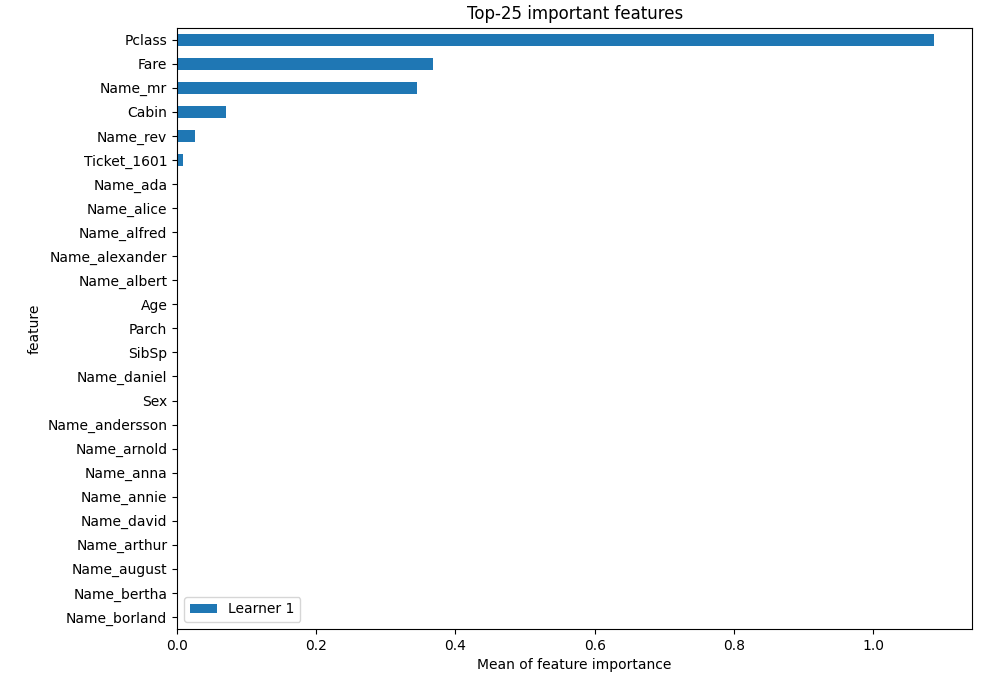
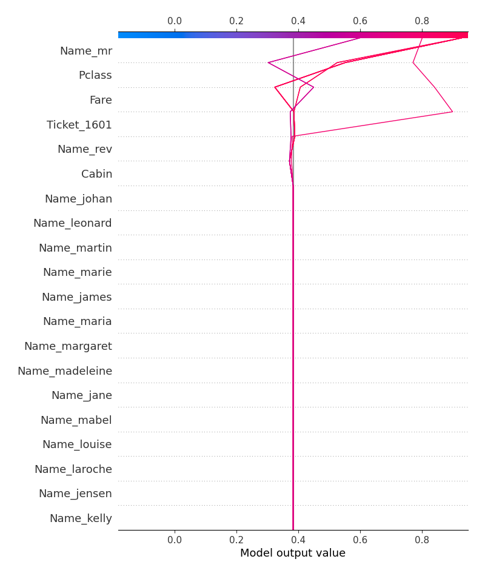
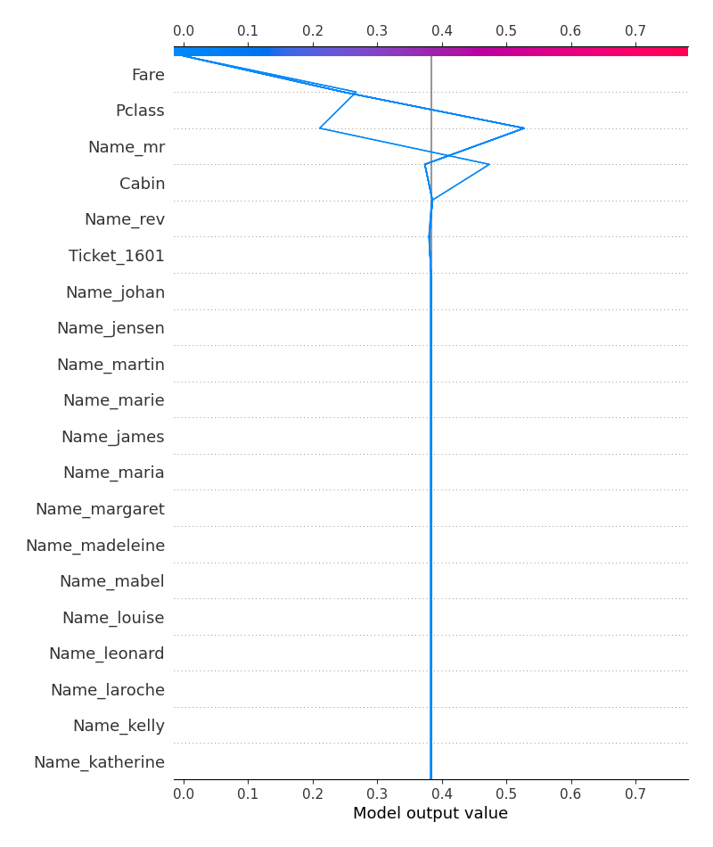
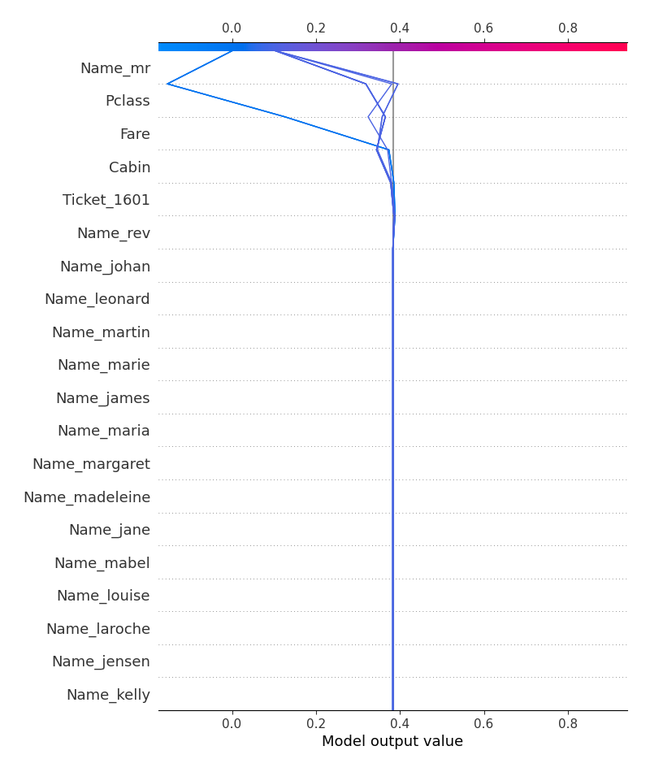
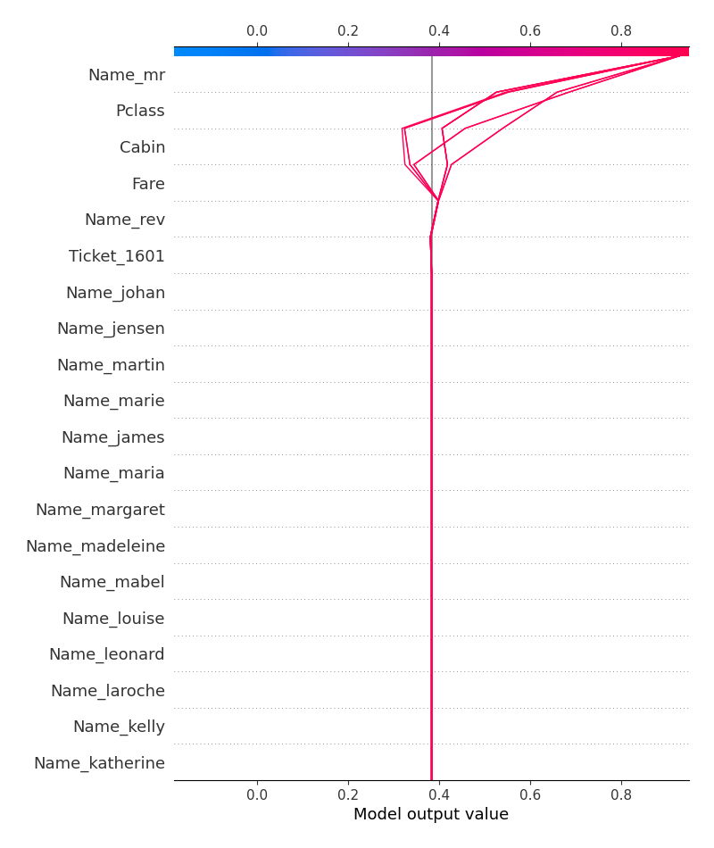

# Summary of 2_DecisionTree

## Decision Tree
- **criterion**: gini
- **max_depth**: 3
- **explain_level**: 2

## Validation
 - **validation_type**: split
 - **train_ratio**: 0.75
 - **shuffle**: True
 - **stratify**: True

## Optimized metric
logloss

## Training time

17.1 seconds

## Metric details
|           |    score |   threshold |
|:----------|---------:|------------:|
| logloss   | 0.648504 |  nan        |
| auc       | 0.814293 |  nan        |
| f1        | 0.728261 |    0.351143 |
| accuracy  | 0.775785 |    0.351143 |
| precision | 0.843137 |    0.597938 |
| recall    | 0.965116 |    0        |
| mcc       | 0.54213  |    0.351143 |

## Confusion matrix (at threshold=0.351143)
|                     |   Predicted as negative |   Predicted as positive |
|:--------------------|------------------------:|------------------------:|
| Labeled as negative |                     106 |                      31 |
| Labeled as positive |                      19 |                      67 |

## Learning curves

## Tree visualizations

### Tree #1

## Permutation-based Importance

## SHAP Importance

## SHAP Dependence plots

### Dependence (Fold #1)

## SHAP Decision plots

### Top-10 Worst decisions for class 0 (Fold #1)

### Top-10 Best decisions for class 0 (Fold #1)

### Top-10 Worst decisions for class 1 (Fold #1)

### Top-10 Best decisions for class 1 (Fold #1)
