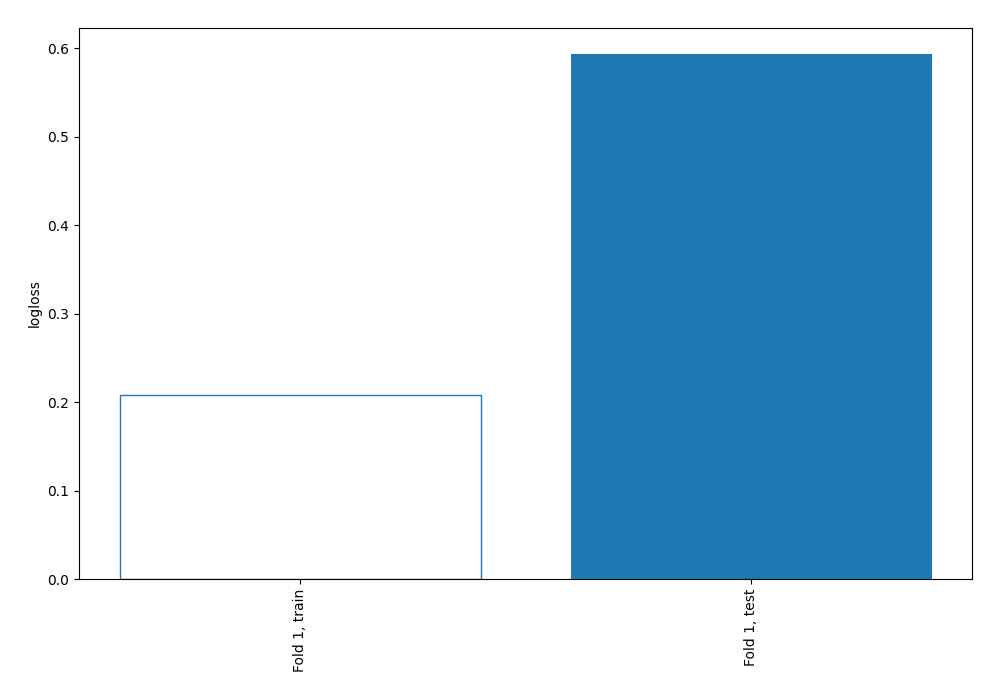
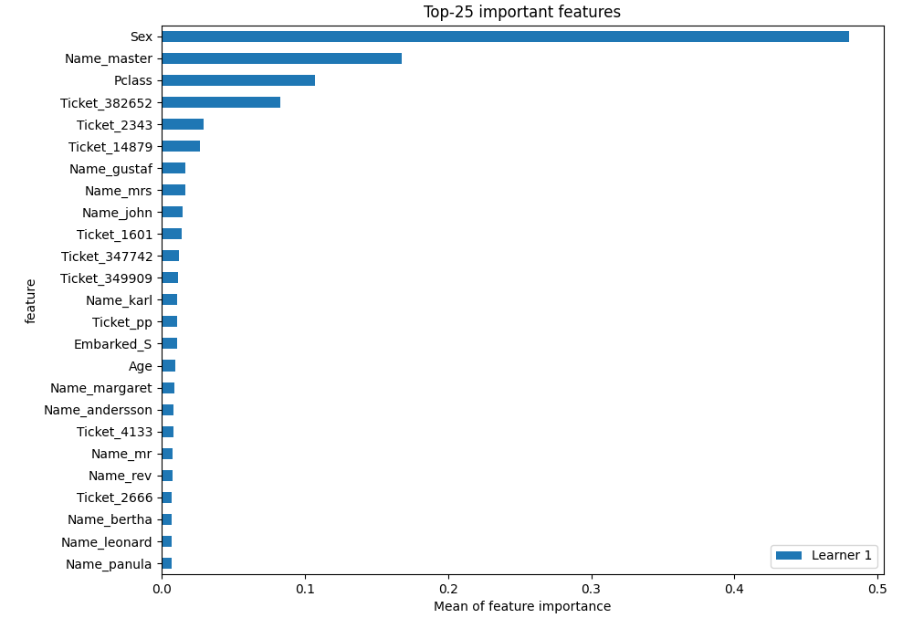
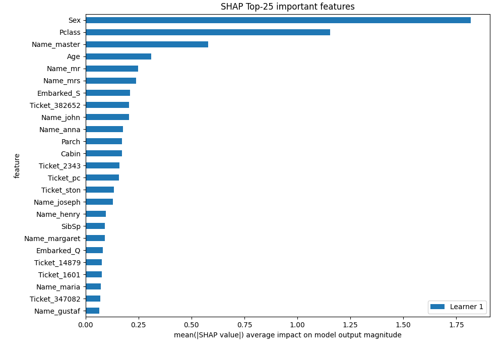
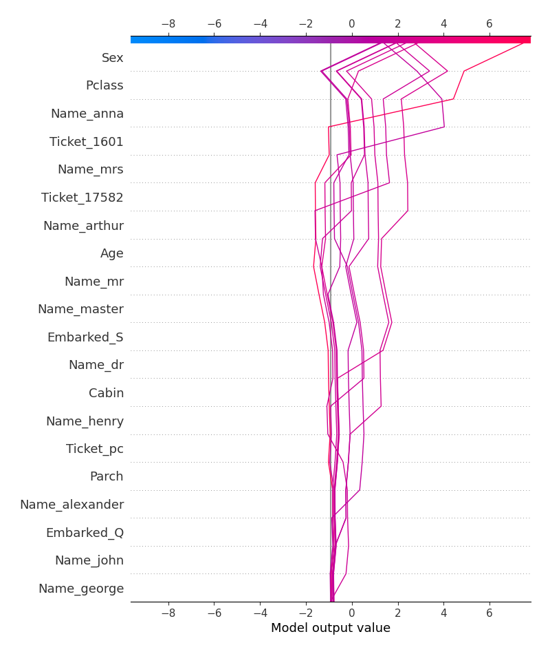
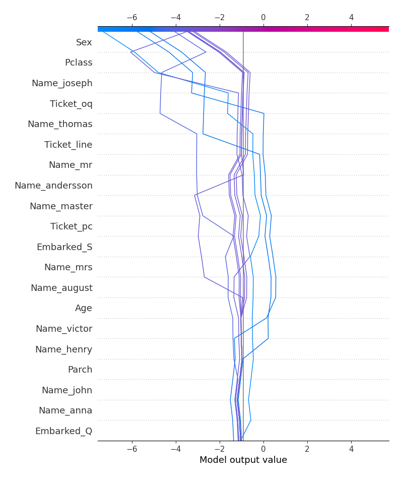
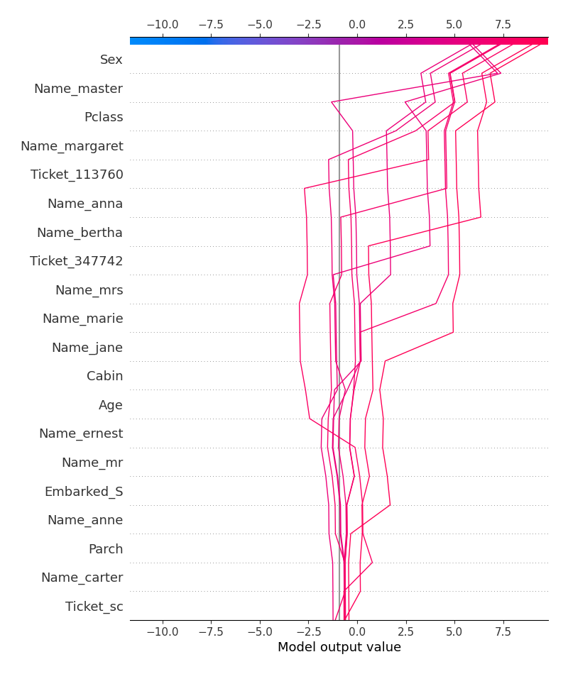

# Summary of 3_Linear

## Logistic Regression (Linear)
- **explain_level**: 2

## Validation
 - **validation_type**: split
 - **train_ratio**: 0.75
 - **shuffle**: True
 - **stratify**: True

## Optimized metric
logloss

## Training time

11.3 seconds

## Metric details
|           |    score |     threshold |
|:----------|---------:|--------------:|
| logloss   | 0.593649 | nan           |
| auc       | 0.834748 | nan           |
| f1        | 0.708134 |   0.0921494   |
| accuracy  | 0.789238 |   0.685035    |
| precision | 0.969697 |   0.950286    |
| recall    | 1        |   1.22919e-06 |
| mcc       | 0.546439 |   0.685035    |

## Confusion matrix (at threshold=0.685035)
|                     |   Predicted as negative |   Predicted as positive |
|:--------------------|------------------------:|------------------------:|
| Labeled as negative |                      88 |                      49 |
| Labeled as positive |                      12 |                      74 |

## Learning curves

## Permutation-based Importance

## SHAP Importance

## SHAP Dependence plots

### Dependence (Fold #1)

## SHAP Decision plots

### Top-10 Worst decisions for class 0 (Fold #1)

### Top-10 Best decisions for class 0 (Fold #1)

### Top-10 Worst decisions for class 1 (Fold #1)

### Top-10 Best decisions for class 1 (Fold #1)
