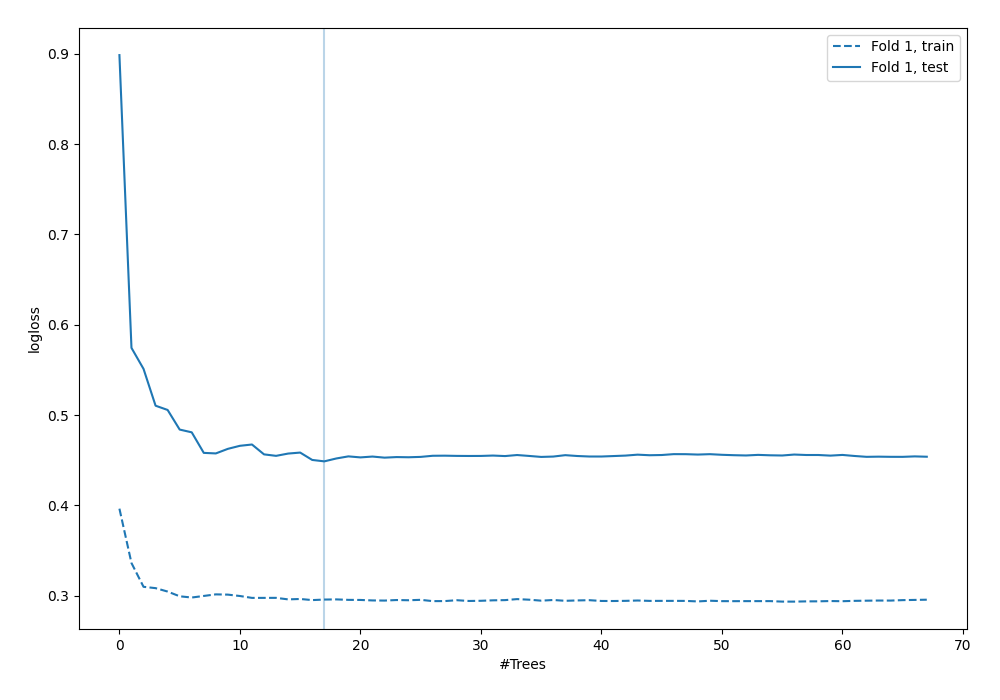
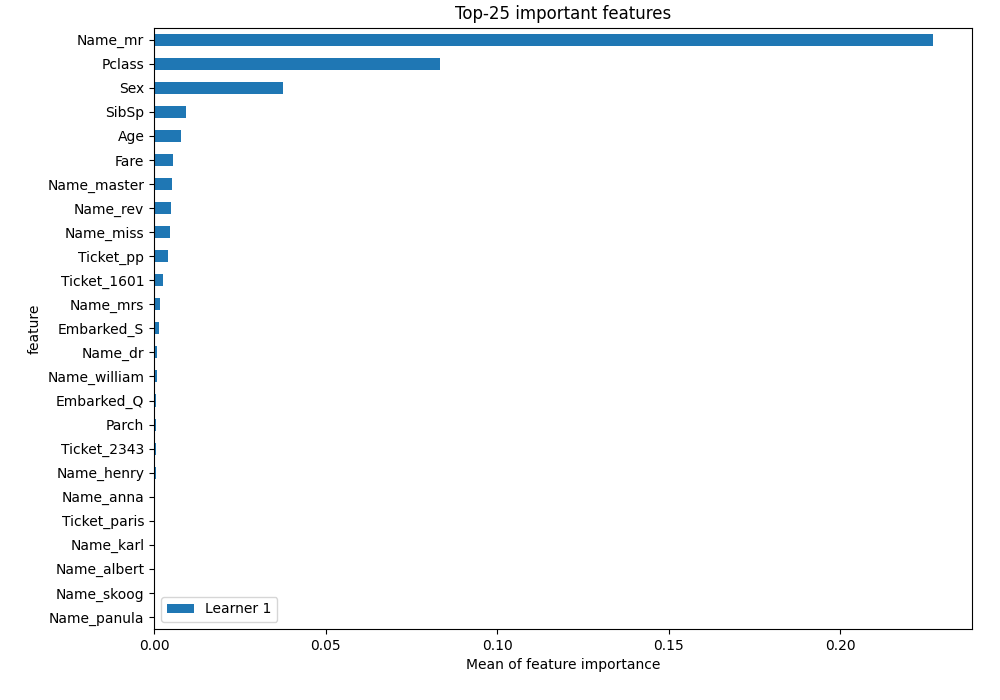
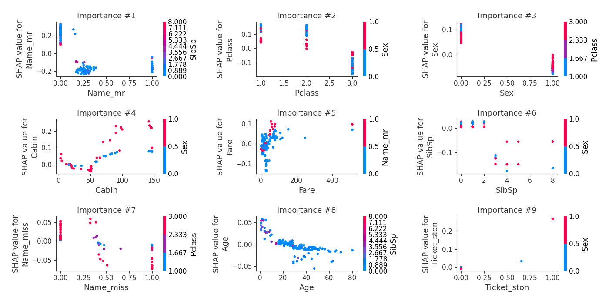
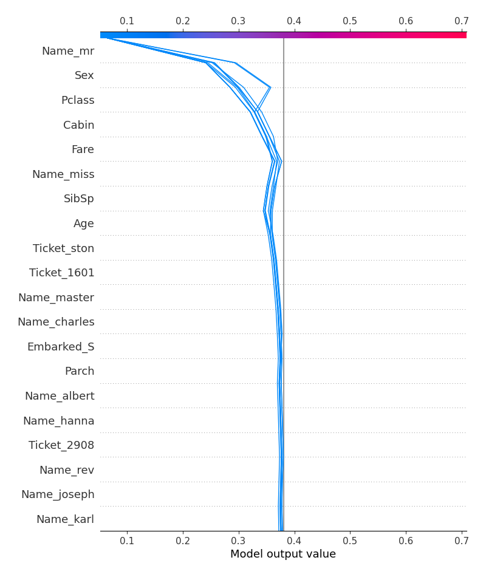
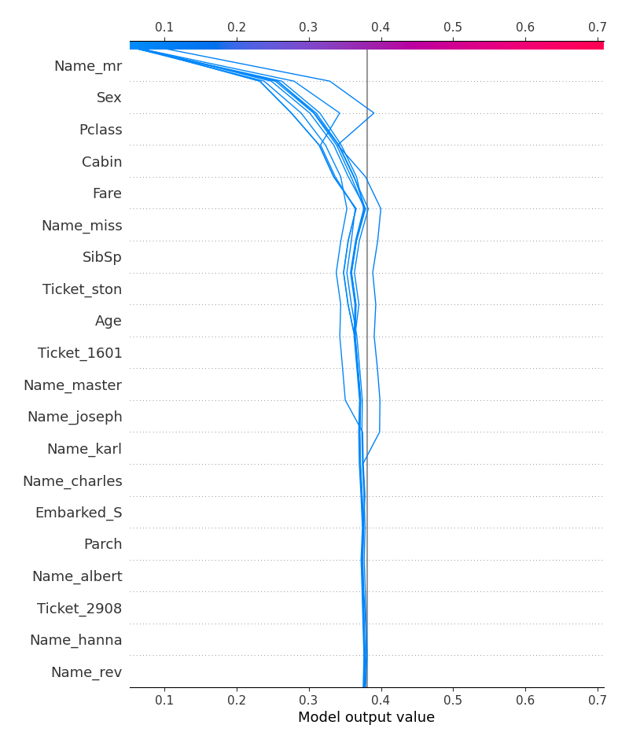
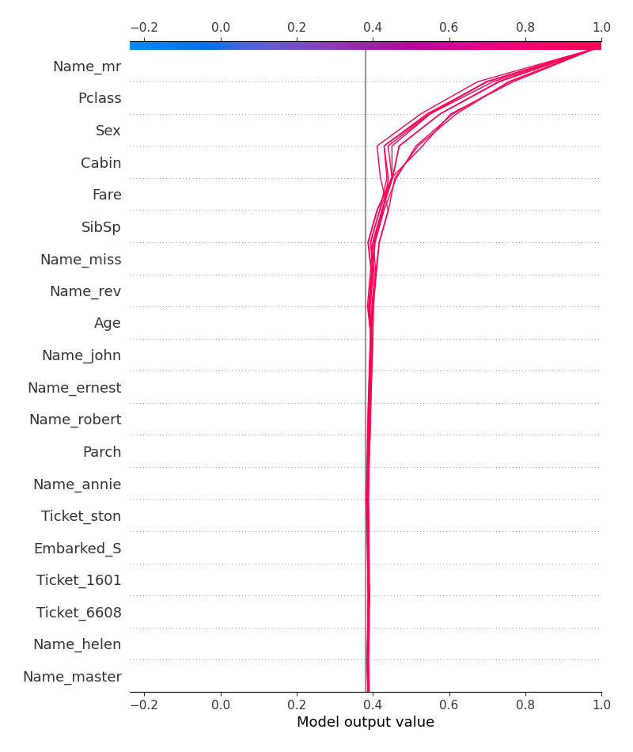

# Summary of 4_Default_RandomForest

## Random Forest
- **criterion**: gini
- **max_features**: 0.6
- **min_samples_split**: 30
- **max_depth**: 6
- **explain_level**: 2

## Validation
 - **validation_type**: split
 - **train_ratio**: 0.75
 - **shuffle**: True
 - **stratify**: True

## Optimized metric
logloss

## Training time

21.3 seconds

## Metric details
|           |    score |   threshold |
|:----------|---------:|------------:|
| logloss   | 0.448691 | nan         |
| auc       | 0.846164 | nan         |
| f1        | 0.740741 |   0.52277   |
| accuracy  | 0.811659 |   0.52277   |
| precision | 0.969697 |   0.914521  |
| recall    | 1        |   0.0589811 |
| mcc       | 0.607057 |   0.752917  |

## Confusion matrix (at threshold=0.52277)
|                     |   Predicted as negative |   Predicted as positive |
|:--------------------|------------------------:|------------------------:|
| Labeled as negative |                     121 |                      16 |
| Labeled as positive |                      26 |                      60 |

## Learning curves

## Permutation-based Importance

## SHAP Importance

## SHAP Dependence plots

### Dependence (Fold #1)

## SHAP Decision plots

### Top-10 Worst decisions for class 0 (Fold #1)

### Top-10 Best decisions for class 0 (Fold #1)

### Top-10 Worst decisions for class 1 (Fold #1)

### Top-10 Best decisions for class 1 (Fold #1)
