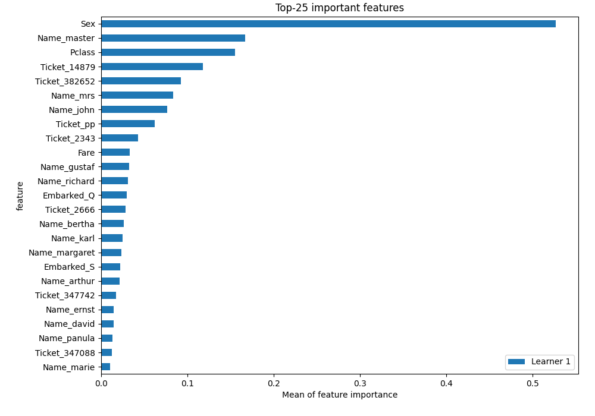

# Summary of 6_Default_NeuralNetwork

## Neural Network
- **dense_layers**: 2
- **dense_1_size**: 32
- **dense_2_size**: 16
- **dropout**: 0
- **learning_rate**: 0.05
- **momentum**: 0.9
- **decay**: 0.001
- **explain_level**: 2

## Validation
 - **validation_type**: split
 - **train_ratio**: 0.75
 - **shuffle**: True
 - **stratify**: True

## Optimized metric
logloss

## Training time

23.2 seconds

## Metric details
|           |    score |     threshold |
|:----------|---------:|--------------:|
| logloss   | 0.733411 | nan           |
| auc       | 0.816245 | nan           |
| f1        | 0.694611 |   0.482816    |
| accuracy  | 0.784753 |   0.764838    |
| precision | 0.864865 |   0.970475    |
| recall    | 1        |   2.70017e-07 |
| mcc       | 0.537243 |   0.764838    |

## Confusion matrix (at threshold=0.764838)
|                     |   Predicted as negative |   Predicted as positive |
|:--------------------|------------------------:|------------------------:|
| Labeled as negative |                     114 |                      23 |
| Labeled as positive |                      28 |                      58 |

## Learning curves

## Permutation-based Importance
