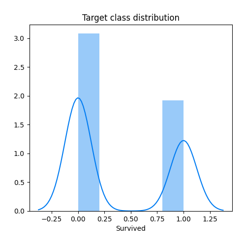
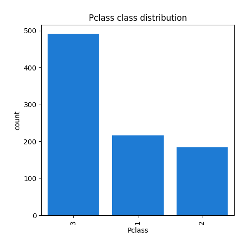
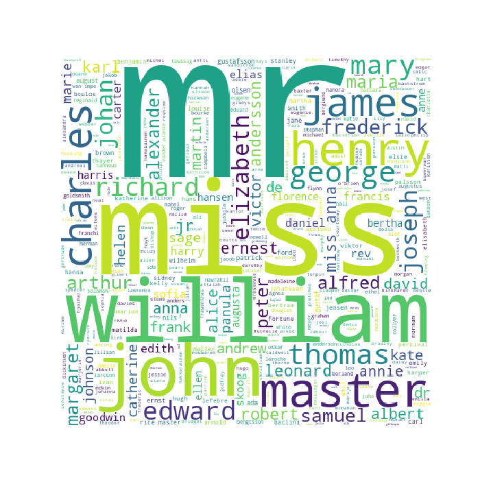
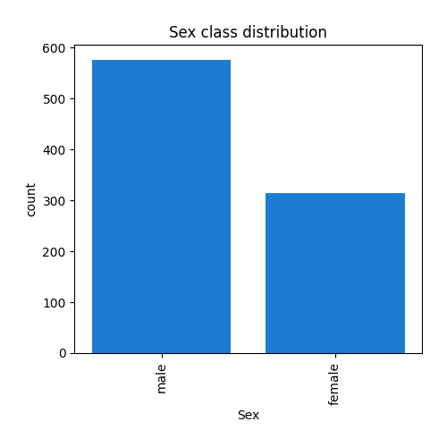
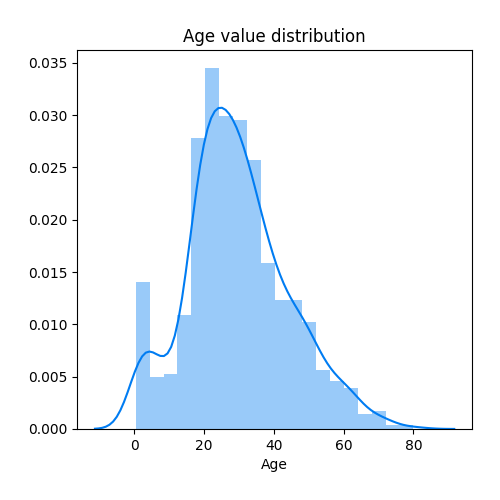
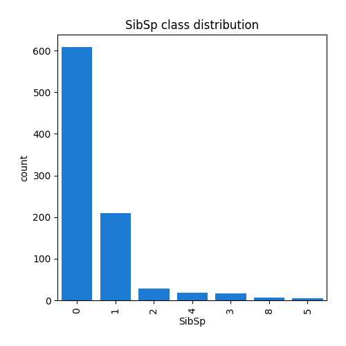
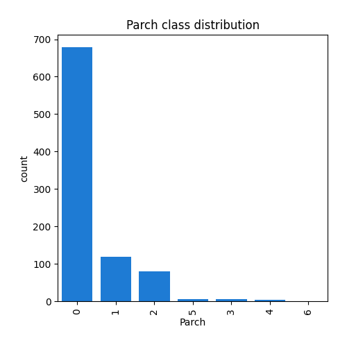
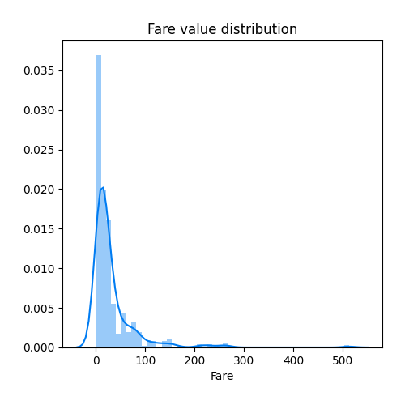
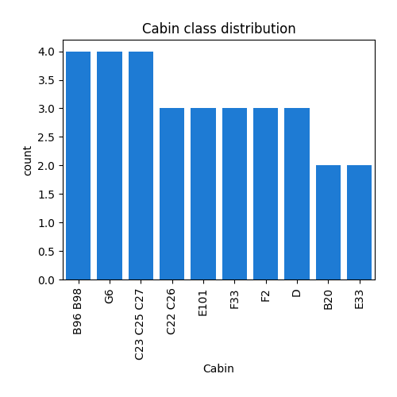
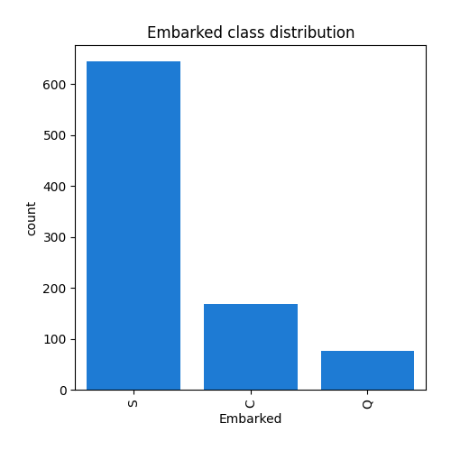

## Feature : target
- **Feature type** : discrete
- **Missing** : 0.0%
- **Unique** : 2
- **Count** :891.0
- **Mean** :0.3838383838383838
- **Std** :0.4865924542648575
- **Min** :0.0
- **25%th Percentile** : 0.0
- **50%th Percentile** : 0.0
- **75%th Percentile** : 1.0
- **Max** :1.0
- 
## Feature : Pclass
- **Feature type** : discrete
- **Missing** : 0.0%
- **Unique** : 3
- **Count** :891.0
- **Mean** :2.308641975308642
- **Std** :0.836071240977049
- **Min** :1.0
- **25%th Percentile** : 2.0
- **50%th Percentile** : 3.0
- **75%th Percentile** : 3.0
- **Max** :3.0
- 
## Feature : Name
- **Feature type** : text
- **Missing** : 0.0%
- **Unique** : 891
- **Count** :891
- **Unique** :891
- **Top** :Sunderland, Mr. Victor Francis
- **Freq** :1
- 
## Feature : Sex
- **Feature type** : categorical
- **Missing** : 0.0%
- **Unique** : 2
- **Count** :891
- **Unique** :2
- **Top** :male
- **Freq** :577
- 
## Feature : Age
- **Feature type** : continous
- **Missing** : 19.865319865319865%
- **Unique** : 88
- **Count** :714.0
- **Mean** :29.69911764705882
- **Std** :14.526497332334042
- **Min** :0.42
- **25%th Percentile** : 20.125
- **50%th Percentile** : 28.0
- **75%th Percentile** : 38.0
- **Max** :80.0
- 
## Feature : SibSp
- **Feature type** : discrete
- **Missing** : 0.0%
- **Unique** : 7
- **Count** :891.0
- **Mean** :0.5230078563411896
- **Std** :1.1027434322934317
- **Min** :0.0
- **25%th Percentile** : 0.0
- **50%th Percentile** : 0.0
- **75%th Percentile** : 1.0
- **Max** :8.0
- 
## Feature : Parch
- **Feature type** : discrete
- **Missing** : 0.0%
- **Unique** : 7
- **Count** :891.0
- **Mean** :0.38159371492704824
- **Std** :0.8060572211299483
- **Min** :0.0
- **25%th Percentile** : 0.0
- **50%th Percentile** : 0.0
- **75%th Percentile** : 0.0
- **Max** :6.0
- 
## Feature : Ticket
- **Feature type** : text
- **Missing** : 0.0%
- **Unique** : 681
- **Count** :891
- **Unique** :681
- **Top** :1601
- **Freq** :7
- 
## Feature : Fare
- **Feature type** : continous
- **Missing** : 0.0%
- **Unique** : 248
- **Count** :891.0
- **Mean** :32.204207968574636
- **Std** :49.6934285971809
- **Min** :0.0
- **25%th Percentile** : 7.9104
- **50%th Percentile** : 14.4542
- **75%th Percentile** : 31.0
- **Max** :512.3292
- 
## Feature : Cabin
- **Feature type** : categorical
- **Missing** : 77.10437710437711%
- **Unique** : 147
- **Count** :204
- **Unique** :147
- **Top** :B96 B98
- **Freq** :4
- 
## Feature : Embarked
- **Feature type** : categorical
- **Missing** : 0.2244668911335578%
- **Unique** : 3
- **Count** :889
- **Unique** :3
- **Top** :S
- **Freq** :644
- 
