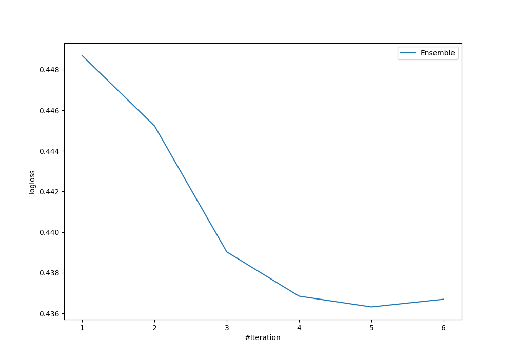

# Summary of Ensemble

## Ensemble structure
| Model                   |   Weight |
|:------------------------|---------:|
| 4_Default_RandomForest  |        2 |
| 5_Default_Xgboost       |        2 |
| 6_Default_NeuralNetwork |        1 |

## Metric details
|           |    score |   threshold |
|:----------|---------:|------------:|
| logloss   | 0.436319 | nan         |
| auc       | 0.855627 | nan         |
| f1        | 0.746835 |   0.524861  |
| accuracy  | 0.820628 |   0.581605  |
| precision | 0.957447 |   0.770579  |
| recall    | 1        |   0.0623511 |
| mcc       | 0.627429 |   0.67958   |

## Confusion matrix (at threshold=0.581605)
|                     |   Predicted as negative |   Predicted as positive |
|:--------------------|------------------------:|------------------------:|
| Labeled as negative |                     124 |                      13 |
| Labeled as positive |                      27 |                      59 |

## Learning curves
