# Summary of 1_Default_Xgboost

## Extreme Gradient Boosting (Xgboost)
- **objective**: reg:squarederror
- **eval_metric**: rmse
- **eta**: 0.1
- **max_depth**: 4
- **min_child_weight**: 1
- **subsample**: 1.0
- **colsample_bytree**: 1.0
- **explain_level**: 2

## Validation
 - **validation_type**: kfold
 - **k_folds**: 3
 - **shuffle**: False

## Optimized metric
rmse

## Training time

247.5 seconds

### Metric details:
| Metric   |           Score |
|:---------|----------------:|
| MAE      | 20260.2         |
| MSE      |     1.22546e+09 |
| RMSE     | 35006.5         |
| R2       |     0.805616    |

## Learning curves
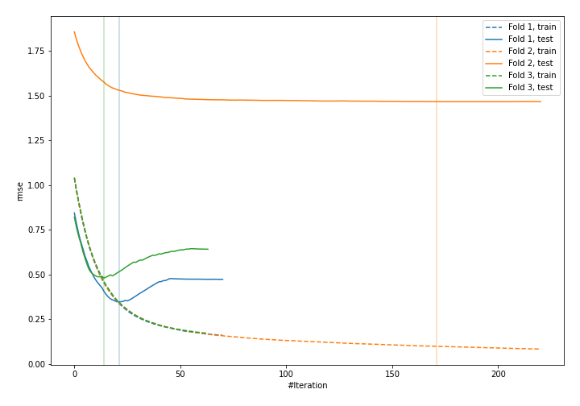

## Permutation-based Importance
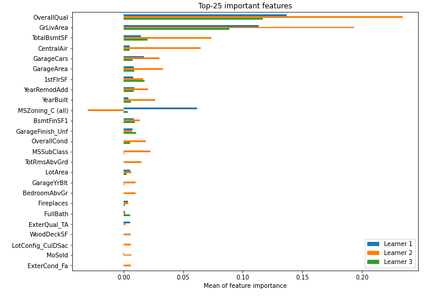

## SHAP Importance
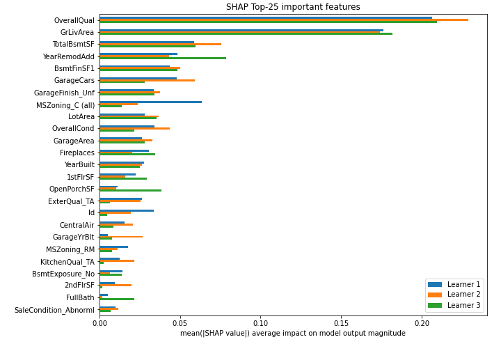

## SHAP Dependence plots

### Dependence (Fold #1)
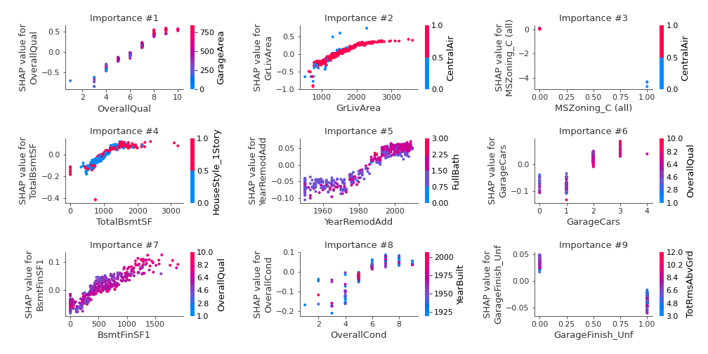
### Dependence (Fold #2)
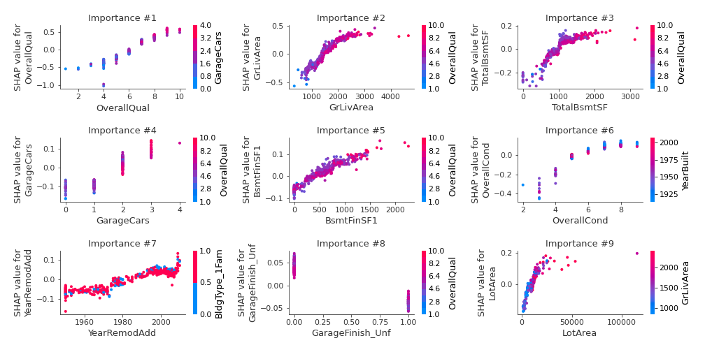
### Dependence (Fold #3)
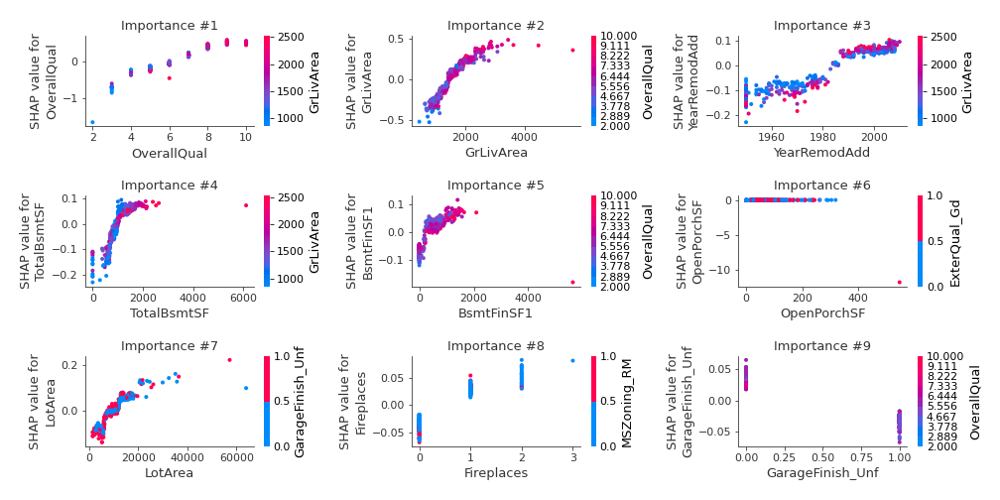

## SHAP Decision plots

### Top-10 Worst decisions (Fold #1)
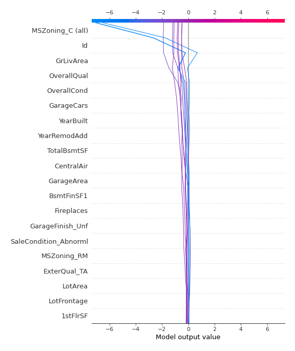
### Top-10 Worst decisions (Fold #2)
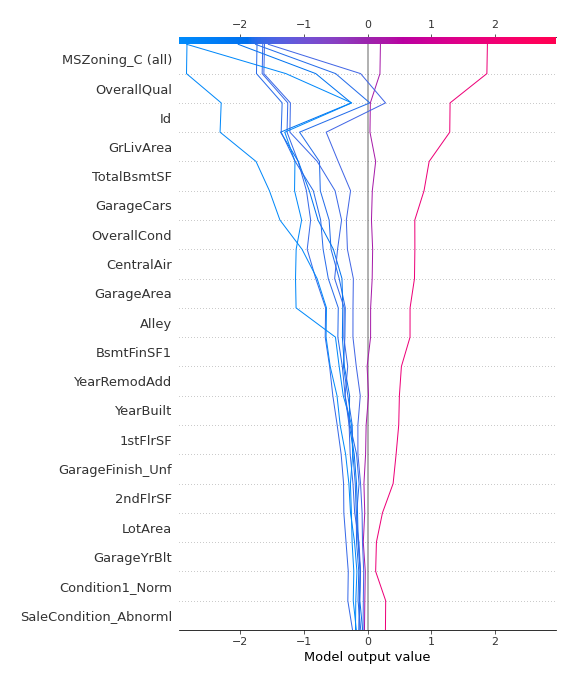
### Top-10 Worst decisions (Fold #3)
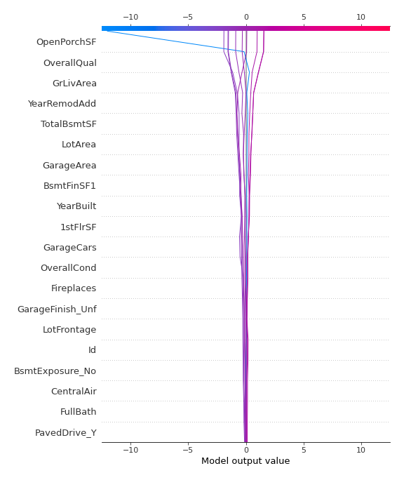
### Top-10 Best decisions (Fold #1)
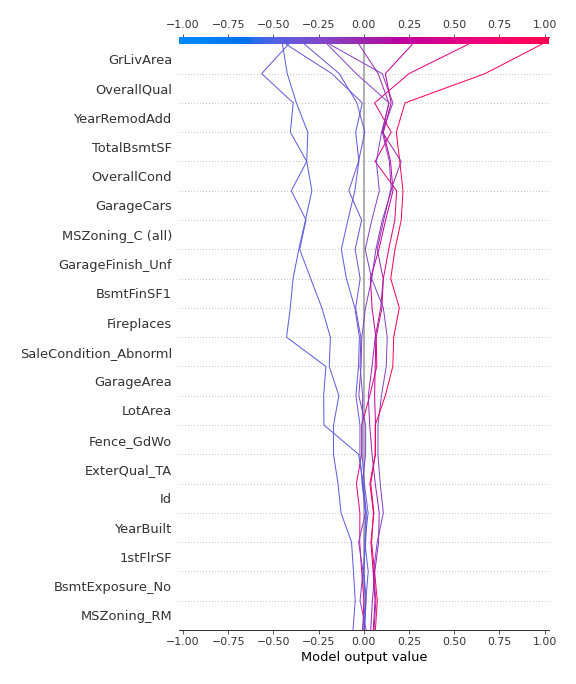
### Top-10 Best decisions (Fold #2)
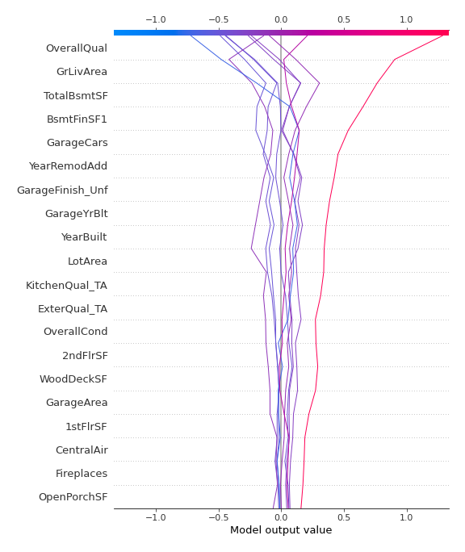
### Top-10 Best decisions (Fold #3)
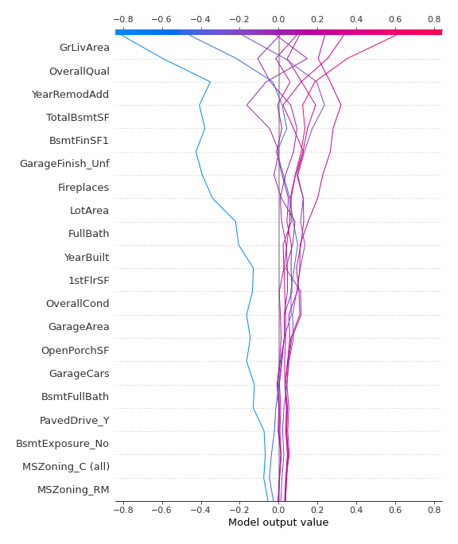