## Feature : target
- **Feature type** : discrete
- **Missing** : 0.0%
- **Unique** : 663
- **Count** :1460.0
- **Mean** :180921.19589041095
- **Std** :79442.50288288662
- **Min** :34900.0
- **25%th Percentile** : 129975.0
- **50%th Percentile** : 163000.0
- **75%th Percentile** : 214000.0
- **Max** :755000.0

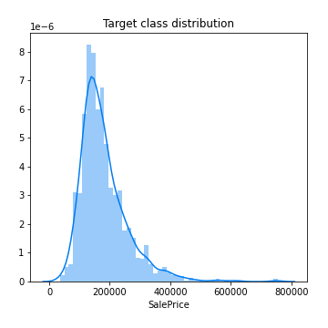
## Feature : Id
- **Feature type** : discrete
- **Missing** : 0.0%
- **Unique** : 1460
- **Count** :1460.0
- **Mean** :730.5
- **Std** :421.6100093688479
- **Min** :1.0
- **25%th Percentile** : 365.75
- **50%th Percentile** : 730.5
- **75%th Percentile** : 1095.25
- **Max** :1460.0

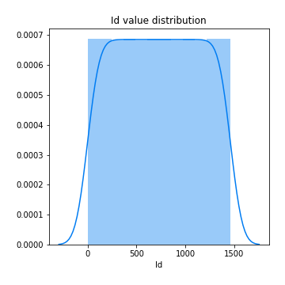
## Feature : MSSubClass
- **Feature type** : discrete
- **Missing** : 0.0%
- **Unique** : 15
- **Count** :1460.0
- **Mean** :56.897260273972606
- **Std** :42.300570993810425
- **Min** :20.0
- **25%th Percentile** : 20.0
- **50%th Percentile** : 50.0
- **75%th Percentile** : 70.0
- **Max** :190.0

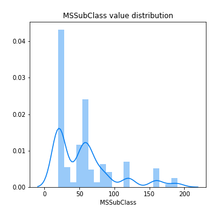
## Feature : MSZoning
- **Feature type** : categorical
- **Missing** : 0.0%
- **Unique** : 5
- **Count** :1460
- **Unique** :5
- **Top** :RL
- **Freq** :1151

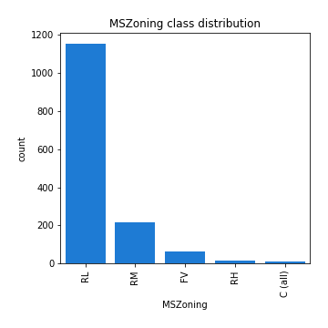
## Feature : LotFrontage
- **Feature type** : continous
- **Missing** : 17.73972602739726%
- **Unique** : 110
- **Count** :1201.0
- **Mean** :70.04995836802665
- **Std** :24.284751774483208
- **Min** :21.0
- **25%th Percentile** : 59.0
- **50%th Percentile** : 69.0
- **75%th Percentile** : 80.0
- **Max** :313.0

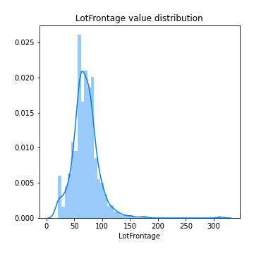
## Feature : LotArea
- **Feature type** : discrete
- **Missing** : 0.0%
- **Unique** : 1073
- **Count** :1460.0
- **Mean** :10516.828082191782
- **Std** :9981.26493237915
- **Min** :1300.0
- **25%th Percentile** : 7553.5
- **50%th Percentile** : 9478.5
- **75%th Percentile** : 11601.5
- **Max** :215245.0

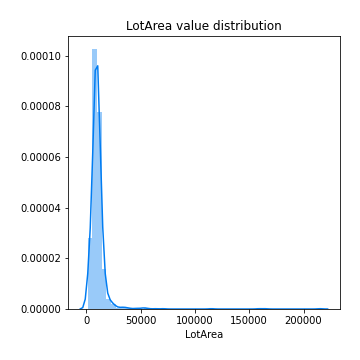
## Feature : Street
- **Feature type** : categorical
- **Missing** : 0.0%
- **Unique** : 2
- **Count** :1460
- **Unique** :2
- **Top** :Pave
- **Freq** :1454

## Feature : Alley
- **Feature type** : categorical
- **Missing** : 93.76712328767124%
- **Unique** : 2
- **Count** :91
- **Unique** :2
- **Top** :Grvl
- **Freq** :50

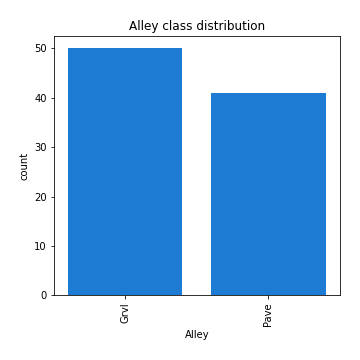
## Feature : LotShape
- **Feature type** : categorical
- **Missing** : 0.0%
- **Unique** : 4
- **Count** :1460
- **Unique** :4
- **Top** :Reg
- **Freq** :925

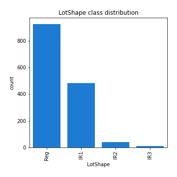
## Feature : LandContour
- **Feature type** : categorical
- **Missing** : 0.0%
- **Unique** : 4
- **Count** :1460
- **Unique** :4
- **Top** :Lvl
- **Freq** :1311

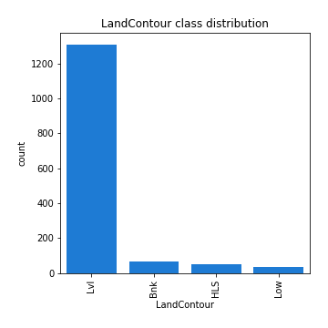
## Feature : Utilities
- **Feature type** : categorical
- **Missing** : 0.0%
- **Unique** : 2
- **Count** :1460
- **Unique** :2
- **Top** :AllPub
- **Freq** :1459

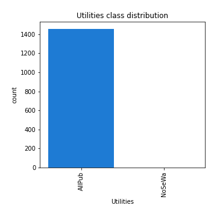
## Feature : LotConfig
- **Feature type** : categorical
- **Missing** : 0.0%
- **Unique** : 5
- **Count** :1460
- **Unique** :5
- **Top** :Inside
- **Freq** :1052

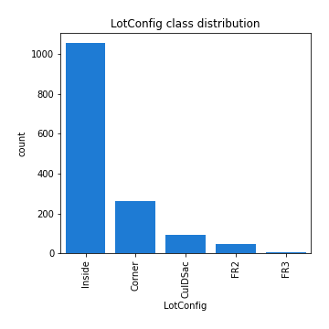
## Feature : LandSlope
- **Feature type** : categorical
- **Missing** : 0.0%
- **Unique** : 3
- **Count** :1460
- **Unique** :3
- **Top** :Gtl
- **Freq** :1382

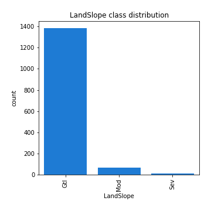
## Feature : Neighborhood
- **Feature type** : categorical
- **Missing** : 0.0%
- **Unique** : 25
- **Count** :1460
- **Unique** :25
- **Top** :NAmes
- **Freq** :225

## Feature : Condition1
- **Feature type** : categorical
- **Missing** : 0.0%
- **Unique** : 9
- **Count** :1460
- **Unique** :9
- **Top** :Norm
- **Freq** :1260

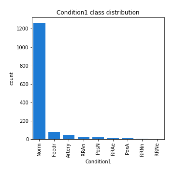
## Feature : Condition2
- **Feature type** : categorical
- **Missing** : 0.0%
- **Unique** : 8
- **Count** :1460
- **Unique** :8
- **Top** :Norm
- **Freq** :1445

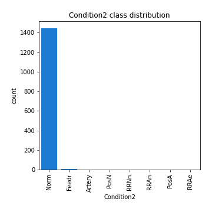
## Feature : BldgType
- **Feature type** : categorical
- **Missing** : 0.0%
- **Unique** : 5
- **Count** :1460
- **Unique** :5
- **Top** :1Fam
- **Freq** :1220

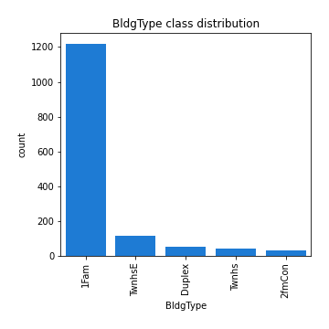
## Feature : HouseStyle
- **Feature type** : categorical
- **Missing** : 0.0%
- **Unique** : 8
- **Count** :1460
- **Unique** :8
- **Top** :1Story
- **Freq** :726

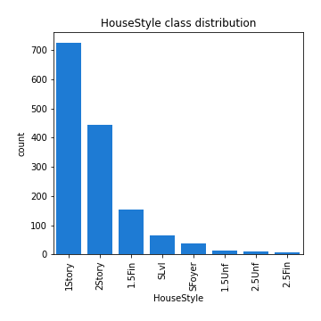
## Feature : OverallQual
- **Feature type** : discrete
- **Missing** : 0.0%
- **Unique** : 10
- **Count** :1460.0
- **Mean** :6.0993150684931505
- **Std** :1.3829965467415934
- **Min** :1.0
- **25%th Percentile** : 5.0
- **50%th Percentile** : 6.0
- **75%th Percentile** : 7.0
- **Max** :10.0

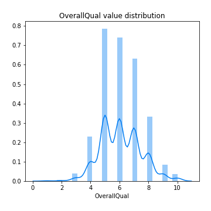
## Feature : OverallCond
- **Feature type** : discrete
- **Missing** : 0.0%
- **Unique** : 9
- **Count** :1460.0
- **Mean** :5.575342465753424
- **Std** :1.1127993367127316
- **Min** :1.0
- **25%th Percentile** : 5.0
- **50%th Percentile** : 5.0
- **75%th Percentile** : 6.0
- **Max** :9.0

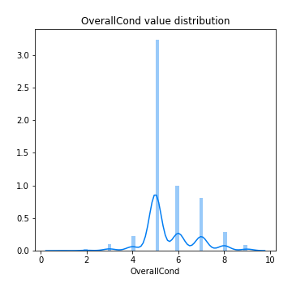
## Feature : YearBuilt
- **Feature type** : discrete
- **Missing** : 0.0%
- **Unique** : 112
- **Count** :1460.0
- **Mean** :1971.267808219178
- **Std** :30.202904042525258
- **Min** :1872.0
- **25%th Percentile** : 1954.0
- **50%th Percentile** : 1973.0
- **75%th Percentile** : 2000.0
- **Max** :2010.0

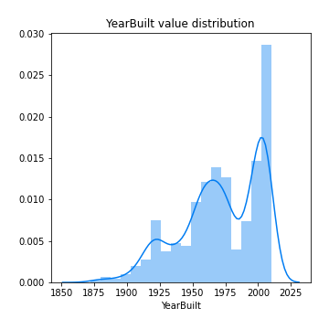
## Feature : YearRemodAdd
- **Feature type** : discrete
- **Missing** : 0.0%
- **Unique** : 61
- **Count** :1460.0
- **Mean** :1984.8657534246574
- **Std** :20.645406807709413
- **Min** :1950.0
- **25%th Percentile** : 1967.0
- **50%th Percentile** : 1994.0
- **75%th Percentile** : 2004.0
- **Max** :2010.0

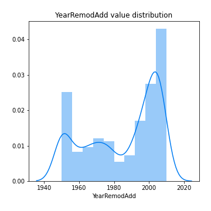
## Feature : RoofStyle
- **Feature type** : categorical
- **Missing** : 0.0%
- **Unique** : 6
- **Count** :1460
- **Unique** :6
- **Top** :Gable
- **Freq** :1141

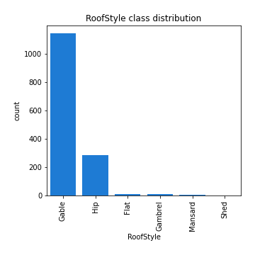
## Feature : RoofMatl
- **Feature type** : categorical
- **Missing** : 0.0%
- **Unique** : 8
- **Count** :1460
- **Unique** :8
- **Top** :CompShg
- **Freq** :1434

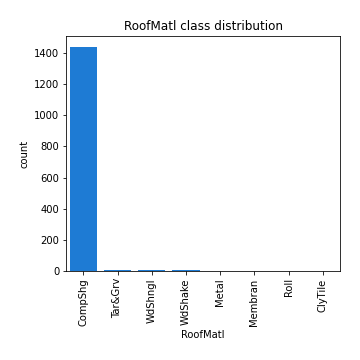
## Feature : Exterior1st
- **Feature type** : categorical
- **Missing** : 0.0%
- **Unique** : 15
- **Count** :1460
- **Unique** :15
- **Top** :VinylSd
- **Freq** :515

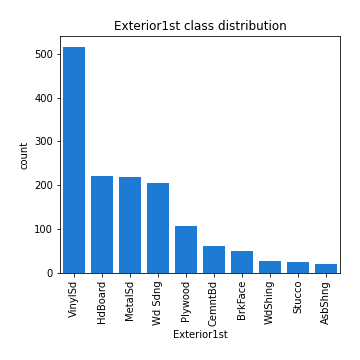
## Feature : Exterior2nd
- **Feature type** : categorical
- **Missing** : 0.0%
- **Unique** : 16
- **Count** :1460
- **Unique** :16
- **Top** :VinylSd
- **Freq** :504

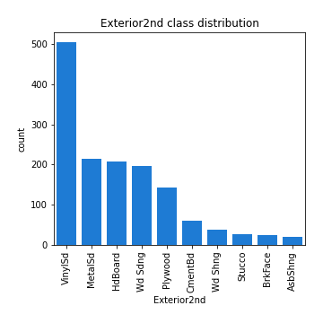
## Feature : MasVnrType
- **Feature type** : categorical
- **Missing** : 0.547945205479452%
- **Unique** : 4
- **Count** :1452
- **Unique** :4
- **Top** :None
- **Freq** :864

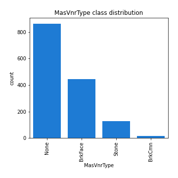
## Feature : MasVnrArea
- **Feature type** : continous
- **Missing** : 0.547945205479452%
- **Unique** : 327
- **Count** :1452.0
- **Mean** :103.68526170798899
- **Std** :181.0662065872166
- **Min** :0.0
- **25%th Percentile** : 0.0
- **50%th Percentile** : 0.0
- **75%th Percentile** : 166.0
- **Max** :1600.0

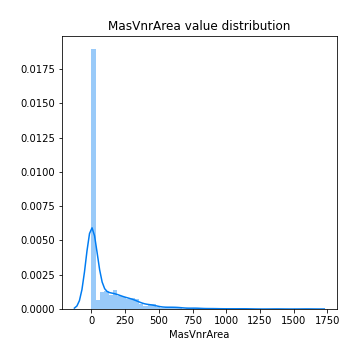
## Feature : ExterQual
- **Feature type** : categorical
- **Missing** : 0.0%
- **Unique** : 4
- **Count** :1460
- **Unique** :4
- **Top** :TA
- **Freq** :906

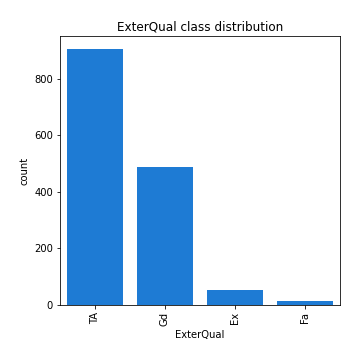
## Feature : ExterCond
- **Feature type** : categorical
- **Missing** : 0.0%
- **Unique** : 5
- **Count** :1460
- **Unique** :5
- **Top** :TA
- **Freq** :1282

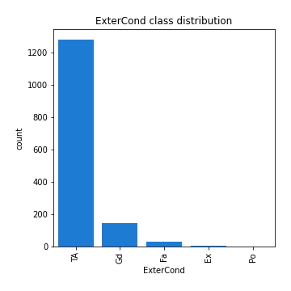
## Feature : Foundation
- **Feature type** : categorical
- **Missing** : 0.0%
- **Unique** : 6
- **Count** :1460
- **Unique** :6
- **Top** :PConc
- **Freq** :647

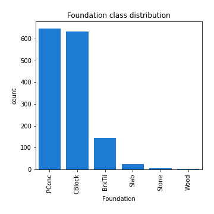
## Feature : BsmtQual
- **Feature type** : categorical
- **Missing** : 2.5342465753424657%
- **Unique** : 4
- **Count** :1423
- **Unique** :4
- **Top** :TA
- **Freq** :649

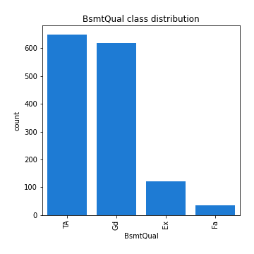
## Feature : BsmtCond
- **Feature type** : categorical
- **Missing** : 2.5342465753424657%
- **Unique** : 4
- **Count** :1423
- **Unique** :4
- **Top** :TA
- **Freq** :1311

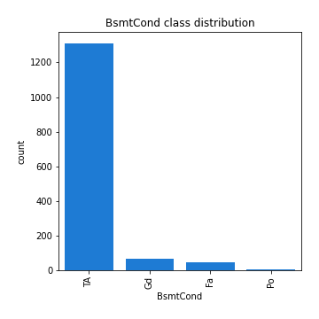
## Feature : BsmtExposure
- **Feature type** : categorical
- **Missing** : 2.6027397260273974%
- **Unique** : 4
- **Count** :1422
- **Unique** :4
- **Top** :No
- **Freq** :953

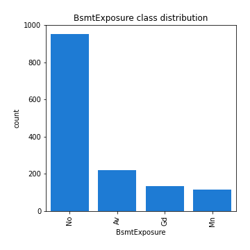
## Feature : BsmtFinType1
- **Feature type** : categorical
- **Missing** : 2.5342465753424657%
- **Unique** : 6
- **Count** :1423
- **Unique** :6
- **Top** :Unf
- **Freq** :430

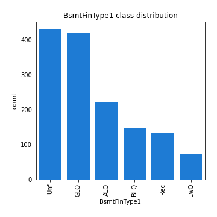
## Feature : BsmtFinSF1
- **Feature type** : discrete
- **Missing** : 0.0%
- **Unique** : 637
- **Count** :1460.0
- **Mean** :443.6397260273973
- **Std** :456.0980908409277
- **Min** :0.0
- **25%th Percentile** : 0.0
- **50%th Percentile** : 383.5
- **75%th Percentile** : 712.25
- **Max** :5644.0

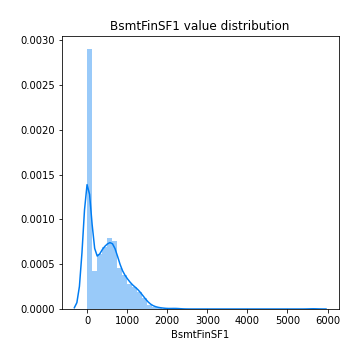
## Feature : BsmtFinType2
- **Feature type** : categorical
- **Missing** : 2.6027397260273974%
- **Unique** : 6
- **Count** :1422
- **Unique** :6
- **Top** :Unf
- **Freq** :1256

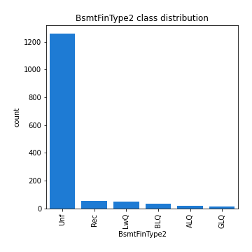
## Feature : BsmtFinSF2
- **Feature type** : discrete
- **Missing** : 0.0%
- **Unique** : 144
- **Count** :1460.0
- **Mean** :46.54931506849315
- **Std** :161.31927280654173
- **Min** :0.0
- **25%th Percentile** : 0.0
- **50%th Percentile** : 0.0
- **75%th Percentile** : 0.0
- **Max** :1474.0

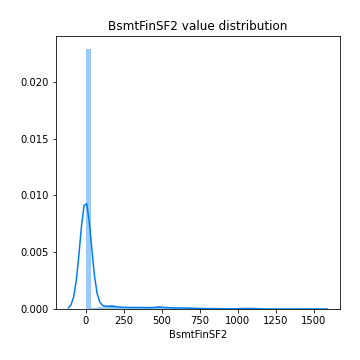
## Feature : BsmtUnfSF
- **Feature type** : discrete
- **Missing** : 0.0%
- **Unique** : 780
- **Count** :1460.0
- **Mean** :567.2404109589041
- **Std** :441.86695529243417
- **Min** :0.0
- **25%th Percentile** : 223.0
- **50%th Percentile** : 477.5
- **75%th Percentile** : 808.0
- **Max** :2336.0

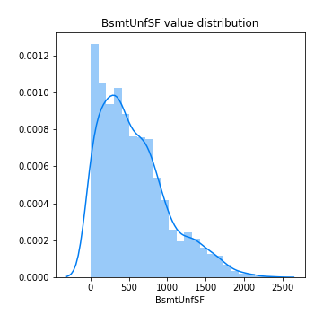
## Feature : TotalBsmtSF
- **Feature type** : discrete
- **Missing** : 0.0%
- **Unique** : 721
- **Count** :1460.0
- **Mean** :1057.4294520547944
- **Std** :438.7053244594708
- **Min** :0.0
- **25%th Percentile** : 795.75
- **50%th Percentile** : 991.5
- **75%th Percentile** : 1298.25
- **Max** :6110.0

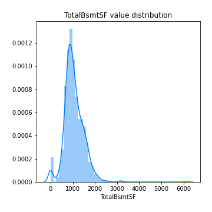
## Feature : Heating
- **Feature type** : categorical
- **Missing** : 0.0%
- **Unique** : 6
- **Count** :1460
- **Unique** :6
- **Top** :GasA
- **Freq** :1428

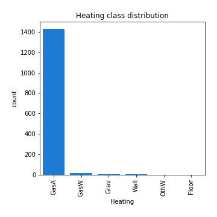
## Feature : HeatingQC
- **Feature type** : categorical
- **Missing** : 0.0%
- **Unique** : 5
- **Count** :1460
- **Unique** :5
- **Top** :Ex
- **Freq** :741

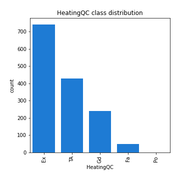
## Feature : CentralAir
- **Feature type** : categorical
- **Missing** : 0.0%
- **Unique** : 2
- **Count** :1460
- **Unique** :2
- **Top** :Y
- **Freq** :1365

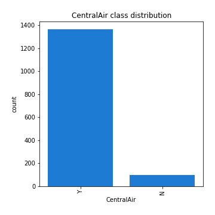
## Feature : Electrical
- **Feature type** : categorical
- **Missing** : 0.0684931506849315%
- **Unique** : 5
- **Count** :1459
- **Unique** :5
- **Top** :SBrkr
- **Freq** :1334

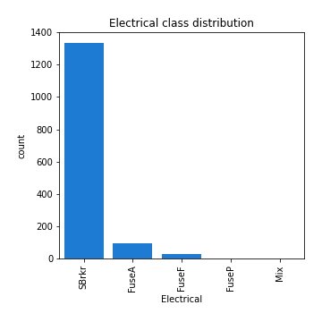
## Feature : 1stFlrSF
- **Feature type** : discrete
- **Missing** : 0.0%
- **Unique** : 753
- **Count** :1460.0
- **Mean** :1162.626712328767
- **Std** :386.5877380410744
- **Min** :334.0
- **25%th Percentile** : 882.0
- **50%th Percentile** : 1087.0
- **75%th Percentile** : 1391.25
- **Max** :4692.0

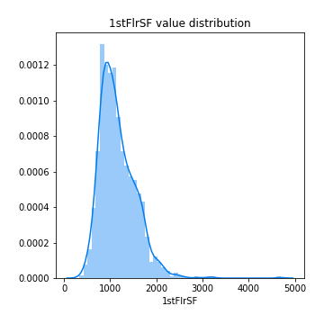
## Feature : 2ndFlrSF
- **Feature type** : discrete
- **Missing** : 0.0%
- **Unique** : 417
- **Count** :1460.0
- **Mean** :346.99246575342465
- **Std** :436.5284358862568
- **Min** :0.0
- **25%th Percentile** : 0.0
- **50%th Percentile** : 0.0
- **75%th Percentile** : 728.0
- **Max** :2065.0

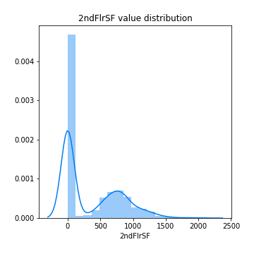
## Feature : LowQualFinSF
- **Feature type** : discrete
- **Missing** : 0.0%
- **Unique** : 24
- **Count** :1460.0
- **Mean** :5.844520547945206
- **Std** :48.62308143352019
- **Min** :0.0
- **25%th Percentile** : 0.0
- **50%th Percentile** : 0.0
- **75%th Percentile** : 0.0
- **Max** :572.0

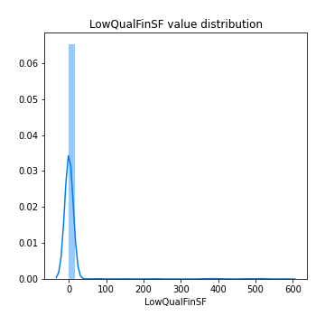
## Feature : GrLivArea
- **Feature type** : discrete
- **Missing** : 0.0%
- **Unique** : 861
- **Count** :1460.0
- **Mean** :1515.463698630137
- **Std** :525.4803834232025
- **Min** :334.0
- **25%th Percentile** : 1129.5
- **50%th Percentile** : 1464.0
- **75%th Percentile** : 1776.75
- **Max** :5642.0

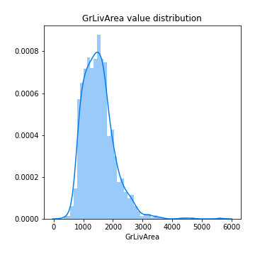
## Feature : BsmtFullBath
- **Feature type** : discrete
- **Missing** : 0.0%
- **Unique** : 4
- **Count** :1460.0
- **Mean** :0.42534246575342466
- **Std** :0.5189106060898065
- **Min** :0.0
- **25%th Percentile** : 0.0
- **50%th Percentile** : 0.0
- **75%th Percentile** : 1.0
- **Max** :3.0

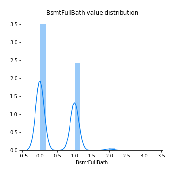
## Feature : BsmtHalfBath
- **Feature type** : discrete
- **Missing** : 0.0%
- **Unique** : 3
- **Count** :1460.0
- **Mean** :0.057534246575342465
- **Std** :0.23875264627921178
- **Min** :0.0
- **25%th Percentile** : 0.0
- **50%th Percentile** : 0.0
- **75%th Percentile** : 0.0
- **Max** :2.0

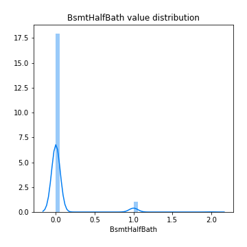
## Feature : FullBath
- **Feature type** : discrete
- **Missing** : 0.0%
- **Unique** : 4
- **Count** :1460.0
- **Mean** :1.5650684931506849
- **Std** :0.5509158012954317
- **Min** :0.0
- **25%th Percentile** : 1.0
- **50%th Percentile** : 2.0
- **75%th Percentile** : 2.0
- **Max** :3.0

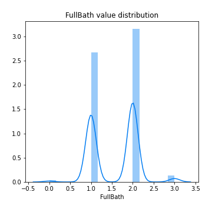
## Feature : HalfBath
- **Feature type** : discrete
- **Missing** : 0.0%
- **Unique** : 3
- **Count** :1460.0
- **Mean** :0.38287671232876713
- **Std** :0.5028853810928914
- **Min** :0.0
- **25%th Percentile** : 0.0
- **50%th Percentile** : 0.0
- **75%th Percentile** : 1.0
- **Max** :2.0

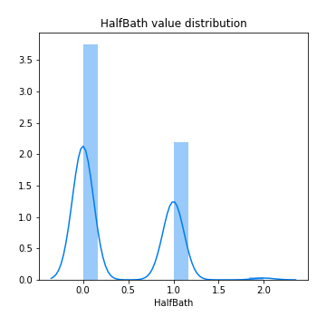
## Feature : BedroomAbvGr
- **Feature type** : discrete
- **Missing** : 0.0%
- **Unique** : 8
- **Count** :1460.0
- **Mean** :2.8664383561643834
- **Std** :0.8157780441442284
- **Min** :0.0
- **25%th Percentile** : 2.0
- **50%th Percentile** : 3.0
- **75%th Percentile** : 3.0
- **Max** :8.0

## Feature : KitchenAbvGr
- **Feature type** : discrete
- **Missing** : 0.0%
- **Unique** : 4
- **Count** :1460.0
- **Mean** :1.0465753424657533
- **Std** :0.22033819838403068
- **Min** :0.0
- **25%th Percentile** : 1.0
- **50%th Percentile** : 1.0
- **75%th Percentile** : 1.0
- **Max** :3.0

## Feature : KitchenQual
- **Feature type** : categorical
- **Missing** : 0.0%
- **Unique** : 4
- **Count** :1460
- **Unique** :4
- **Top** :TA
- **Freq** :735

## Feature : TotRmsAbvGrd
- **Feature type** : discrete
- **Missing** : 0.0%
- **Unique** : 12
- **Count** :1460.0
- **Mean** :6.517808219178082
- **Std** :1.6253932905840505
- **Min** :2.0
- **25%th Percentile** : 5.0
- **50%th Percentile** : 6.0
- **75%th Percentile** : 7.0
- **Max** :14.0

## Feature : Functional
- **Feature type** : categorical
- **Missing** : 0.0%
- **Unique** : 7
- **Count** :1460
- **Unique** :7
- **Top** :Typ
- **Freq** :1360

## Feature : Fireplaces
- **Feature type** : discrete
- **Missing** : 0.0%
- **Unique** : 4
- **Count** :1460.0
- **Mean** :0.613013698630137
- **Std** :0.6446663863122295
- **Min** :0.0
- **25%th Percentile** : 0.0
- **50%th Percentile** : 1.0
- **75%th Percentile** : 1.0
- **Max** :3.0

## Feature : FireplaceQu
- **Feature type** : categorical
- **Missing** : 47.26027397260274%
- **Unique** : 5
- **Count** :770
- **Unique** :5
- **Top** :Gd
- **Freq** :380

## Feature : GarageType
- **Feature type** : categorical
- **Missing** : 5.5479452054794525%
- **Unique** : 6
- **Count** :1379
- **Unique** :6
- **Top** :Attchd
- **Freq** :870

## Feature : GarageYrBlt
- **Feature type** : continous
- **Missing** : 5.5479452054794525%
- **Unique** : 97
- **Count** :1379.0
- **Mean** :1978.5061638868744
- **Std** :24.689724768590242
- **Min** :1900.0
- **25%th Percentile** : 1961.0
- **50%th Percentile** : 1980.0
- **75%th Percentile** : 2002.0
- **Max** :2010.0

## Feature : GarageFinish
- **Feature type** : categorical
- **Missing** : 5.5479452054794525%
- **Unique** : 3
- **Count** :1379
- **Unique** :3
- **Top** :Unf
- **Freq** :605

## Feature : GarageCars
- **Feature type** : discrete
- **Missing** : 0.0%
- **Unique** : 5
- **Count** :1460.0
- **Mean** :1.7671232876712328
- **Std** :0.7473150101111095
- **Min** :0.0
- **25%th Percentile** : 1.0
- **50%th Percentile** : 2.0
- **75%th Percentile** : 2.0
- **Max** :4.0

## Feature : GarageArea
- **Feature type** : discrete
- **Missing** : 0.0%
- **Unique** : 441
- **Count** :1460.0
- **Mean** :472.9801369863014
- **Std** :213.80484145338042
- **Min** :0.0
- **25%th Percentile** : 334.5
- **50%th Percentile** : 480.0
- **75%th Percentile** : 576.0
- **Max** :1418.0

## Feature : GarageQual
- **Feature type** : categorical
- **Missing** : 5.5479452054794525%
- **Unique** : 5
- **Count** :1379
- **Unique** :5
- **Top** :TA
- **Freq** :1311

## Feature : GarageCond
- **Feature type** : categorical
- **Missing** : 5.5479452054794525%
- **Unique** : 5
- **Count** :1379
- **Unique** :5
- **Top** :TA
- **Freq** :1326

## Feature : PavedDrive
- **Feature type** : categorical
- **Missing** : 0.0%
- **Unique** : 3
- **Count** :1460
- **Unique** :3
- **Top** :Y
- **Freq** :1340

## Feature : WoodDeckSF
- **Feature type** : discrete
- **Missing** : 0.0%
- **Unique** : 274
- **Count** :1460.0
- **Mean** :94.2445205479452
- **Std** :125.3387943517241
- **Min** :0.0
- **25%th Percentile** : 0.0
- **50%th Percentile** : 0.0
- **75%th Percentile** : 168.0
- **Max** :857.0

## Feature : OpenPorchSF
- **Feature type** : discrete
- **Missing** : 0.0%
- **Unique** : 202
- **Count** :1460.0
- **Mean** :46.66027397260274
- **Std** :66.25602767664971
- **Min** :0.0
- **25%th Percentile** : 0.0
- **50%th Percentile** : 25.0
- **75%th Percentile** : 68.0
- **Max** :547.0

## Feature : EnclosedPorch
- **Feature type** : discrete
- **Missing** : 0.0%
- **Unique** : 120
- **Count** :1460.0
- **Mean** :21.954109589041096
- **Std** :61.1191486017286
- **Min** :0.0
- **25%th Percentile** : 0.0
- **50%th Percentile** : 0.0
- **75%th Percentile** : 0.0
- **Max** :552.0

## Feature : 3SsnPorch
- **Feature type** : discrete
- **Missing** : 0.0%
- **Unique** : 20
- **Count** :1460.0
- **Mean** :3.4095890410958902
- **Std** :29.31733055678188
- **Min** :0.0
- **25%th Percentile** : 0.0
- **50%th Percentile** : 0.0
- **75%th Percentile** : 0.0
- **Max** :508.0

## Feature : ScreenPorch
- **Feature type** : discrete
- **Missing** : 0.0%
- **Unique** : 76
- **Count** :1460.0
- **Mean** :15.060958904109588
- **Std** :55.757415281874174
- **Min** :0.0
- **25%th Percentile** : 0.0
- **50%th Percentile** : 0.0
- **75%th Percentile** : 0.0
- **Max** :480.0

## Feature : PoolArea
- **Feature type** : discrete
- **Missing** : 0.0%
- **Unique** : 8
- **Count** :1460.0
- **Mean** :2.758904109589041
- **Std** :40.17730694453019
- **Min** :0.0
- **25%th Percentile** : 0.0
- **50%th Percentile** : 0.0
- **75%th Percentile** : 0.0
- **Max** :738.0

## Feature : PoolQC
- **Feature type** : categorical
- **Missing** : 99.52054794520548%
- **Unique** : 3
- **Count** :7
- **Unique** :3
- **Top** :Gd
- **Freq** :3

## Feature : Fence
- **Feature type** : categorical
- **Missing** : 80.75342465753425%
- **Unique** : 4
- **Count** :281
- **Unique** :4
- **Top** :MnPrv
- **Freq** :157

## Feature : MiscFeature
- **Feature type** : categorical
- **Missing** : 96.3013698630137%
- **Unique** : 4
- **Count** :54
- **Unique** :4
- **Top** :Shed
- **Freq** :49

## Feature : MiscVal
- **Feature type** : discrete
- **Missing** : 0.0%
- **Unique** : 21
- **Count** :1460.0
- **Mean** :43.489041095890414
- **Std** :496.12302445794415
- **Min** :0.0
- **25%th Percentile** : 0.0
- **50%th Percentile** : 0.0
- **75%th Percentile** : 0.0
- **Max** :15500.0

## Feature : MoSold
- **Feature type** : discrete
- **Missing** : 0.0%
- **Unique** : 12
- **Count** :1460.0
- **Mean** :6.321917808219178
- **Std** :2.7036262083595126
- **Min** :1.0
- **25%th Percentile** : 5.0
- **50%th Percentile** : 6.0
- **75%th Percentile** : 8.0
- **Max** :12.0

## Feature : YrSold
- **Feature type** : discrete
- **Missing** : 0.0%
- **Unique** : 5
- **Count** :1460.0
- **Mean** :2007.8157534246575
- **Std** :1.3280951205521099
- **Min** :2006.0
- **25%th Percentile** : 2007.0
- **50%th Percentile** : 2008.0
- **75%th Percentile** : 2009.0
- **Max** :2010.0

## Feature : SaleType
- **Feature type** : categorical
- **Missing** : 0.0%
- **Unique** : 9
- **Count** :1460
- **Unique** :9
- **Top** :WD
- **Freq** :1267

## Feature : SaleCondition
- **Feature type** : categorical
- **Missing** : 0.0%
- **Unique** : 6
- **Count** :1460
- **Unique** :6
- **Top** :Normal
- **Freq** :1198

